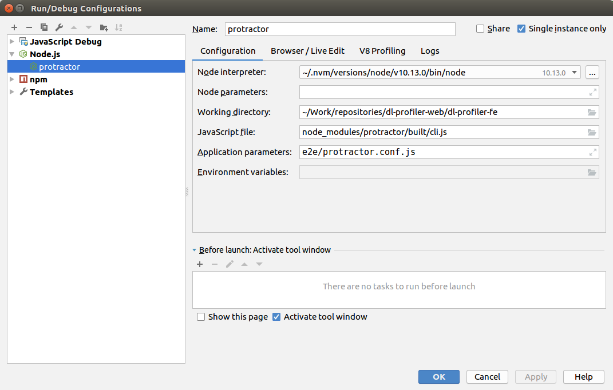

## Setting up

1. [Optional if behind proxy] Create `.npmrc` file:

    ```
    touch .npmrc
    ```

2. [Optional if behind proxy] Add proxies there:

    ```
    proxy=http://proxy-example.com:999
    https-proxy=http://proxy-example.com:999
    ```

    Also, add the proxies to the terminal:
    
    ```
    export https_proxy=http://proxy-example.com:999
    export http_proxy=http://proxy-example.com:999
    ```

3. Install dependencies

    1. Install Node Versions Manager (NVM)
    
    2. Install NodeJS version 14 with NVM
    ```
    nvm install v14.18.0
    ```
    3. Start using NodeJS v10:
    ```
    nvm use v10.13.0
    ```
    4. Install dependencies:
    ```
    npm install
    ```
    5. Setup Netron (IR visualization engine):
    ```
    npm run init-netron
    ```

## Project structure

The structure of the project is organised according to Angular framework [guidelines](https://angular.io/guide/styleguide) and focuses on a multiple-module architecture.

In general, the structure is the following:

```text
|-- app
     |-- core
       |-- [+] guards
       |-- [+] header
       |-- [+] interceptors
       |-- [+] popup
       |-- services
         |-- api
           |-- [+] rest
           |-- [+] socket
         |-- [+] common
       |-- core.module.ts
     |
     |-- modules
       |-- home
         |-- [+] components
         |-- [+] pages
         |-- home-routing.module.ts
         |-- home.module.ts
       |-- <Other feature modules...>
     |-- shared
       |-- [+] components
       |-- [+] directives
       |-- [+] models
       |-- [+] pipes
       |-- material.module.ts
       |-- shared.module.ts
|-- assets
|-- environments
|-- stories
```

1. The `CoreModule` should contain singleton services (which is usually the case), universal components and other features where there’s only once instance per application.

   > **Note:** Consider using `@Injectable({ providedIn: SomeModule or 'root' })` syntax when creating an injectable service in order to support Angular modules tree-shaking feature.

2. All feature modules are located in the `modules` directory. Each feature module usually includes routing module, `components` directory for all common components declared in this module and `pages` directory with pages components described in routing.

3. The `SharedModule` consists of any shared components, pipes, directives and it can be imported in any other module (including unit tests). The `SharedModule` shouldn’t have any dependency to the rest of the application.
   > **Note:** `MaterialModule` is used just to define and then re-export base Angular Material components for shared components and rest of application.

For more information you can read the following articles:

- [How to define a highly scalable folder structure for your Angular project](https://itnext.io/choosing-a-highly-scalable-folder-structure-in-angular-d987de65ec7)
- [Angular Folder Structure](https://medium.com/@motcowley/angular-folder-structure-d1809be95542)

## Production

### Building for the production

1. Build for the production:

```
DL_PROFILER_BACKEND_STATIC_PATH=path-to-static-directory npm run pack-dev
```

### Running for the production (Front-End only and is not a preferable option)

1. Run the following command:

```
ng serve --host 0.0.0.0 --port 4200 --disable-host-check
```

### Working with e2e tests

1. Run the following command:

```
npm run ci:e2e
```

You can also run E2E tests not on the localhost but the remote server:

```
DL_PROFILER_DEPLOY_TARGET=http://123.456.789:123 npm run ci:test
```

When writing e2e tests, follow several requirements:

1. All tests are placed in the `e2e/src`
2. A test file should be called in the following manner: `name-of-test.e2e-spec.ts`
3. Any common logic should be moved to the `Page` objects
4. `Page` classes should be called in the following manner: `name-of-the-page.po.ts`
5. DO NOT NEST describe blocks more than once.

```js
describe('Title !', () => {
  describe('Nested Title', () => {});
});
```

6. Exclamation mark is mandatory at the end of the parent `describe` title. Look at example above.

You can debug Protractor tests from WebStorm:



### Working with unit tests

1. Run the following command:

```
npm run test
```

2. Check the BOM integrity:

```
STATIC_PATH=${PATH_TO_BUILT_STATIC} python3 -m unittest discover -p bom_test.py
```

### Running linting

To run linting, you need to execute this command:

```bash
npm run lint
```

### Configure Prettier for WebStorm

Follow the [guide](https://prettier.io/docs/en/webstorm.html) to enable a prettier with WebStorm File Watchers.
