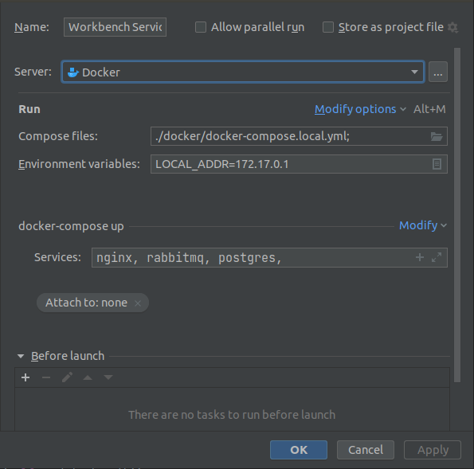
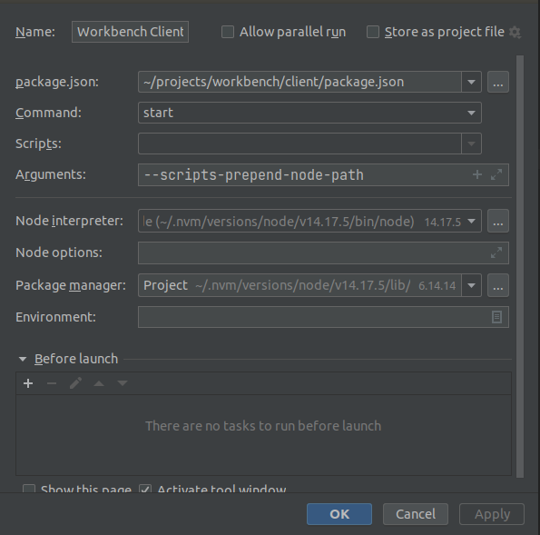
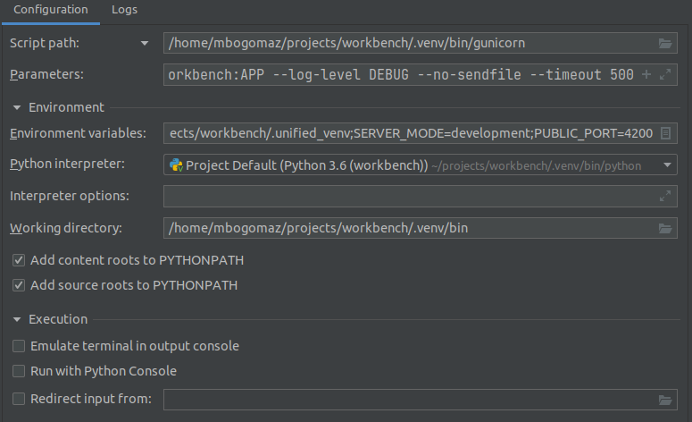
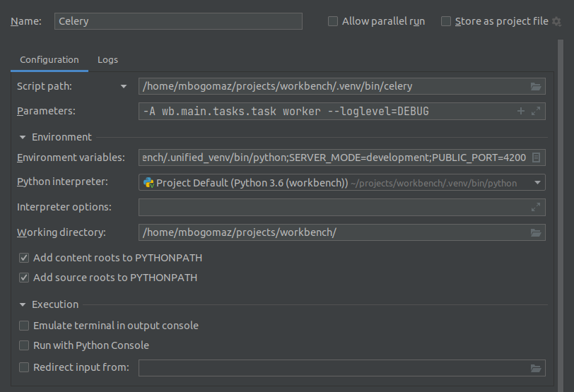

# Set Up OpenVINO DL Workbench

* If you are a developer and want to configure your system for DL Workbench development, refer to  [Configure for Development](#configure-for-development) section.

## Configure for Development <a name="configure-for-development"></a>


0. Install prerequisites:
   * `git`
   * `python3.6`

1. Clone the DL Workbench repository:
    ```bash
    git clone https://github.com/openvinotoolkit/workbench.git
2. Run the script to bootstrap os from the root folder of the DL Workbench repository:
    ```bash
    bash automation/bootstrap/bootstrap_os.sh
    ```

3. (Optional) Set up the workspace in PyCharm
   1. Open the workbench project in PyCharm
   2. Open the `automation/bootstrap/bootstrap_pycharm.py`
   3. Right click inside the script and choose `Run 'bootstrap_pycharm.py'`
   4. Restart PyCharm


### Steps if you want to set up the environment manually
0. Install prerequisites:
   * `git`
   * `python3.6`

1. Download the OpenVINO package and install it (follow the [instruction](https://docs.openvinotoolkit.org/latest/openvino_docs_install_guides_installing_openvino_linux.html))
   The full link to the current package you can find in `openvino_version.yml` in the private CI repository.

2. Open the terminal and clone the DL Workbench repository:
    ```bash
    git clone https://github.com/openvinotoolkit/workbench.git
    cd workbench
    export OPENVINO_WORKBENCH_ROOT=$(pwd)
    ```

3. Initialize and clone submodules of the repository:
    ```bash
    git submodule update --init --recursive
    ```

4. Install the `virtualenv` python package:
    ```bash
    python3 -m pip install virtualenv
    ```

5. Create a python virtual environment:
    ```bash
    python3 -m virtualenv ${OPENVINO_WORKBENCH_ROOT}/.venv
    ```

6. Initialize the OpenVINO environment:
    ```bash
    source ~/intel/openvino_2022.4.653/setupvars.sh
    ```

7. Install OpenVINO console tools (Accuracy Checker, POT, Benchmark App, Model Optimizer) from wheels:
    ```bash
    source ${OPENVINO_WORKBENCH_ROOT}/.venv/bin/activate
    python -m pip install ${INTEL_OPENVINO_DIR}/tools/wheels/openvino-2022.1.0-5583-cp36-cp36m-manylinux2014_x86_64.whl
    python -m pip install ${INTEL_OPENVINO_DIR}/tools/wheels/openvino_dev-2022.1.0-5583-py3-none-any.whl
    deactivate
    ```
   
    > Make sure to substitute `cp36-cp36m` in openvino runtime wheel with your Python version.

8. Install requirements of DL Workbench:
    ```bash
    source ${OPENVINO_WORKBENCH_ROOT}/.venv/bin/activate
    python -m pip install -r ${OPENVINO_WORKBENCH_ROOT}/requirements/requirements.txt
    python -m pip install -r ${OPENVINO_WORKBENCH_ROOT}/requirements/requirements_dev.txt
    python -m pip install -r ${OPENVINO_WORKBENCH_ROOT}/requirements/requirements_jupyter.txt
    python -m pip install -r ${OPENVINO_WORKBENCH_ROOT}/client/automation/requirements_dev.txt
    python -m pip install -r ${OPENVINO_WORKBENCH_ROOT}/model_analyzer/requirements.txt
    deactivate
    ```

9. Create a environment for models conversion:
    ```bash
    python3 -m virtualenv ${OPENVINO_WORKBENCH_ROOT}/.unified_venv
    source ${OPENVINO_WORKBENCH_ROOT}/.unified_venv/bin/activate
    python3 -m pip install -r ${INTEL_OPENVINO_DIR}/tools/model_optimizer/requirements_tf2.txt
    python3 -m pip install -r ${INTEL_OPENVINO_DIR}/extras/open_model_zoo/tools/model_tools/requirements.in
    python3 -m pip install -r ${INTEL_OPENVINO_DIR}/extras/open_model_zoo/tools/model_tools/requirements-pytorch.in
    python3 -m pip install -r ${INTEL_OPENVINO_DIR}/extras/open_model_zoo/tools/model_tools/requirements-caffe2.in
    deactivate
    ```

10. Install Node.js and install packages for the client:
    ```bash
    wget -qO- https://raw.githubusercontent.com/nvm-sh/nvm/v0.38.0/install.sh | bash
    export NVM_DIR="$([ -z "${XDG_CONFIG_HOME-}" ] && printf %s "${HOME}/.nvm" || printf %s "${XDG_CONFIG_HOME}/nvm")"
    [ -s "$NVM_DIR/nvm.sh" ] && \. "$NVM_DIR/nvm.sh" # This loads nvm

    pushd ${OPENVINO_WORKBENCH_ROOT}/client
        nvm use --delete-prefix v14 --silent
        npm ci
        npm run init-netron
    popd
    ```

11. Install Git hooks:
    ```bash
    source ${OPENVINO_WORKBENCH_ROOT}/.venv/bin/activate
    pre-commit install
    pre-commit install --hook-type pre-push
    deactivate
    ```

12. Install Docker
    1. Update the apt package index and install packages to allow apt to use a repository over HTTPS
    ```bash
    sudo -E apt-get update

    sudo -E apt-get install \
        apt-transport-https \
        ca-certificates \
        curl \
        gnupg \
        lsb-release
    ```

    2. Add Docker’s official GPG key
    ```bash
    curl -fsSL https://download.docker.com/linux/ubuntu/gpg | sudo gpg --dearmor -o /usr/share/keyrings/docker-archive-keyring.gpg
    ```

    3. Use the following command to set up the stable repository
    ```bash
    echo \
    "deb [arch=amd64 signed-by=/usr/share/keyrings/docker-archive-keyring.gpg] https://download.docker.com/linux/ubuntu \
    $(lsb_release -cs) stable" | sudo tee /etc/apt/sources.list.d/docker.list > /dev/null
    ```

    4. Install Docker engine
    ```bash
    sudo -E apt-get update

    sudo -E apt-get install docker-ce docker-ce-cli containerd.io
    ```

    5. Verify that Docker Engine is installed correctly by running the hello-world image
    ```bash
    sudo docker run hello-world
    ```

    6. To manage Docker as a non-root user create the docker group
    ```bash
    sudo groupadd docker
    ```

    7. Add your user to the docker group
    ```bash
    sudo usermod -aG docker $USER
    ```

    8. Log out and log back in so that your group membership is re-evaluated


13. Install Docker Compose
    1. Run this command to download the current stable release of Docker Compose
    ```bash
    sudo -E curl -L "https://github.com/docker/compose/releases/download/1.29.2/docker-compose-$(uname -s)-$(uname -m)" -o /usr/local/bin/docker-compose
    ```

    2. Apply executable permissions to the binary
    ```bash
    sudo chmod +x /usr/local/bin/docker-compose
    ```

    3. Install command completion for the bash and zsh shell
    ```bash
    sudo -E curl \
    -L https://raw.githubusercontent.com/docker/compose/1.29.2/contrib/completion/bash/docker-compose \
    -o /etc/bash_completion.d/docker-compose
    ```
    4. Reload your terminal. You can close and then open a new terminal, or reload your setting with source ~/.bashrc command in your current terminal.

14. Install PyCharm

16. Setup PyCharm environment

    1. Open 'Edit Configurations' window and add new configuration(press plus button)
    2. Select Docker->Docker-compose from the list
    3. Setup settings as on the image

        | Property              | Value                              |
        |-----------------------|------------------------------------|
        | Compose files         | ./docker/docker-compose.local.yml; |
        | Environment variables | LOCAL_ADDR=172.17.0.1              |
        | Services              | nginx, postgres, rabbitmq,         |
    4. Add another configuration, select 'npm' from the list
    5. Setup settings as on the image

        | Property     | Value                                    |
        |--------------|------------------------------------------|
        | package.json | OPENVINO_WORKBENCH_ROOT/client/package.json |
        | Command      | start                                    |
        | Arguments    | --scripts-prepend-node-path              |
    6. Create Python configuration for Gunicorn
    7. Setup settings as on the image
        | Property              | Value                                                                                                    |
        |-----------------------|----------------------------------------------------------------------------------------------------------|
        | Script path           | OPENVINO_WORKBENCH_ROOT/.venv/bin/gunicorn                                                 |
        | Parameters            | --worker-class eventlet -w 1 -b 0.0.0.0:5676 workbench:APP --log-level DEBUG --no-sendfile --timeout 500 |
        | Working configuration | OPENVINO_WORKBENCH_ROOT/.venv/bin                                                          |
    
    8. Add these user environment variables for the configuration:
        | Property           | Value                           |
        |--------------------|---------------------------------|
        | PYTHONUNBUFFERED   | 1                               |
        | PYTHONPATH         |                                 |
        | LD_LIBRARY_PATH    |                                 |
        | INTEL_OPENVINO_DIR |                                 |
        | VENV_TF2_PYTHON    | OPENVINO_WORKBENCH_ROOT/.unified_venv |
        | SERVER_MODE        | development                     |
        | PUBLIC_PORT        | 4200                            |
    
    9. In terminal activate OpenVINO environment
       ```bash
       source ~/intel/openvino_2022/setupvars.sh
       ```
    10. Copy output of commands as values to the same named environment variables in PyCharm
        ```bash
        echo $PYTHONPATH
        echo $LD_LIBRARY_PATH
        echo $INTEL_OPENVINO_DIR
        ```

    11. Copy this configuration(this one will be for Celery)
    12. Setup settings as on the image

         | Property              | Value                                                                                                    |
        |-----------------------|----------------------------------------------------------------------------------------------------------|
        | Script path           | OPENVINO_WORKBENCH_ROOT/.venv/bin/celery                                                |
        | Parameters            | -A wb.main.tasks.task worker --loglevel=DEBUG |
        | Working configuration | OPENVINO_WORKBENCH_ROOT/                                                          |
    13. Set to user environment variable `VENV_TF2_PYTHON`  this value `OPENVINO_WORKBENCH_ROOT/.unified_venv/bin/python`
    14. Copy this configuration(this one will be for database upgrading)
    15. Setup settings as on the image

        | Property              | Value                                                                                                    |
        |-----------------------|----------------------------------------------------------------------------------------------------------|
        | Script path           | OPENVINO_WORKBENCH_ROOT/.venv/bin/flask                                                |
        | Parameters            | db upgrade |
        | Working configuration | OPENVINO_WORKBENCH_ROOT/                                                          |
    16. Set to user environment variable `FLASK_APP` this value `OPENVINO_WORKBENCH_ROOT/migrations/migration:APP`
    17. Remove `PUBLIC_PORT` user environment variable

16. Run all of these configurations
17. Check http://127.0.0.1:4200 in your browser, you should see DL Workbench app


## How to download bundles for setuping remote targets and creating deployment package
1. Copy the value of the field `openvino_package` from the `openvino_version.yml` from the private CI repository file
2. Run the following command to download bundles from root of the repository:
```
python ./wb/main/utils/bundle_creator/bundle_downloader.py \
    --link ${PACKAGE_LINK}/deployment_archives \
    -os ubuntu18 ubuntu20 \
    --output-path ./bundles \
    --targets cpu gpu vpu hddl opencv python3.6 python3.7 python3.8 
```

## Setup VM for working with remote targets

1. Create new virtual machine with Ubuntu 18.04 OS
2. Configure SSH server in guest Ubuntu OS
    1. Install `openssh-server`:
        ```sh
       sudo apt update 
       sudo apt install openssh-server
        ```
    2. Check SSH service is running:
        ```sh
       sudo systemctl status ssh 
        ```
    3. Update firewall rules:
        ```sh
       sudo ufw allow ssh
        ```
    4. Configure network in virtual machine as bridged network.
        Your VM's IP address should be in the same network as your host machine (e.g `192.168.*.*`), **not** in the virtual subnet.
    5. Test SSH connection:
        ```sh
        ssh -p $user $user@$machine_ip_address 
        ```
       Example:
        ```sh
        ssh -p 22 parallels@192.168.1.100
        ```
3. Generate and setup SSH keys:
    1. Generate SSH public and private key pair:
        ```sh
        ssh-keygen -t rsa -f ~/destination_file_path
        ```
    2. Copy public key to virtual machine:
        ```sh
        ssh-copy-id -i ~/destination_file_path -p $user $user@$machine_ip_address
        ```
    3. Test SSH connection with private key:
        ```sh
        ssh -i ~/destination_file_path -p $user $user@$machine_ip_address
        ```
4. Make sure that your VM satisfy requirement:
    * Installed `python` (v3) and `pip` (as a python module:`python3 -m pip --version`)
    * Configured Internet connection (`ping -c 1 google.com`)
