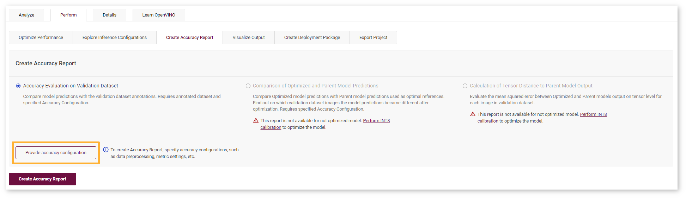
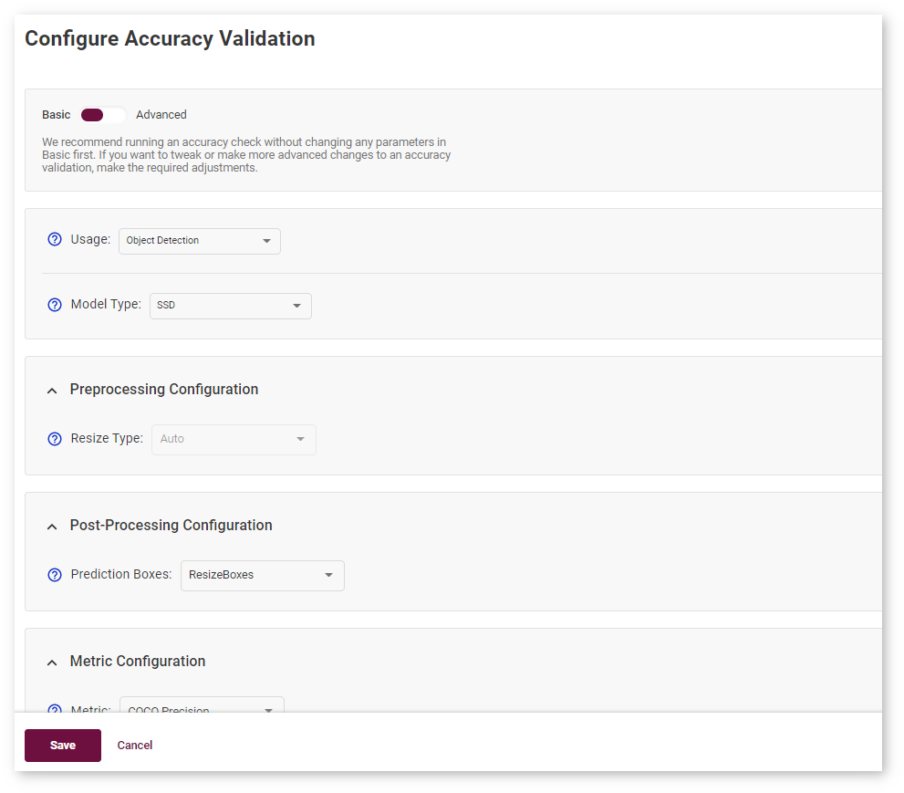
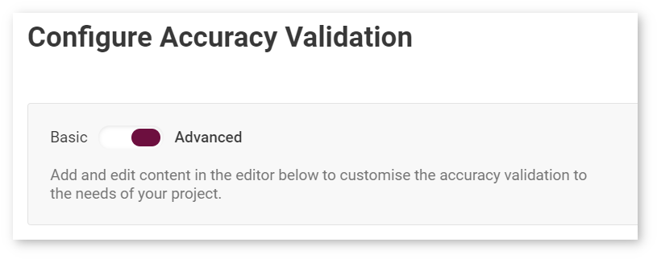
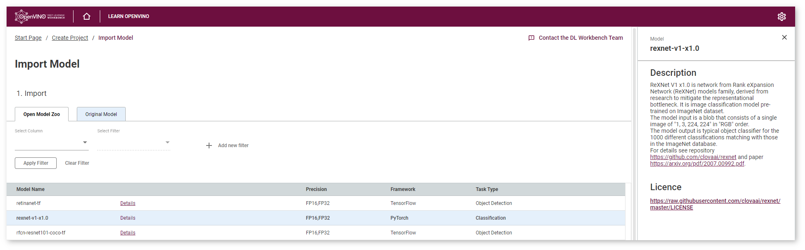
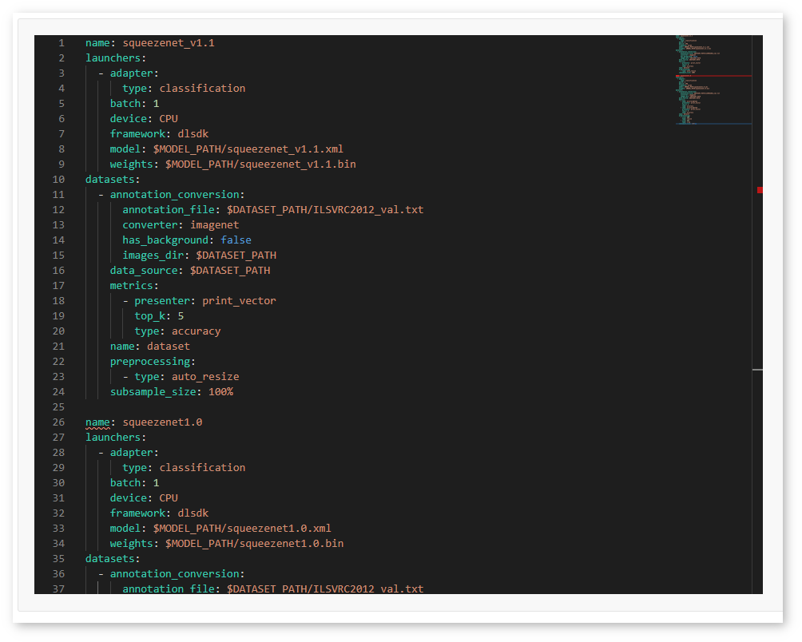
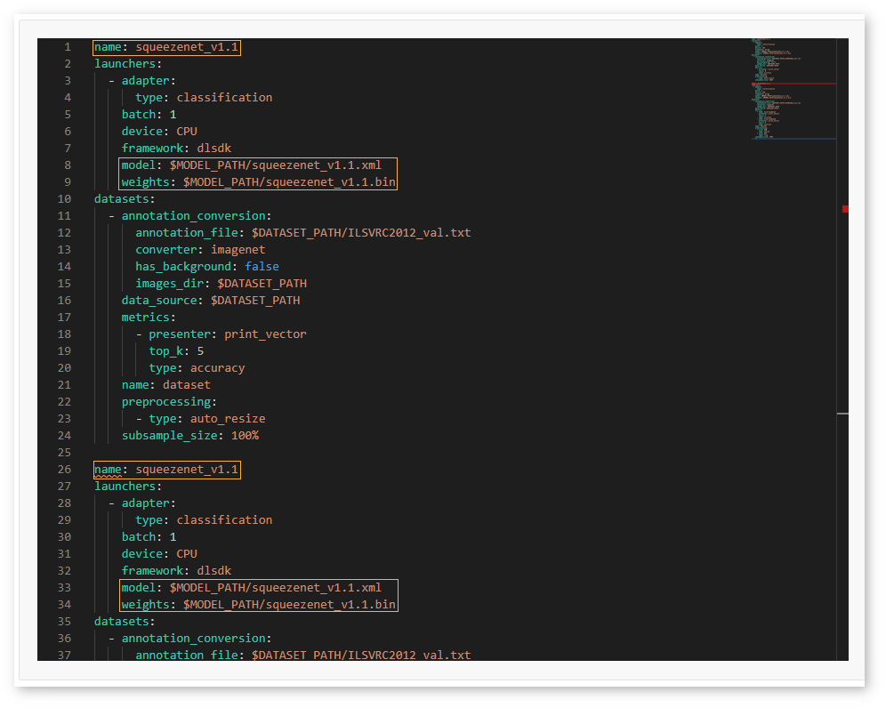
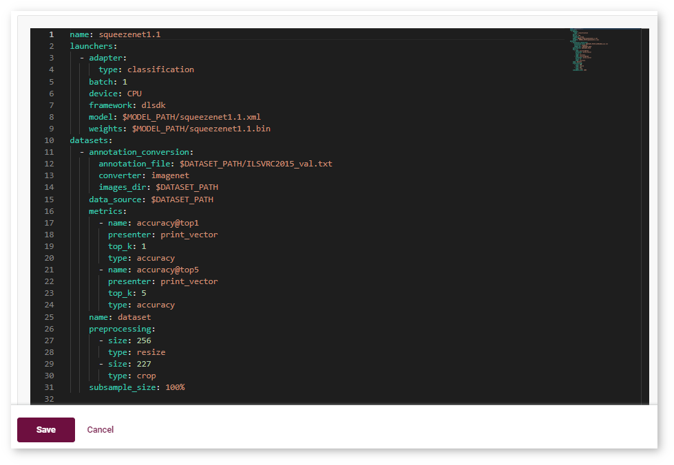
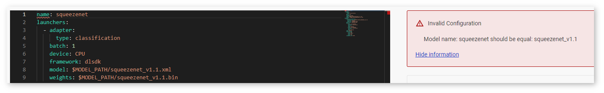
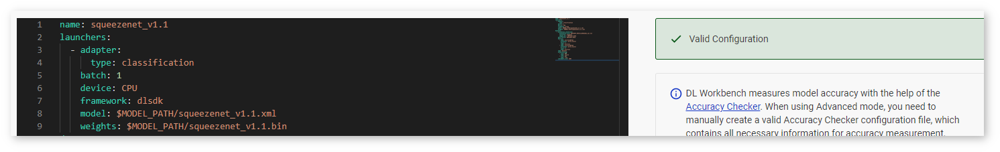

# Accuracy Configuration {#workbench_docs_Workbench_DG_Accuracy_Configuration}

To specify accuracy configuration, go to **Create Accuracy Report**, select the report type and click **Provide Accuracy Configuration** button.

The DL Workbench has two modes of accuracy settings, **Basic** and **Advanced**. 
In Basic mode, most configurations are predefined based on default settings. 
Run an accuracy check without changing any parameters in **Basic** first. 

Use <a href="#advanced">Advanced mode</a> in the following cases:
* Your model task is not listed in the **Usage** drop-down list of the Basic mode.
* You want to use additional settings to those in the Basic mode.
* You have an Accuracy Checker configuration file for your model.

## Basic Accuracy Settings

Specify the settings as described in [Set Accuracy Configuration](Configure_Accuracy_Settings.md), and click **Save**.

You will be redirected to the **Create Accuracy Report** page where you can proceed by creating the report. 

## <a name="advanced">Advanced Accuracy Settings</a>

Switch to **Advanced** under the page title:

When using Advanced mode, you need to manually create a valid Accuracy Checker configuration file in the built-in code editor.
The file should contain all necessary information for accuracy measurement, such as data
preprocessing or metric settings. You must follow the [YAML](https://docs.ansible.com/ansible/latest/reference_appendices/YAMLSyntax.html) syntax. 
For examples, see [Accuracy Checker configuration files for Open Model Zoo (OMZ) models](https://github.com/openvinotoolkit/open_model_zoo/tree/master/tools/accuracy_checker/configs). 

Follow the steps below to edit the Accuracy Checker configuration file:

**Step 1.** Find the closest model from the OMZ in terms of usage, topology, number of
inputs, and type of data required. For this, open a new tab with the DL Workbench and go
to the **Import Model** page. View models descriptions by clicking **Details**.

**Step 2.** Obtain the accuracy configuration for this similar model from the OMZ. This can be done in two ways:
  * Import this model into the DL Workbench, create a project with it and the dataset you
    use in the current project, and go to the advanced accuracy settings for this model.
  * Search for the accuracy configuration file in the [OMZ GitHub repository](https://github.com/openvinotoolkit/open_model_zoo/tree/master/tools/accuracy_checker/configs).

**Step 3.** Copy the contents of the OMZ model configuration and paste them into the code
editor. Do not override the original content of the editor.   
In the example below, the configuration of the OMZ squeezenet1.0 model configuration is
pasted on the line 26, one line after the configuration of the original squeezenet_v1.1
model (lines 1-24): 

**Step 4.** In the *copied configuration of an OMZ model*, replace the model name, paths
to the model files, and dataset information with the values you have in the *original
configuration*. Adapt other parameters if needed.  
In the example below, the configuration of the OMZ squeezenet1.0 model is adapted to the
original squeezenet_v1.1 model by changing the model name (line 26) and paths to the model
files (lines 33-34). The dataset information is not changed because the same dataset is
used.

**Step 5.** Once you have adapted the copied configuration, erase the 
*original configuration* and click **Save**. 

You will be redirected to the **Create Accuracy Report** page where you can proceed by creating the report. 

> **TIP**: A relatively low accuracy estimation can be due to incorrectly selected options in the **Advanced Configuration** form the [Set Accuracy Configuration](Configure_Accuracy_Settings.md) step. To remeasure accuracy, click the **Provide Accuracy Configuration** button and fill in the form again.

## Possible Issues

The DL Workbench instantly validates the configuration inside the editor. If something is
incorrect, the tool underlines the problematic area and displays the issue on the right to
the editor: 

When everything is correct, the tool displays the **Valid Configuration** message on the
right. This means you can run the accuracy check. 

Below are the rules that help you create a valid configuration file:

* Specify only one dataset.
* Do not add a launcher other than `dlsdk`.
* The device name should match the device that you use for your project.
* Adapter type should match the dataset type. For example, you cannot specify the
  `classification` adapter for a COCO dataset, which is used for other tasks.
* Configurations in adapter, annotation converter, metric, preprocessor, and
  post-processor fields must meet the [Accuracy Checker](https://docs.openvino.ai/latest/omz_tools_accuracy_checker.html)
  requirements.
* The paths in the configuration file should start with the `$MODEL_PATH` or
  `$DATASET_PATH` prefix. The prefixes are pointing to the model and dataset directories
  inside the DL Workbench. You are required to specify only a filename after a prefix, for
  example, `$MODEL_PATH/my_model.xml`.

---
## See Also

* [Accuracy Checker](https://docs.openvinotoolkit.org/latest/omz_tools_accuracy_checker.html)
* [Post-Training Optimization Tool](@ref pot_README)
* [Set Accuracy Configuration](Configure_Accuracy_Settings.md)
* [Troubleshooting](Troubleshooting.md)