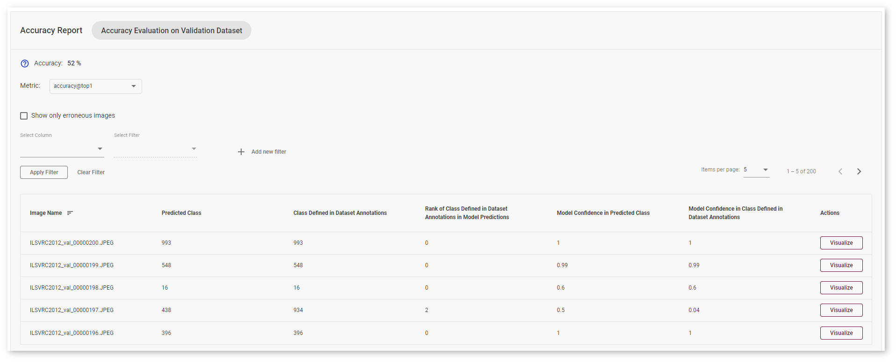

# Interpret Accuracy Report Results {#workbench_docs_Workbench_DG_Accuracy_Report_Results}

## Parent and Optimized model comparison

### Object Detection Use Case

#### Basic Mode

Each line of the report table in basic mode contains a number of detected objects in the image: **A. Optimized Model Detections**. The number of objects in Parent model predictions for the image is indicated in **B. Parent Model Detections**. If the numbers do not match, the model must be incorrect.

To assess the difference between Optimized and Parent model predictions, check **Matches between A and B**. Matches show the number of times the Optimized model detected the same location of an object as the Parent Model.

#### Advanced Mode

Each line of the report table in advanced mode contains a specific class that the model predicted for the object in the image - **Class Predicted by Optimized Model**. The number of detected objects of predicted class is represented in **A. Optimized Model Detections of Predicted Class**. The number of objects that have the same class in Parent model predictions is indicated in **B. Parent Model Detections of Predicted Class**. If the numbers do not match, the Optimized model might be incorrect.

To assess the difference between Optimized and Parent model predictions, check **Matches between A and B** and **Predicted Class Precision**. Matches show the number of times the Optimized model detected the same location of an object as the Parent Model. 

### Classification Use Case

#### Basic Mode

Each line of the table contains a specific class that the model predicted for the object in the image - **Class Predicted by Optimized Model**. You can compare this class with the **Class Predicted by Parent Model**. 

If the classes do not match, the Optimized model might be incorrect. To assess the difference between the classes, check the **Rank of Class Defined in Parent Model Predictions**. 

#### Advanced Mode

Each line of the table contains a specific class that the model predicted for the object in the image - **Class Predicted by Optimized Model**. You can compare this class with the **Class Predicted by Parent Model**. 

If the classes do not match, the Optimized model might be incorrect. To assess the difference between the classes, check the **Rank of Class Defined in Parent Model Predictions**. You can also compare optimized **Model Confidence in Class Predicted by Optimized Model** with **Optimized Model Confidence in Class Predicted by Parent Model**. This indicates the place of the class predicted by the parent model in the predictions of the optimized model. The larger the value, the more the predictions of the models diverge.

### Segmentation Use Case

#### Semantic Segmentation 

Each line of the report table in basic mode contains an **Image Name** and **Optimized Model Average Result** for all objects in the image. Advanced mode shows **Class Predicted by Optimized Model**.

Advanced mode:

#### Instance Segmentation 

##### Basic Mode

Each line of the report table in basic mode contains a number of detected objects in the image: **A. Optimized Model Detections**. The number of objects in Parent model predictions for the image is indicated in **B. Parent Model Detections**. If the numbers do not match, the model must be incorrect.

To assess the difference between Optimized and Parent model predictions, check **Matches between A and B**. Matches show the number of times the Optimized model detected the same location of an object as the Parent Model.

#####  Advanced Mode

Each line of the report table in advanced mode contains a specific class that the model predicted for the object in the image - **Class Predicted by Optimized Model**. The number of detected objects of predicted class is represented in **A. Optimized Model Detections of Predicted Class**. The number of objects that have the same class in Parent model predictions is indicated in **B. Parent Model Detections of Predicted Class**. If the numbers do not match, the Optimized model might be incorrect.

To assess the difference between Optimized and Parent model predictions, check **Matches between A and B** and **Predicted Class Precision**. Matches show the number of times the Optimized model detected the same location of an object as the Parent Model.

## Comparison with dataset annotations

### Object Detection Use Case

Each line of the table contains a specific class that the model predicted for the object in the image - **Class Predicted by Model**. 

The number of detected objects of predicted class is represented in  **A. Model Detections of Predicted Class**. The number of objects that have the same class specified in the image annotations is indicated in **B. Objects of Predicted Class in Dataset Annotations**. If the numbers do not match, the model must be incorrect.

To assess the difference between model detections and dataset annotations, check **Matches between A and B**. Matches show the number of times the model detected the location of the object as specified in the validations dataset annotations.

### Classification Use Case

Accuracy is measured on the validation dataset images. The model suggests the **Predicted Class** of the objects on images. You can compare this class with the **Class Defined in Dataset Annotations**. 

If the classes do not match, the model must be incorrect. To assess the difference between the classes, check the **Rank of Class Defined in Dataset Annotations in Model Predictions**. 

