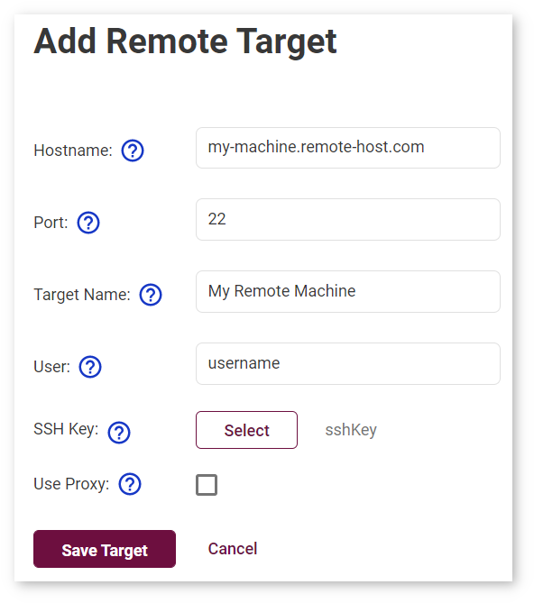
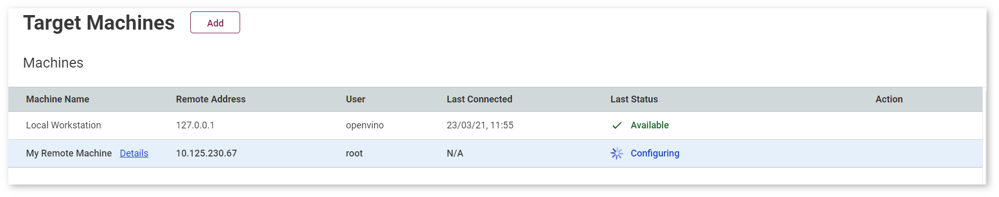
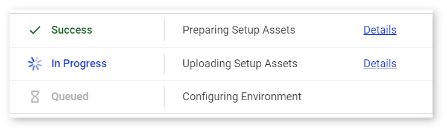
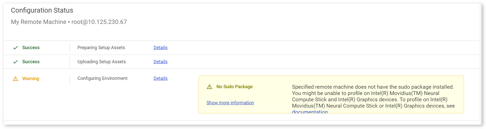
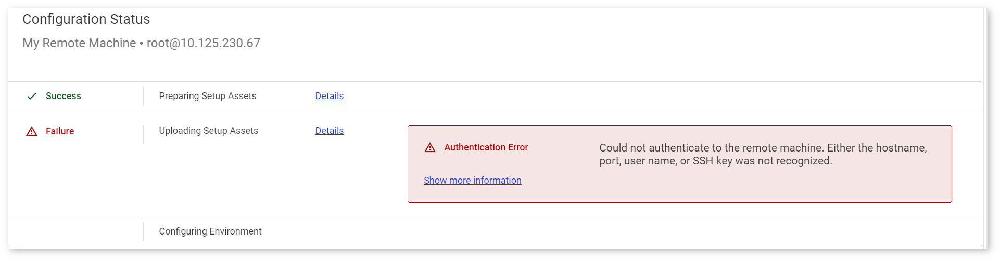

# Register Remote Target in DL Workbench {#workbench_docs_Workbench_DG_Add_Remote_Target}

[Set up your remote target](Setup_Remote_Target.md), then follow the instructions below:

**Step 1**: Go to the **Create Project** page.  
**Step 2**: Select **Add Remote Target** next to the **Environment** table.  
**Step 3**: Fill in the fields shown in the figure and table below. If you are behind a corporate proxy, select the **Use Proxy** box and provide proxy information.  

Field | Explanation
--- | ---
Hostname | Name of the host or the IP address for the remote machine. *Example: my-machine.remote-host.com*
Port | Port for the SSH connection to the remote machine. *Default: 22*
Target Name | Alias name of the remote machine in the DL Workbench. *Example: My Machine*
User | User name for the passwordless SSH connection to the remote machine. If you use GPU or MYRIAD devices, sudo privileges for the user are required. *Example: root*
SSH Key| Private SSH key for authenticated connection to the remote machine. It is generated with the public key that you copy to the remote machine.
HTTP, HTTPS Proxy Hostname | Hostname or IP address for the proxy server connection. Required if the remote machine is behind a proxy.
HTTP, HTTPS Proxy Port | Port for the proxy server connection. Required if the remote machine is behind a proxy.
Proxy-server Username | User name for the proxy server connection. Required if your proxy server uses a password.
Proxy-server Password | Password for the proxy server connection. Required if your proxy server uses a password.

**Step 4**: Click **Add**. The machine is listed to the **Target Machines** table with a status of **Configuring**:

The **Configuration Status** and **Connection Status** tables show you the configuration progress. Click **Details** to review a log at each stage.

See [Troubleshooting](Troubleshooting.md) to address a **Warning** or **Failure**:
	
* **Warning** indicates issues that might limit your actions. Warnings do not prevent work with remote targets. Refer to [Troubleshooting](Troubleshooting.md) to fix an issue: 

**Failure** indicates issues that prevent using the remote target. Refer to [Troubleshooting](Troubleshooting.md) to fix an issue:

---
## See Also

* [Work with Remote Targets](Remote_Profiling.md)
* [Manipulate Remote Machines](Remote_Machines.md)
* [Profile on a Remote Machine](Profile_on_Remote_Machine.md)
* [Troubleshooting](Troubleshooting.md)