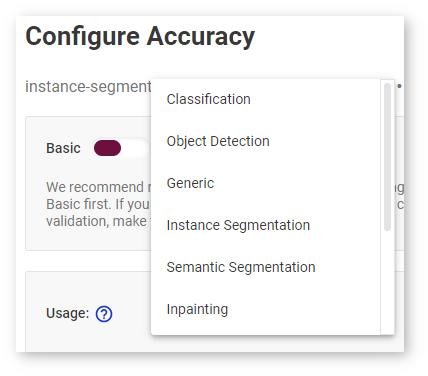
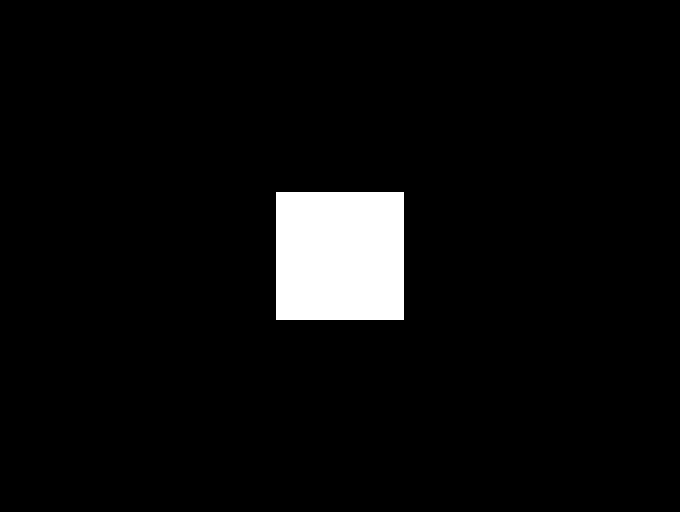
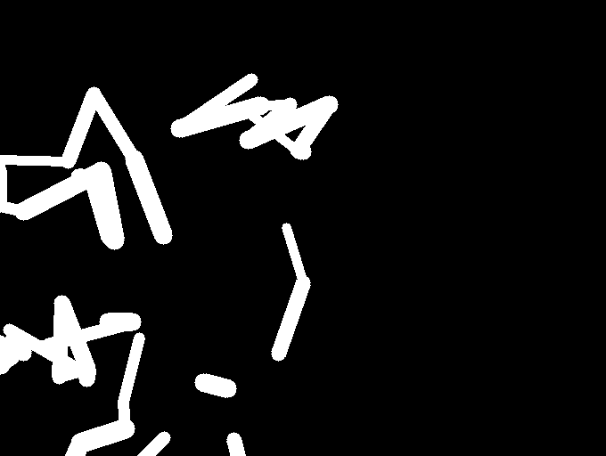

# Set Accuracy Configuration {#workbench_docs_Workbench_DG_Configure_Accuracy_Settings}

To get an adequate accuracy number, you need to correctly set accuracy configuration. Accuracy parameters depend on the model task type. To set accuracy configuration, click **Provide accuracy configuration** button in the **Create Accuracy Report** table or in the settings from the INT8 calibration tab before the
optimization process or accuracy report creation. Once you have specified your parameters, you are directed back to your previous page, either the **Create Accuracy Report** table or the **INT8** tab. 

Accuracy settings depend on the model usage. Choose the usage-specific instructions from the list below:
* <a href="#classification">Classification</a>
* <a href="#OD_SSD">Object Detection SSD</a>
* <a href="#OD_YOLO">Object Detection YOLO V2 and YOLO Tiny V2</a>
* <a href="#instance_segmentation">Instance Segmentation</a>
* <a href="#semantic_segmentation">Semantic Segmentation</a>
* <a href="#inpainting">Image Inpainting</a>
* <a href="#super_resolution">Super-Resolution</a>
* <a href="#style_transfer">Style Transfer</a>
* <a href="#landmark_detection">Facial Landmark Detection</a>
* <a href="#face_recognition">Face Recognition</a>

> **Limitations**: 
> * DL Workbench does not support multi-input models, so make sure to use
> a single-input model. You can choose and download one of the Intel® 
> [Open Model Zoo](@ref omz_models_group_intel) models directly in the tool.
> * Accuracy parameters of models from Intel® Open Model Zoo are already configured. You
> cannot change accuracy configurations for these models.

> **Possible problems with accuracy**:
> * AccuracyAware optimization method that is used to measure accuracy is impossible to
> apply to certain model types, for example, language models. If you see an error message
> when trying to calibrate such a model, return to the **Calibration Options** page and
> select the **Default** method.
> * Accuracy close to zero may appear due to incorrectly configured parameters. Often
> users make mistakes when setting parameters such as *Color space*, *Normalization
> scales*, or *Normalization means* in the **Conversion Settings** before importing the
> model.

## <a name="classification">Classification</a>

Specify **Classification** in the drop-down list in the **Accuracy Settings**:
 

### Preprocessing Configuration

[Preprocessing configuration](@ref omz_tools_accuracy_checker_preprocessor) parameters define how to process images prior to inference with a model.

Parameter | Values | Explanation 
--- |---- | ---
Resize type|**Auto** (default)|  Automatically scale images to the model input shape using the OpenCV\* library.
Normalization: mean |[0; 255]| *Optional.* The values to be subtracted from the corresponding image channels. Available for input with three channels only. 
Normalization: standard deviation |[0; 255]| *Optional.* The values to divide image channels by. Available for input with three channels only.

### Metric Configuration  

[Metric parameters](@ref omz_tools_accuracy_checker_metrics) specify rules to test inference results against reference values.

Parameter | Values | Explanation | Units of measurement | Details
---| :---: |--- |--- |---
Metric| **Accuracy** (default)|The rule that is used to compare inference results of a model with reference values. Classification accuracy metric is defined as the number of correct predictions divided by the total number of predictions. The output for a specific image is considered correct if the expected class is included into top K predictions of the model. | Percentage | [Details](https://developers.google.com/machine-learning/crash-course/classification/accuracy)
Top K|[1; 100]|The number of top predictions among which the correct class is searched for | N/A | [Details](https://developers.google.com/machine-learning/crash-course/classification/accuracy)

### Annotation Conversion Configuration

[Annotation conversion parameters](@ref omz_tools_accuracy_checker_annotation_converters) define conversion of a dataset annotation.

Parameter | Values | Explanation 
---| :---: | ---
Separate background class|Yes No| Select *Yes* if your model was trained on a dataset with background as an additional class. Usually the index of this class is 0.

## <a name="OD_SSD">Object Detection Single-Shot multibox Detection (SSD)</a>

Specify **Object Detection** in the drop-down list in the **Accuracy Settings**:
 
Then specify SSD in the **Model Type** box that opens below.

### Preprocessing Configuration

[Preprocessing configuration](@ref omz_tools_accuracy_checker_preprocessor) parameters define how to process images prior to inference with a model.

Parameter | Values | Explanation 
---| :---: | ---
Resize type|**Auto** (default)|  Automatically scale images to the model input shape using the OpenCV library.
Normalization: mean |[0; 255]| *Optional.* The values to be subtracted from the corresponding image channels. Available for input with three channels only. 
Normalization: standard deviation |[0; 255]| *Optional.* The values to divide image channels by. Available for input with three channels only. 

### Post-Processing Configuration  

[Post-processing](@ref omz_tools_accuracy_checker_postprocessor) parameters define how to process prediction values and/or annotation data after inference and before metric calculation. 

Parameter | Values | Explanation 
---| :---: | ---
 Prediction boxes|None  ResizeBoxes   ResizeBoxes-NMS| Resize boxes or apply Non-Maximum Suppression (NMS) to make sure that detected objects are identified only once.

### Metric Configuration  

[Metric parameters](@ref omz_tools_accuracy_checker_metrics) specify rules to test inference results against reference values.

Parameter | Values | Explanation | Units of measurement | Details
---| :---: |--- |--- |---
Metric| mAP|The rule that is used to compare inference results of a model with reference values. Mean average precision (mAP) is calculated by first finding the sum of average precisions of all classes and then dividing the sum by the number of classes. | Percentage | [Details](https://en.wikipedia.org/wiki/Evaluation_measures_(information_retrieval)#Mean_average_precision)
Metric| COCO Precision|The rule that is used to compare inference results of a model with reference values. COCO average precision metric is calculated by averaging precisions of all classes over Intersection over Union (IoU) values in the range from *0.50* to *0.95* with the step *0.05*. For keypoints recognition and object detection tasks, the metric is computed using bounding boxes of objects. | Percentage | [Details](https://towardsdatascience.com/breaking-down-mean-average-precision-map-ae462f623a52)
Overlap threshold|[0; 1]| *COCO precision specific.* Minimal value for IoU to qualify that a detected bounding box coincides with a ground truth bounding box | N/A| [Details](https://towardsdatascience.com/breaking-down-mean-average-precision-map-ae462f623a52)
Integral|Max 11 Point| *COCO precision specific.* Integral type to calculate average precision| N/A| [Details](https://towardsdatascience.com/breaking-down-mean-average-precision-map-ae462f623a52)
Max Detections | Positive Integer | *mAP-specific.* Maximum number of predicted results per image. If you have more predictions, results with minimum confidence are ignored.| N/A| [Details](https://en.wikipedia.org/wiki/Evaluation_measures_(information_retrieval)#Mean_average_precision)

### Annotation Conversion Configuration

[Annotation conversion parameters](@ref omz_tools_accuracy_checker_annotation_converters) define conversion of a dataset annotation.

Parameter | Values | Explanation 
---| :---: | ---
Separate background class|Yes No| Select *Yes* if your model was trained on a dataset with background as an additional class. Usually the index of this class is 0.
**Predictions are mapped to:**|80 COCO classes 91 COCO classes| *For COCO datasets only.* Specify whether your model was trained on a dataset with 80 or 91 COCO classes.

## <a name="OD_YOLO">Object Detection You Only Look Once (YOLO) V2 and YOLO Tiny V2</a>

Specify **Object Detection** in the drop-down list in the **Accuracy Settings**:
 
Then specify YOLO V2 or YOLO Tiny V2 in the **Model Type** box that opens below.

> **NOTE**: YOLO models of other versions, like YOLO V3 or YOLO V5, are not supported.

### Preprocessing Configuration

[Preprocessing configuration](@ref omz_tools_accuracy_checker_preprocessor) parameters define how to process images prior to inference with a model.

Parameter | Values | Explanation 
---| :---: | ---
Resize type|**Auto** (default)|  Automatically scale images to the model input shape using the OpenCV library.
Normalization: mean |[0; 255]| *Optional.* The values to be subtracted from the corresponding image channels. Available for input with three channels only. 
Normalization: standard deviation |[0; 255]| *Optional.* The values to divide image channels by. Available for input with three channels only. 

### Post-Processing Configuration  

[Post-processing](@ref omz_tools_accuracy_checker_postprocessor) parameters define how to process prediction values and/or annotation data after inference and before metric calculation. 

Parameter | Values | Explanation 
---| :---: | ---
Prediction boxes|None  ResizeBoxes  ResizeBoxes-NMS| Resize boxes or apply Non-Maximum Suppression (NMS) to make sure that detected objects are identified only once.
NMS overlap|[0; 1]| Non-maximum suppression overlap threshold to merge detections

### Metric Configuration  

[Metric parameters](@ref omz_tools_accuracy_checker_metrics) specify rules to test inference results against reference values.

Parameter | Values | Explanation | Units of measurement | Details
---| :---: |--- |--- |---
 Metric| mAP|The rule that is used to compare inference results of a model with reference values. Mean average precision (mAP) is calculated by first finding the sum of average precisions of all classes and then dividing the sum by the number of classes.| Percentage | [Details](https://en.wikipedia.org/wiki/Evaluation_measures_(information_retrieval)#Mean_average_precision)
 Metric| COCO Precision|The rule that is used to compare inference results of a model with reference values. COCO average precision metric is calculated by averaging precisions of all classes over Intersection over Union (IoU) values in the range from *0.50* to *0.95* with the step *0.05*. For keypoints recognition and object detection tasks, the metric is computed using bounding boxes of objects. | Percentage | [Details](https://towardsdatascience.com/breaking-down-mean-average-precision-map-ae462f623a52)
 Overlap threshold|[0; 1]| *COCO precision specific.* Minimal value for IoU to qualify that a detected bounding box coincides with a ground truth bounding box | N/A | [Details](https://towardsdatascience.com/breaking-down-mean-average-precision-map-ae462f623a52)
 Integral|Max 11 Point| *COCO precision specific.* Integral type to calculate average precision | N/A | [Details](https://towardsdatascience.com/breaking-down-mean-average-precision-map-ae462f623a52)
 Max Detections | Positive Integer | *mAP-specific.* Maximum number of predicted results per image. If you have more predictions, results with minimum confidence are ignored.| N/A | [Details](https://en.wikipedia.org/wiki/Evaluation_measures_(information_retrieval)#Mean_average_precision)

### Annotation Conversion Configuration

[Annotation conversion parameters](@ref omz_tools_accuracy_checker_annotation_converters) define conversion of a dataset annotation.

Parameter | Values | Explanation 
---| :---: | ---
Separate background class|Yes No| Select *Yes* if your model was trained on a dataset with background as an additional class. Usually the index of this class is 0.
**Predictions are mapped to:**|80 COCO classes 91 COCO classes| *For COCO datasets only.* Specify whether your model was trained on a dataset with 80 or 91 COCO classes.

## <a name="instance_segmentation">Instance Segmentation</a>

DL Workbench supports only TensorFlow\* and ONNX\* instance
segmentation models. ONNX instance segmentation models have different output layers for masks,
boxes, predictions, and confidence scores, while TensorFlow ones have a layer for masks and a layer
for boxes, predictions, and confidence scores. 

Example of an ONNX instance segmentation model: [instance segmentation-security-0002](https://github.com/openvinotoolkit/open_model_zoo/tree/develop/models/intel/instance-segmentation-security-0002)  
Example of a TensorFlow instance segmentation model: [Mask R-CNN](https://github.com/matterport/Mask_RCNN)

Specify **Instance Segmentation** in the drop-down list in the **Accuracy Settings**:
 

### Adapter Parameters

[Adapter parameters](@ref omz_tools_accuracy_checker_adapters) define
conversion of inference results into a metrics-friendly format.

Parameter | Values | Explanation 
---| :---: | ---
 Input info layer|`im_info` `im_data`|Name of the layer with image metadata, such as height, width, and depth
 Output layer: Masks|boxes classes raw_masks scores| *TensorFlow-specific parameter.* Boxes coordinates, predictions, and confidence scores for detected objects
 Output layer: Boxes|boxes classes raw_masks scores| *ONNX-specific parameter.* Boxes coordinates for detected objects
 Output layer: Classes|boxes classes raw_masks scores| *ONNX-specific parameter.* Predictions for detected objects
 Output layer: Scores|boxes classes raw_masks scores| *ONNX-specific parameter.* Confidence score for detected objects

### Preprocessing Configuration

[Preprocessing configuration](@ref omz_tools_accuracy_checker_preprocessor) parameters define how to process images prior to inference with a model.

Parameter | Values | Explanation 
---| :---: | ---
Resize type|**Auto** (default)| Automatically scale images to the model input shape using the OpenCV library.
Normalization: mean |[0; 255]| *Optional.* The values to be subtracted from the corresponding image channels. Available for input with three channels only. 
Normalization: standard deviation |[0; 255]| *Optional.* The values to divide image channels by. Available for input with three channels only. 

### Metric Configuration  

[Metric parameters](@ref omz_tools_accuracy_checker_metrics) specify rules to test inference results against reference values.

Parameter | Values | Explanation | Units of measurement | Details
---| :---: |--- |--- |---
Metric| **COCO Segmentation Precision** (default)| The rule that is used to compare inference results of a model with reference values. COCO average precision metric for keypoints recognition and object detection tasks is calculated using masks of objects. | Percentage | [Details](https://towardsdatascience.com/breaking-down-mean-average-precision-map-ae462f623a52)
Threshold start|0.5| Lower threshold of the intersection over union (IoU) value | N/A | [Details](https://towardsdatascience.com/breaking-down-mean-average-precision-map-ae462f623a52)
Threshold step|0.05| Increment in the intersection over union (IoU) value | N/A | [Details](https://towardsdatascience.com/breaking-down-mean-average-precision-map-ae462f623a52)
Threshold end|0.95| Upper threshold of the intersection over union (IoU) value | N/A | [Details](https://towardsdatascience.com/breaking-down-mean-average-precision-map-ae462f623a52)

### Annotation Conversion Configuration

[Annotation conversion parameters](@ref omz_tools_accuracy_checker_annotation_converters) define conversion of a dataset annotation.

Parameter | Values | Explanation 
---| :---: | ---
Separate background class|Yes No| Select *Yes* if your model was trained on a dataset with background as an additional class. Usually the index of this class is 0.

## <a name="semantic_segmentation">Semantic Segmentation</a>

Specify **Semantic Segmentation** in the drop-down list in the **Accuracy Settings**:
 

### Preprocessing Configuration

[Preprocessing configuration](@ref omz_tools_accuracy_checker_preprocessor) parameters define how to process images prior to inference with a model.

Parameter | Values | Explanation 
---| :---: | ---
Resize type|**Auto** (default)|  Automatically scale images to the model input shape using the OpenCV library.
Normalization: mean |[0; 255]| *Optional.* The values to be subtracted from the corresponding image channels. Available for input with three channels only. 
Normalization: standard deviation |[0; 255]| *Optional.* The values to divide image channels by. Available for input with three channels only. 

### Post-Processing Configuration  

[Post-processing](@ref omz_tools_accuracy_checker_postprocessor) parameters define how to process prediction values and/or annotation data after inference and before metric calculation. 

Parameter | Values | Explanation 
---| :---: | ---
 Segmentation mask encoding|**Annotation** (default)| Transfer mask colors to class labels using the color mapping from metadata in the annotation of a dataset.
 Segmentation mask resizing|**Prediction** (default)| Resize the model output mask to initial image dimensions.

### Metric Configuration  

[Metric parameters](@ref omz_tools_accuracy_checker_metrics) specify rules to test inference results against reference values.

Parameter | Values | Explanation | Units of measurement | Details
---| :---: |--- |--- |---
 Metric| **Mean IoU** (default)| The rule that is used to compare inference results of a model with reference values. Mean Intersection-over-Union (mean IoU) has many flavors. For semantic segmentation, it is calculated by first computing the IoU for each semantic class and then computing the average over classes. | Percentage| [Details](https://www.pyimagesearch.com/2016/11/07/intersection-over-union-iou-for-object-detection/)
 Argmax| **On**  (default)| Argmax is applied because the model does not perform it internally. Argmaxing is required for accuracy measurements. | N/A| [Details](https://www.pyimagesearch.com/2016/11/07/intersection-over-union-iou-for-object-detection/)

### Annotation Conversion Configuration 

[Annotation conversion parameters](@ref omz_tools_accuracy_checker_annotation_converters) define conversion of a dataset annotation.

Parameter | Values | Explanation 
---| :---: | ---
Separate background class|Yes No| Select *Yes* if your model was trained on a dataset with background as an additional class. Usually the index of this class is 0.
**Predictions are mapped to:**|80 COCO classes 91 COCO classes| *For COCO datasets only.* Specify whether your model was trained on a dataset with 80 or 91 COCO classes.

## <a name="inpainting">Image Inpainting</a>

Specify **Image Inpainting** in the drop-down list in the **Accuracy Settings**:
 

### Preprocessing Configuration

[Preprocessing configuration](@ref omz_tools_accuracy_checker_preprocessor) parameters define how to process images prior to inference with a model.

Two types of masks can be applied to your image to measure its accuracy: rectangle and free form. Based on a masking type, you have two choose different sets of preprocessing parameters.

@sphinxdirective
.. raw:: html

    

@endsphinxdirective

The rectangle means that there is a rectangle of specified with and height applied to the middle of the image. Example of the rectangle masking:

@sphinxdirective
.. raw:: html

    

@endsphinxdirective

@sphinxdirective
.. raw:: html

    

@endsphinxdirective

The free-form masking means separate lines of specified lengths, widths, and vertex numbers.
Example of the free-form masking:

@sphinxdirective
.. raw:: html

    

@endsphinxdirective

Parameter | Values | Explanation 
---| :---: | ---
Resize type|**Auto** (default)|  Automatically scale images to the model input shape using the OpenCV library.
 Mask type|Rectangle  Free-form| The shape of the mask cut from an original model
 Mask width|Positive integer| *For rectangle masking.* The rectangle width in pixels
 Mask height|Positive integer| *For rectangle masking.* The rectangle height in pixels
 Number of parts|Positive integer| *For free-form masking.* The number of autogenerated forms which will be cut from an original image
Maximum brush width |Positive integer| *For free-form masking.* The width of a form line in pixels
Maximum length |Positive integer| *For free-form masking.* The maximum length of a form edge in pixels
Maximum vertex count |Positive integer greater than 2| *For free-form masking.* The maximum number of the vertices of a form
Inverse mask|Yes No| If your model uses inverse masking, reset it to regular masking by checking *Yes*.
Normalization: mean |[0; 255]| *Optional.* The values to be subtracted from the corresponding image channels. Available for input with three channels only. 
Normalization: standard deviation |[0; 255]| *Optional.* The values to divide image channels by. Available for input with three channels only. 

### Metric Configuration  

[Metric parameters](@ref omz_tools_accuracy_checker_metrics) specify rules to test inference results against reference values.

Parameter | Values | Explanation | Units of measurement | Details
---| :---: |--- |--- |---
Metric| SSIM| The rule that is used to compare inference results of a model with reference values. The structural similarity index measure (SSIM) is used to assess similarity between two images.| Percentage | [Details](https://en.wikipedia.org/wiki/Structural_similarity)
Metric| PSNR| The rule that is used to compare inference results of a model with reference values. Peak signal-to-noise ratio (PSNR) is used as a quality measurement between the original and a modified image. Higher PSNR value means better quality of a modified image. | Decibel | [Details](https://www.ni.com/en-ie/innovations/white-papers/11/peak-signal-to-noise-ratio-as-an-image-quality-metric.html)

## <a name="super_resolution">Super-Resolution</a>

Specify **Super-Resolution**
in the drop-down list in the **Accuracy Settings**:
 

### Preprocessing Configuration

[Preprocessing configuration](@ref omz_tools_accuracy_checker_preprocessor) parameters define how to process images prior to inference with a model.

Parameter | Values | Explanation 
---| :---: | ---
Resize type|**Auto** (default)|  Automatically scale images to the model input shape using the OpenCV library.
Normalization: mean |[0; 255]| *Optional.* The values to be subtracted from the corresponding image channels. Available for input with three channels only. 
Normalization: standard deviation |[0; 255]| *Optional.* The values to divide image channels by. Available for input with three channels only. 

### Annotation Conversion Configuration

[Annotation conversion parameters](@ref omz_tools_accuracy_checker_annotation_converters) define conversion of a dataset annotation.

Parameter | Values | Explanation 
---| :---: | ---
Two streams | **Yes** (default) No| Specifies whether the selected model has the second input for the upscaled image.

## <a name="style_transfer">Style Transfer</a>

Specify **Style Transfer**
in the drop-down list in the **Accuracy Settings**:
 

### Preprocessing Configuration

[Preprocessing configuration](@ref omz_tools_accuracy_checker_preprocessor) parameters define how to process images prior to inference with a model.

Parameter | Values | Explanation 
---| :---: | ---
Resize type|**Auto** (default)|  Automatically scale images to the model input shape using the OpenCV library.
Normalization: mean |[0; 255]| *Optional.* The values to be subtracted from the corresponding image channels. Available for input with three channels only. 
Normalization: standard deviation |[0; 255]| *Optional.* The values to divide image channels by. Available for input with three channels only. 

### Metric Configuration  

[Metric parameters](@ref omz_tools_accuracy_checker_metrics) specify rules to test inference results against reference values.

Parameter | Values | Explanation | Units of measurement | Details
---| :---: |--- |--- |---
Metric| SSIM| The rule that is used to compare inference results of a model with reference values. The structural similarity index measure (SSIM) is used to assess similarity between two images. | Percentage| [Details](https://en.wikipedia.org/wiki/Structural_similarity)
Metric| PSNR| The rule that is used to compare inference results of a model with reference values. Peak signal-to-noise ratio (PSNR) is used as a quality measurement between the original and a modified image. Higher PSNR value means better quality of a modified image. | Decibel | [Details](https://www.ni.com/en-ie/innovations/white-papers/11/peak-signal-to-noise-ratio-as-an-image-quality-metric.html)

## <a name="landmark_detection">Facial Landmark Detection</a>

Specify **Facial Landmark Detection** in the drop-down list in the **Accuracy Settings**:
 

### Preprocessing Configuration

[Preprocessing configuration](@ref omz_tools_accuracy_checker_preprocessor) parameters define how to process images prior to inference with a model.
Parameter | Values | Explanation 
--- |---- | ---
Resize type|**Auto** (default)|  Automatically scale images to the model input shape using the OpenCV\* library.

### Post-Processing Configuration 

[Post-processing](@ref omz_tools_accuracy_checker_postprocessor) parameters define how to process prediction values and/or annotation data after inference and before metric calculation. 

Parameter | Values | Explanation 
---| :---: | ---
Landmark Processing|**Normalize** (default)| As a rule, a model outputs landmark coordinates in the range [0,1], while the original coordinates in a dataset correspond to the image size. To avoid mismapping, the Accuracy Checker normalizes landmark coordinates in annotations by dividing the coordinates by the image size, that is *x* is divided by *width*, and *y* is divided by *height*. 

### Metric Configuration

[Metric parameters](@ref omz_tools_accuracy_checker_metrics) specify rules to test inference results against reference values.

Parameter | Values | Explanation | Units of measurement | Details
---| :---: |--- |--- |---
 Metric| **Normed Error** (default)| The rule that is used to compare inference results of a model with reference values. Normed error measures the quality of landmark positions. | Percentage | [Details](https://github.com/openvinotoolkit/open_model_zoo/tree/master/models/intel/facial-landmarks-35-adas-0002)

## <a name="face_recognition">Face Recognition</a>

Specify **Face Recognition** in the drop-down list in the **Accuracy Settings**:
 

### Preprocessing Configuration

[Preprocessing configuration](@ref omz_tools_accuracy_checker_preprocessor) parameters define how to process images prior to inference with a model.
Parameter | Values | Explanation 
--- |---- | ---
Resize type|**Auto** (default)|  Automatically scale images to the model input shape using the OpenCV\* library.

### Metric Configuration

[Metric parameters](@ref omz_tools_accuracy_checker_metrics) specify rules to test inference results against reference values.

Parameter | Values | Explanation | Units of measurement | Details
---| :---: |--- |--- |---
 Metric| **Pairwise Subsets** (default)| The rule that is used to compare inference results of a model with reference values. To compute pairwise accuracy, a dataset is first split into N subsets and for each subset a pairwise comparison metric is found, then  the average metric across all subsets is calculated. | Percentage | [Details](https://stackoverflow.com/questions/60504959/how-to-calculate-lfw-accuracy-of-a-face-recognition-model)
 Subset Count|[2;999]| The number of subsets N depends on the number of images M. If there are subsets that have a single image, value of the whole metric might be inadequate. Make sure to select N great enough for each subset to have at least two images. In other words, N should be not greater than M/2. | N/A| [Details](https://stackoverflow.com/questions/60504959/how-to-calculate-lfw-accuracy-of-a-face-recognition-model) 

---
## See Also

* [Measure Accuracy](Measure_Accuracy.md)
* [Accuracy Checker Tool](@ref omz_tools_accuracy_checker)
* [Troubleshooting](Troubleshooting.md)

