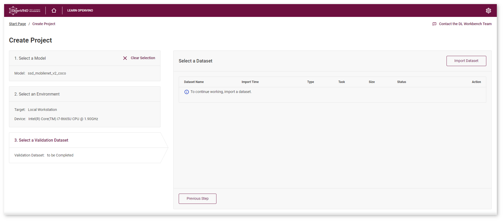
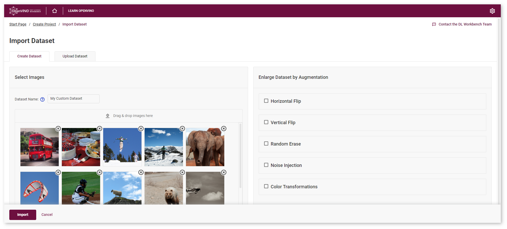
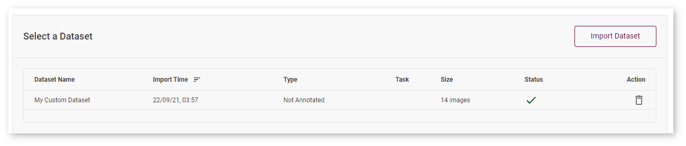
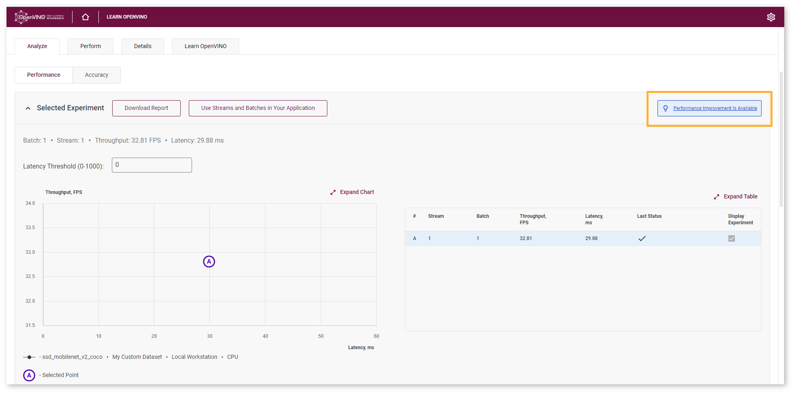

# Create Project {#workbench_docs_Workbench_Create_Project}

This is the second part of [Get Started with DL Workbench](Work_with_Models_and_Sample_Datasets.md) guide.
Create a project to get the most out of DL Workbench functionality: evaluate model performance and accuracy, optimize the model and prepare it for deployment. A project is a combination of a model, dataset, target machine, and device that you use to run experiments in the DL Workbench.

## Import Model

Before creating a project, you need to have a model imported in DL Workbench. The process is described in the previous part: [Import Model](Select_Model.md). This section partly follows the workflow described in the Create Project video. 

@sphinxdirective

.. list-table::

   * - .. raw:: html

           <iframe  allowfullscreen mozallowfullscreen msallowfullscreen oallowfullscreen webkitallowfullscreen height="315" width="560"
           src="https://www.youtube.com/embed/gzUFYxomjn8">
           </iframe>
   * - **Get Started with the DL Workbench**. Duration: 8:27
     
@endsphinxdirective

## Select Environment

Target is a machine that hosts one or several accelerators. Device is a hardware accelerator on which a model is executed. By default, your Local Target is selected. If you want to learn detailed information about different environment configurations, see the [Select Environment](Select_Environment.md) page. If you have a remote machine, you can learn how to register and work with it at the [Remote Target](https://docs.openvinotoolkit.org/latest/workbench_docs_Workbench_DG_Remote_Profiling.html) documentation page. 

## Import Dataset

Validation datasets can be either annotated or not annotated. This document, unlike the Create Project video, describes how to import not annotated dataset. If you want to learn about importing annotated datasets, see the [Obtain Datasets](Import_Datasets.md) page. 

On the **Create Project** page, go to the **Select a Validation Dataset** tab and click **Import Dataset**:

You will see the **Create Dataset** page where you can add your own images and specify the dataset name:

> **NOTE**: Not annotated dataset cannot be used to measure accuracy of your models. If measuring accuracy and accuracy related tasks are critical for you, it is recommended to import an annotated dataset.

After clicking **Import**, you are redirected to the **Create Project** page where you can check the import status and proceed by creating a project.

## Measure Performance

Make sure you have selected all the necessary elements of the project.

At the bottom of the page click **Create Project** to measure the model performance. Once this stage is complete, the **Projects** page opens automatically. 

Now you can successfully proceed to explore different DL Workbench features. 

## Next Step: Analyze Performance

Scroll to the **Analyze** tab, where you can see the performance improvement tip. 

One of the recommended ways to accelerate your model performance is to perform 8-bit integer (INT8) calibration. A model in INT8 precision takes up less memory and has higher throughput capacity. Often this performance boost is achieved at the cost of a small accuracy reduction. 

Congratulations, you have completed the Get Started tutorial. Your next step is to [Optimize Model Performance](https://docs.openvino.ai/latest/workbench_docs_Workbench_DG_Int_8_Quantization.html). 

*All images were taken from ImageNet, Pascal Visual Object Classes, and Common Objects in Context datasets for demonstration purposes only.*

## See Also

* [Next Step: Optimize Model Performance](https://docs.openvino.ai/latest/workbench_docs_Workbench_DG_Int_8_Quantization.html)
* [Work with Annotated Datasets](https://docs.openvinotoolkit.org/latest/workbench_docs_Workbench_DG_Generate_Datasets.html)
* [Work with Remote Target](https://docs.openvinotoolkit.org/latest/workbench_docs_Workbench_DG_Remote_Profiling.html)
