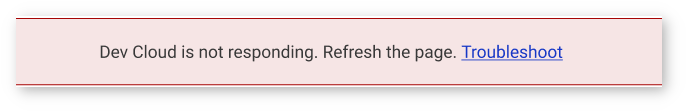
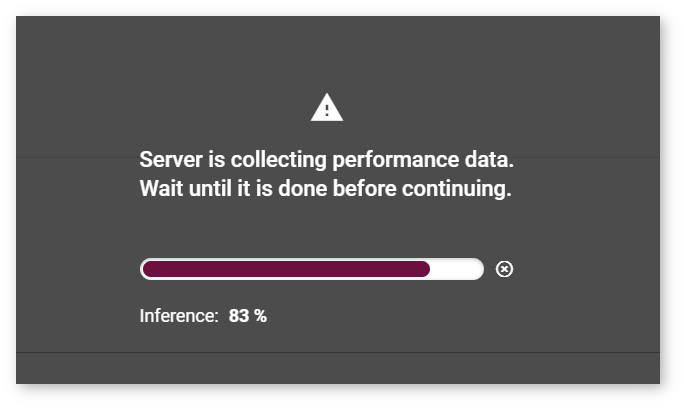
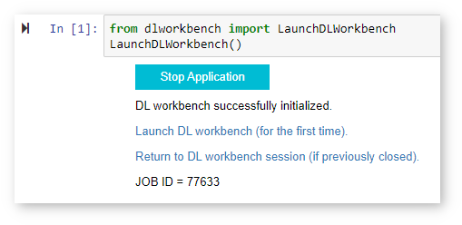
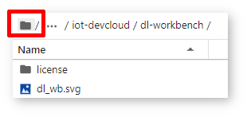
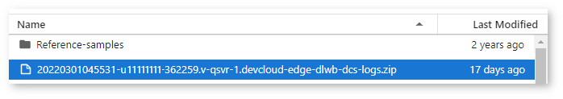
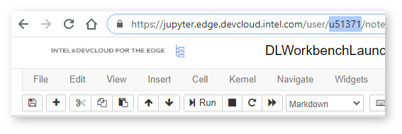

# Troubleshooting for DL Workbench in the Intel® DevCloud for the Edge {#workbench_docs_Workbench_DG_DC_Troubleshooting}

If you encounter an issue when running the DL Workbench, follow the steps below:
1. Refresh the page.
2. If it does not help, search for the solution among the issues listed on this page.
3. If you could not find the issue on this page or the proposed solution did not work for
   you, <a href="#report-devcloud">report the issue to the DevCloud forum</a>.

## Most Frequent Issues

- <a href="#not-responding">Intel® DevCloud for the Edge is not responding</a>
- <a href="#hanging">Server is collecting performance data for too long</a>
- <a href="#session">DL Workbench session in the DevCloud is over</a>
- <a href="#blocked-tab">Cannot open the DL Workbench tab from the DevCloud menu</a>
- <a href="#login">Cannot log in to the DL Workbench in the DevCloud after a logout</a>
- <a href="#closed-tab">Accidentally closed the DL Workbench tab in the DevCloud</a>

### <a name="not-responding">Intel® DevCloud for the Edge Is Not Responding</a>

When you see the message as in the image below:

1. Refresh the page. 
2. If it does not help, start a new DL Workbench session as described in the 
   **Start a New DL Workbench Session in the Intel® DevCloud for the Edge** 
   section of [Run DL Workbench in the DevCloud](Start_DL_Workbench_in_DevCloud.md). 
3. If the issue persists, <a href="#report-devcloud">report the issue on the DevCloud forum</a>.

### <a name="hanging">Server is Collecting Performance Data for Too Long</a>

When the **Server is Collecting Performance Data** banner is hanging on the page for too
long:

1. Refresh the page. 
2. If it does not help, start a new DL Workbench session as described in the 
   **Start a New DL Workbench Session in the Intel® DevCloud for the Edge** 
   section of [Run DL Workbench in the DevCloud](Start_DL_Workbench_in_DevCloud.md).
3. If the issue persists, <a href="#report-devcloud">report the issue on the Intel®
   DevCloud for the Edge forum</a> . 

### <a name="session">DL Workbench Session in the DevCloud is Over</a>

A DL Workbench session in the DevCloud is limited to four hours. Remaining session time is
indicated in the upper-right corner of the interface:  

All data is autosaved in the DevCloud. To use the DL Workbench again,
start a new session as described in the **Start a New DL Workbench Session in the Intel® DevCloud for the Edge** 
section of [Run DL Workbench in the DevCloud](Start_DL_Workbench_in_DevCloud.md).

### <a name="blocked-tab">Cannot Open the DL Workbench Tab from the DevCloud Menu</a>

If you tried to run the DL Workbench as described in [Run DL Workbench in the DevCloud](Start_DL_Workbench_in_DevCloud.md),
but nothing happens when you press **Deep Learning Workbench** from the **Advanced** tab,
make sure your browser does not block pop-up windows as it prevents the tab from opening.

### <a name="login">Cannot Log In to the DL Workbench in the DevCloud after a Logout</a>

Once you log out of the DL Workbench in the DevCloud from the
**Settings** panel, you can no longer log in to the same DL Workbench session and should
start a new one as described in the **Start a New DL Workbench Session in the Intel®
DevCloud for the Edge** section of [Run DL Workbench in the DevCloud](Start_DL_Workbench_in_DevCloud.md).

### <a name="closed-tab">Accidentally Closed the DL Workbench Tab in the DevCloud</a>

If you accidentally closed the tab with the DL Workbench, go to the Jupyter notebook tab
and click the **Return to DL Workbench session** link under the **Stop Application**
button. 

## <a name="report-devcloud">Obtain Logs</a>

To obtain server logs, open the root folder: 

Download log.zip files:

## <a name="report-devcloud">Report an Issue</a>

To report an issue that occurred when you run the DL Workbench in the DevCloud:
1. Before you stop the session, take screenshots of the issue.
2. Find the user ID that you got when you registered in the DevCloud.
   It is also available in the Jupyter\* notebook link:  
   
3. Go to the Jupyter notebook tab and find the job ID under the **Start Application**
   button: 
   
4. Go to the [Intel® DevCloud for the Edge forum](https://community.intel.com/t5/Intel-DevCloud-for-Edge/bd-p/devcloud-edge). Describe your issue providing the details necessary to reproduce it
   and attach your user ID, job ID, and the screenshots.

## See Also 

* [Troubleshooting](Troubleshooting.md)
* [Run DL Workbench in the Intel® DevCloud for the Edge](Start_DL_Workbench_in_DevCloud.md)