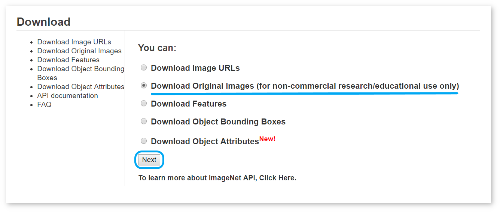
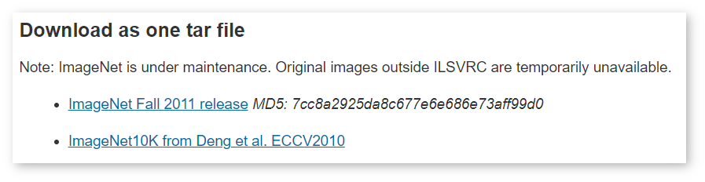
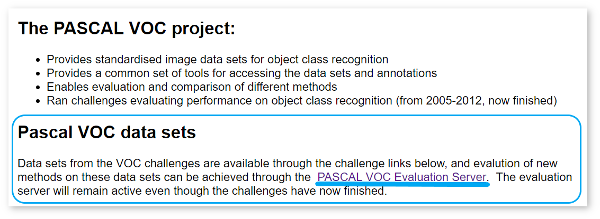
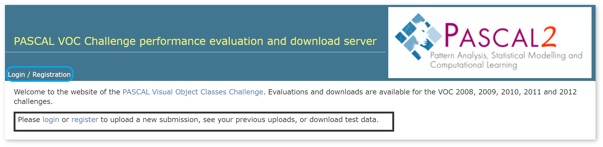
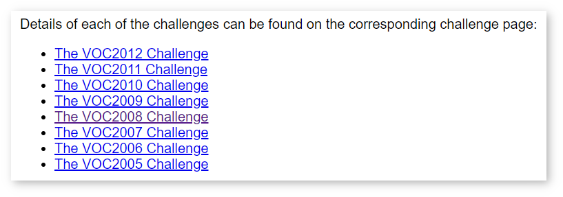
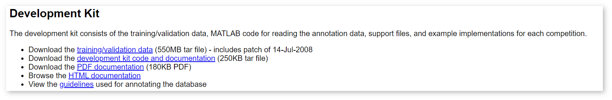
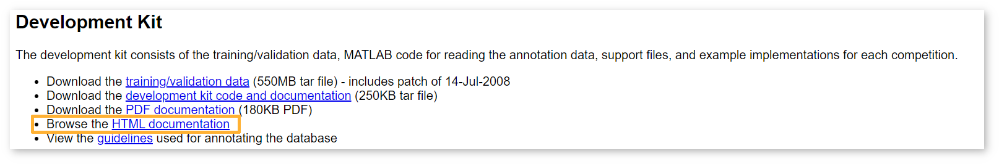
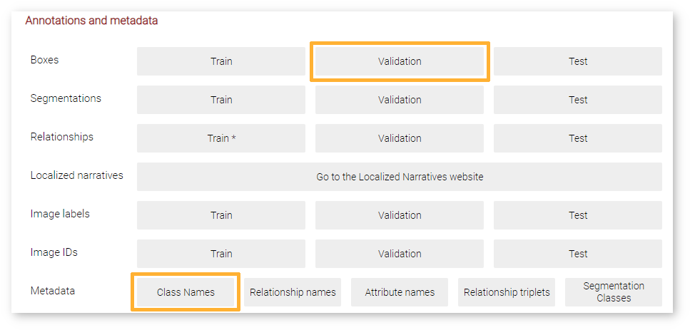
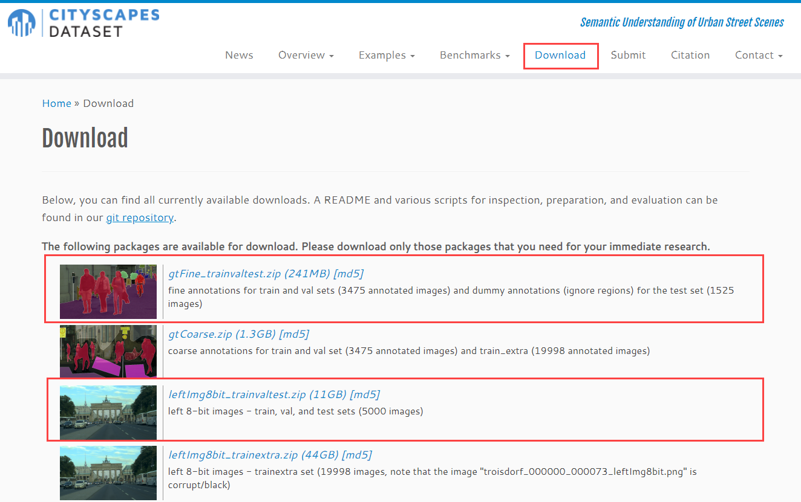

# Dataset Types {#workbench_docs_Workbench_DG_Dataset_Types}

@sphinxdirective

.. toctree::
   :maxdepth: 1
   :hidden:
   
   workbench_docs_Workbench_DG_Download_and_Cut_Datasets

@endsphinxdirective

Below is the list of dataset types available to use in the DL Workbench:
- <a href="#imagenet">ImageNet</a>
- <a href="#voc">Pascal Visual Object Classes (Pascal VOC)</a>
- <a href="#coco">Common Objects in Context (COCO)</a>
- <a href="#css">Common Semantic Segmentation (CSS)</a>
- <a href="#csr">Common Super-Resolution (CSR)</a>
- <a href="#lfw">Labeled Faces in the Wild (LFW)</a>
- <a href="#vgg">Visual Geometry Group Face 2 (VGGFace2)</a>
- <a href="#wider">Wider Face</a>
- <a href="#openimages">Open Images</a>
- <a href="#cityscapes">Cityscapes</a>
- <a href="#unannotated">Not annotated dataset</a>

Your dataset does not need to contain images from official databases providing these types, like ImageNet or Pascal VOC, but it needs to adhere to the supported dataset formats.

Use case  |                 Datasets/Dataset formats
|------------------|------------------|
|Classification|ImageNet, unannotated*​|
|Object Detection​|Pascal VOC, MS COCO, Wider Face, Open Images, unannotated*​|
|Segmentation (Semantic, Instance)​|MS COCO, Pascal VOC, CSS, Cityscapes, unannotated*|
|Facial Landmark detection​|LFW, unannotated*|
|Face recognition​|VGGFace2, unannotated*|
|Super resolution​|Common Super Resolution, unannotated*|
|Style Transfer​|ImageNet, Pascal VOC, MS COCO, CSS, CSR, unannotated*|
|Inpainting|ImageNet, Pascal VOC, MS COCO, CSS, CSR, unannotated*|

## <a name="imagenet">ImageNet</a>

[ImageNet](http://www.image-net.org/) is a dataset for classification models. DL Workbench supports only the format of the ImageNet validation dataset published in 2012. 

### Download ImageNet Dataset

To download images from ImageNet, you need to have
an account and agree to the Terms of Access. Follow the steps below:

1. Go to the [ImageNet](http://www.image-net.org/) homepage:


2. If you have an account, click **Login**. Otherwise, click **Signup** in the right upper corner, 
provide your data, and wait for a confirmation email:


3. Once you receive the confirmation email and log in, go to the **Download** page:


4. Select **Download Original Images**:


5. This redirects you to the Terms of Access page. If you agree to the Terms, continue by clicking **Agree and Sign**:


6. Click one of the links in the **Download as one tar file** section to select it:


7. Save it to the directory with the name `/home/<user>/Work/imagenet.zip` for Linux\*, macOS\* or `C:\Work\imagenet.zip` for Windows\*.

8. Download [the archive with annotations](http://dl.caffe.berkeleyvision.org/caffe_ilsvrc12.tar.gz). 

9. Unarchive both `imagenet.zip` and `caffe_ilsvrc12.tar.gz`. Place the `val.txt` file from `caffe_ilsvrc12` inside the `imagenet` folder. 

10. Zip the contents of the `imagenet` folder. 

### ImageNet Structure

The final `imagenet.zip` archive must follow the structure below: 
```
|-- imagenet.zip
    |-- val.txt
    |-- 0001.jpg
    |-- 0002.jpg
    |...  
    |-- n.jpg  
```

The annotation file is organized as follows:
```
0001.jpg <label ID>
0002.jpg <label ID>
...
n.jpg <label ID>
```

> **NOTE**: The dataset is considerably big in size. If you want to save your time when loading it into the DL Workbench, follow the instructions to [cut the dataset](Download_and_Cut_Datasets.md).

## <a name="voc">Pascal Visual Object Classes (Pascal VOC)</a>

[Pascal VOC](http://host.robots.ox.ac.uk/pascal/VOC/) dataset is
used to train classification, object-detection and semantic-segmentation models. DL Workbench supports validation on Pascal VOC datasets for object detection, semantic segmentation, image inpainting and style transfer.
DL Workbench supports only the format of the VOC validation datasets published in 2007, 2010, and 2012. 

### Download Pascal VOC Dataset

To download test data from [Pascal VOC](http://host.robots.ox.ac.uk/pascal/VOC/), you need to have
an account. Follow the steps below:

1. Go to the [PASCAL Visual Object Classes Homepage](http://host.robots.ox.ac.uk/pascal/VOC/):


2. Click **PASCAL VOC Evaluation Server** under the **Pascal VOC data sets** heading:


3. If you have an account, click **Login** in the left upper corner. Otherwise, click **Registration**, provide your data, and wait for a confirmation email:


4.  Once you receive the confirmation email and log in, go to the **Pascal VOC Challenges 2005-2012**:


5. Select a challenge. For example, *The VOC2008 Challenge*. On the challenge page, go to the **Development Kit** section:


6. Download the *training/validation_data* file.

> **NOTE**: The dataset is considerably big in size. If you want to save your time when loading it into the DL Workbench, follow the instructions to [cut the dataset](Download_and_Cut_Datasets.md).

### Pascal VOC Structure

Pascal VOC datasets consist of several folders containing annotation files and image
indices. Each image file must have the corresponding annotation file. Annotation files are XML format, images are stored in JPEG format, and segmentation ground truth in PNG format.

A Pascal VOC dataset archive is organized as follows:

```
|-- VOCdevkit
    |-- VOC
        |-- Annotations
              |-- 0001.xml
              |-- 0002.xml  
              ...  
              |-- n.xml  
        |-- ImageSets
              |-- Layout - Optional
                  |-- val.txt
              |-- Main - At least one imageset is required.
                  |-- 0001_val.txt
                  |-- 0002_val.txt  
                  ...  
                  |-- n_val.txt  
              |-- Segmentation - Optional. Required only for Segmentation use case.
                  |-- val.txt  
        |-- JPEGImages
              |-- 0001.jpg
              |-- 0002.jpg  
              ...  
              |-- n.jpg  
        |-- SegmentationClass - Optional. Required only for Segmentation use case.
              |-- 0001.png
              |-- 0002.png
              ...  
              |-- n.png
        |-- SegmentationObject - Optional. Required only for Segmentation use case.
              |-- 0001.png
              |-- 0002.png
              ...  
              |-- n.png
```

For each object, the following annotations must be present:

- `class`: the object class, for example ‘car’ or ‘bicycle’

- `bounding box`: an axis-aligned rectangle specifying the extent of the
object visible in the image.

Optional annotations include the following parameters: `view/pose`, `truncated`, `occluded`, `difficult`.

Each line of the `val.txt` file must contain a single image name without the extension, for example:

```
2008_000002
2008_000003
2008_000004 
```
Find out more about the contents of each file and optional parameters in the VOC dataset documentation. On the challenge page, go to the **Development Kit** section and select **Browse the HTML documentation**:




## <a name="coco">Common Objects in Context (COCO)</a>

[COCO](http://cocodataset.org/) dataset is used for object detection, instance
segmentation, person keypoints detection, stuff segmentation, and caption generation. DL
Workbench supports validation on COCO datasets for object detection, instance
segmentation, image inpainting, and style transfer. 
DL Workbench supports only the format of the COCO validation datasets published in 2014 and 2017. 

### Download COCO Dataset

To use a dataset from the [COCO](http://cocodataset.org) website, download annotations and images archives
separately. Choose one of the options:

- [2014 Val images](http://images.cocodataset.org/zips/val2014.zip) and  [2014 Train/Val annotations](http://images.cocodataset.org/annotations/annotations_trainval2014.zip)
 
    *or*
- [2017 Val images](http://images.cocodataset.org/zips/val2017.zip) and 
[2017 Train/Val annotations](http://images.cocodataset.org/annotations/annotations_trainval2017.zip)

> **NOTE**: The dataset is considerably big in size. If you want to save your time when loading it into the DL Workbench, follow the instructions to [cut the dataset](Download_and_Cut_Datasets.md).

### COCO Structure

COCO dataset is organized as follows:
```
|-- val
      |-- 0001.jpg
      |-- 0002.jpg
      ...  
      |-- n.jpg
|-- annotations  
      |-- instances_val.json
```

The JSON file with annotations must contain `instances_` in its name and be organized as follows:
```
{
  "info": <info>,
  "images": [<images>],
  "licenses": [<licenses>],
  "annotations": [<annotations>]
}
```
The presence of all components is required. The parameters `info` and `licenses` can be left empty.

## <a name="css">Common Semantic Segmentation (CSS)</a>

CSS is an OpenVINO™ dataset type aimed to simplify the structure provided by Pascal VOC.
DL Workbench supports validation on CSS datasets for semantic segmentation, image
inpainting, and style transfer.

### CSS Structure

A CSS dataset archive consists of folders with images and masks, and a JSON 
file with meta information:
```
|-- dataset_meta.json
|-- Images
      |-- 0001.jpg
      |-- 0002.jpg
      ...  
      |-- n.jpg    
|-- Masks  
      |-- 0001.png
      |-- 0002.png
      ...  
      |-- n.png
```

The JSON meta information file is organized as follows:

```
{
  "label_map": {<map>},
  "background_label":"<label>",
  "segmentation_colors":[<colors>]
}
```

## <a name="csr">Common Super-Resolution (CSR)</a>

CSR is an OpenVINO™ dataset type for super-resolution, image-inpainting, and style-transfer models. 

### CSR Structure

The archive consists of three separate folders for high-resolution images, low-resolution images, and 
upsampled low-resolution images:

```
|-- HR
      |-- 0001.jpg
      |-- 0002.jpg
      ...  
      |-- n.jpg   
|-- LR
      |-- 0001.jpg
      |-- 0002.jpg
      ...  
      |-- n.jpg    
|-- upsampled  - Optional
      |-- 0001.png
      |-- 0002.png
      ...  
      |-- n.png
```

## <a name="lfw">Labeled Faces in the Wild (LFW)</a>

[LFW](http://vis-www.cs.umass.edu/lfw/) is used for face recognition. 
DL Workbench supports only LFW *validation* datasets.

### Download LFW Dataset

1. Create an empty `LFW` folder with two subdirectories: `Images` and `Annotations`.
1. [Download the `lfw.tgz` archive with images](http://vis-www.cs.umass.edu/lfw/lfw.tgz). Unarchive it and place it in the `Images` folder.  
2. [Download the `pairs.txt` annotation file](http://vis-www.cs.umass.edu/lfw/pairs.txt). Place the file in the `Annotations` folder.
3. Archive the `LFW` folder.

### LFW Structure

An LFW dataset archive consists of folders with images and annotations. The **Images** folder contains separate folders with photographs of a particular person. The **Annotations** folder contains two files: `pairs.txt` and `landmarks.txt`. The `pairs.txt` file is required, while `landmarks.txt` is optional.

```
|-- LFW
      |-- Images
            |-- Person_1
                  |-- Person_1_0001.jpg  
                  ...  
                  |-- Person_1_n.jpg 
            ...
            |-- Person_N
                  |-- Person_N_0001.jpg   
                  ...  
                  |-- Person_N_n.jpg 
      |-- Annotations
            |-- pairs.txt
            |-- landmarks.txt
```

* The `pairs.txt` file follows the structure represented below. The file is split into sets of randomly selected persons to provide randomization for accuracy measurements.
   * The first line contains the number of sets and the number of images in a set. This information is necessary for accuracy measurements.
   * Lines with correct pairs: two images of one person.
   * Lines with incorrect pairs: two images of two different persons.
   
   Blocks of lines with correct and incorrect pairs alternate to represent different sets. Below is an example of an annotation beginning. The numbers of sets and images in them come first, followed by the lines for the first set. 
   
   ```
   10 300
   Person_1	2	4
   Person_2	3	6
   Person_2	4	5
   ...
   Person_N	2	3
   Person_1    1     Person_15    1
   Person_1    2     Person_43    1
   Person_2    1     Person_89    2
   ...
   Person_300    1     Person_21    1
   ```
   Then the lines for the second set begin:
   ```
   Person_301	2	4
   Person_302	3	6
   ...
   Person_600	2	3
   Person_301    1     Person_334    1
   Person_302    1     Person_570    2
   ...
   Person_600    1     Person_416    1
   ```

* The `landmarks.txt` file contains coordinates of five facial landmarks found in an image:
   * Left eye
   * Right eye
   * Nose
   * Left mouth corner
   * Right mouth corner
   
   Each line consists of the relative path to an image and two coordinates in pixels of
   each landmark in the same order as in the list above:
   ```
   Person_1/Person_1_0001.jpg	102	114	146	111	122	133	104	158	148	155
   Person_2/Person_2_0001.jpg	107	113	147	117	126	139	110	158	136	159
   Person_2/Person_2_0002.jpg	103	112	145	111	125	137	107	156	146	160
   ...
   Person_N/Person_N_0002.jpg	102	114	146	105	127	133	113	159	152	153
   ```

> **NOTE**: There is no requirements for image and folder names. However, the names that
> you use for images and folders must match the names that you put in annotations.

## <a name="vgg">Visual Geometry Group Face 2 (VGGFace2)</a>

[VGGFace2](https://github.com/ox-vgg/vgg_face2) is used for facial landmark detection. 

VGGFace2 is currently not available for download. Consider creating your own dataset with
the same structure and annotations as described below.

### VGGFace2 Structure

A VGGFace2 dataset archive consists of folders with images and annotations. The **Images** folder contains separate folders with images of a particular person. The **Annotations** folder contains two files: `loose_bb_test.csv` and `loose_landmark_test.csv`.

```
|-- VGGFace2
      |-- Images
            |-- 0001
                  |-- 0001_01.jpg
                  |-- 0002_02.jpg
                  |-- 0003_02.jpg
                  |-- 0002_01.jpg
                  |...  
                  |-- nnnn_1.jpg
            |-- 0002  
            ...
            |-- nnnn
      |-- Annotations
            |-- loose_bb_test.csv
            |-- loose_landmark_test.csv      
```

* The `loose_bb_test.csv` contains the coordinates in pixels of a bounding box in an
  image:
```
NAME_ID           X     Y     W     H
0001/0001_01.jpg	60	60	79	111
0001/0002_01.jpg	107	113	147	117
0001/0002_01.jpg	103	112	145	111
...
NNNN/nnnn_01.jpg	102	114	146	105
```

* The `loose_landmarks_test.csv` file contains coordinates of five facial landmarks found
  in an image:
   * Left eye
   * Right eye
   * Nose
   * Left mouth corner
   * Right mouth corner

   Each line consists of the relative path to an image and two coordinates in pixels of
   each landmark in the same order as in the list above:

   ```
   NAME_ID           P1X	P1Y	P2X	P2Y	P3X	P3Y	P4X	P4Y	P5X	P5Y
   0001/0001_01.jpg	75	110	103	104	90	133	85	149	114	144
   0001/0002_01.jpg	195	212	279	206	237	273	208	318	283	312
   0001/0002_01.jpg	289	232	400	233	345	322	289	373	394	378
   ...
   NNNN/nnnn_01.jpg	83	90	111	87	103	111	86	129	111	126
   ```

   > **NOTE**: When you download an original dataset, it includes `loose_bb_train.csv` and `loose_landmarks_train.csv` files. Remove these files before importing the dataset into the DL Workbench.

> **NOTE**: There is no requirements for image and folder names. However, the names that you use for images and folders must match the names that you put in annotations.

## <a name="wider">Wider Face</a>

Wider Face is used for object-detection use case. DL Workbench supports validation and training formats. 

### Download Wider Dataset

1. Create an empty Wider folder with two subdirectories: `Images` and `Annotations`.
2. Download [WIDER Face Validation Images archive](http://shuoyang1213.me/WIDERFACE/). Unarchive it and place it in the `Images` folder.
3. Download the Face annotations folder. Extract the `wider_face_val_bbx_gt.txt` file and place it in the `Annotations` folder.
4. Archive the Wider folder.

### Wider Face Structure

A Wider Face dataset archive consists of folders with images and annotations. The **Images** folder contains separate subfolders with photographs of a particular event. 
The **Annotations** folder contains the `wider_face_subset.txt` file.

```
|-- Wider
	|-- Images
		|-- Event_1
			|-- Event_1_0001.jpg
			...
			|-- Event_1_n.jpg
		...
		|-- Event_N
			|-- Event_N_0001.jpg
			...
			|-- Event_N_n.jpg
	|-- Annotations
		|-- wider_face_val_bbx_gt.txt
```

The `wider_face_subset.txt` file follows the structure represented below. Each image annotation consists of a line with the relative path to the image, a line with the number of objects represented on the image, and a matching number of lines with two coordinates in pixels of each landmark, width and height of the landmark, and additional parameters, such as blur, expression, illumination, invalid image, occlusion, and pose:

```
0--Parade/0_Parade_Parade_0_194.jpg
5
111 425 122 127 0 1 0 0 0 1 
209 347 70 103 0 1 0 0 0 0 
368 252 89 133 0 1 0 0 0 0 
555 282 89 100 0 1 0 0 0 1 
707 252 92 133 0 1 0 0 0 0 
```

## <a name="openimages">Open Images</a>

Open Images is used for the object-detection use case. DL Workbench supports only validation dataset format. 

### Download Open Images

1. Create an empty Open Images folder with a subdirectory `Images`.

2. There are several options to download Open Images dataset. On the [download page](https://storage.googleapis.com/openimages/web/download.html), select *Manually downloading the images and raw annotation files* option. Follow the instructions to download the full set of validation images from CVDF. 

   For example, you can use the following commands to download the full set of validation images:

   ```
   pip install aws-shell
   ```

   ```
   aws s3 --no-sign-request sync s3://open-images-dataset/validation [target_dir/validation]
   ```

3. Download `Validation` annotations in the *Boxes* and `Class Names` from *Metadata*. Place them in the **Open Images** folder.


4. Archive the Open Images folder.

### Open Images Structure

An Open Images dataset archive consists of the folder with images, csv file with annotations, and object class descriptions file with meta information. 

```
|-- Open Images 
	|-- Images
        |-- 0001.jpg
		|-- 0002.jpg
		...
		|-- n.jpg
	|-- annotations.csv
	|-- class-descriptions-boxable.csv
```

`annotations.csv` defines each bounding box and has the following structure:

```

ImageID	     Source	      LabelName	Confidence	XMin	XMax	YMin	YMax	IsOccluded	IsTruncated IsGroupOf	IsDepiction	IsInside
0213a5d9dace975a	xclick	/m/02wbm	1	0	0.3640625	0.40416667	0.8354167	0	0	0	0	0
0213a5d9dace975a	xclick	/m/02wbm	1	0.0796875	1	0.05	0.95416665	0	0	1	0	0

```
Learn more about bounding boxes structure and attributes at the [Open Images site](https://storage.googleapis.com/openimages/web/download.html).

`class-descriptions-boxable.csv` contains the class names and their short descriptions: 

```
/m/012n7d	Ambulance
/m/012w5l	Ladder
/m/012xff	Toothbrush
```
## <a name="cityscapes">Cityscapes</a>

Cityscapes dataset is used for semantic segmentation of urban street scenes. DL Workbench supports validation and train dataset format. 

### Download Cityscapes

1. Create an empty `cityscapes` folder.

2. Register on the [Cityscapes dataset site](https://www.cityscapes-dataset.com/). On the [download page](https://www.cityscapes-dataset.com/downloads/), download `gtFine_trainvaltest.zip` and `leftImg8bit_trainvaltest.zip`. 



3. Unzip the downloaded archives and place them in the `cityscapes` folder.

4. Archive the `cityscapes` folder.

### Cityscapes Structure

A Cityscapes dataset archive consists of the folders with annotations and images. 

```
|--cityscapes
    |-- gtFine
       |-- val
             |-- city
                 |-- city_gtFine_labelIds.png
                 |-- city_gtFine_instanceIds.png
                 |-- city_gtFine_color.png - Optional
                 |-- city_gtFine_labels.png - Optional
                 |-- city_gtFine_labelTrainIds.png - Optional
                 |-- city_gtFine_polygons.json
    |-- imgsFine
         |-- leftImg8bit
             |-- val
                 |-- city
                     |-- city.png

```

`gtFine` folder contains the fine annotations encoded using `json` files with the individual polygons. Additionally, there are `png` images, where pixel values encode labels. `leftImg8bit` consists of the left images in 8-bit LDR format.

Learn more about the dataset preparation and evaluation at the [Cityscapes dataset site](https://www.cityscapes-dataset.com/dataset-overview/) and in the [GitHub repository](https://github.com/mcordts/cityscapesScripts).

## <a name="unannotated">Not Annotated Dataset</a>

Not annotated datasets are sets of images and do not contain annotations. Models in projects that use not annotated datasets can be calibrated only with the [Default Calibration method](Int-8_Quantization.md) and 
cannot be used for accuracy measurements.

### Download Not Annotated Dataset

Download the [Landscape Pictures dataset](https://www.kaggle.com/arnaud58/landscape-pictures/download) without annotations.

### Not Annotated Dataset Structure

The archive is organized as follows:

```
|-- 0001.jpg
|-- 0002.jpg
|...  
|-- n.jpg  
```

---
## See Also

* [Cut Datasets](Download_and_Cut_Datasets.md)
* [Import Datasets](Import_Datasets.md)
* [Troubleshooting](Troubleshooting.md)