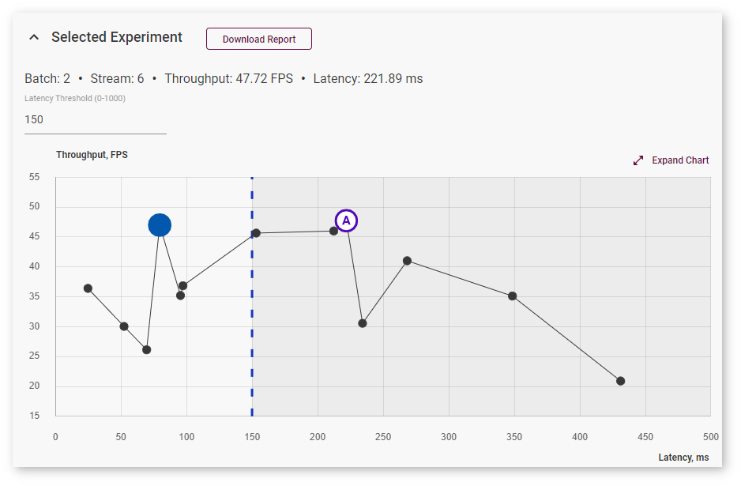
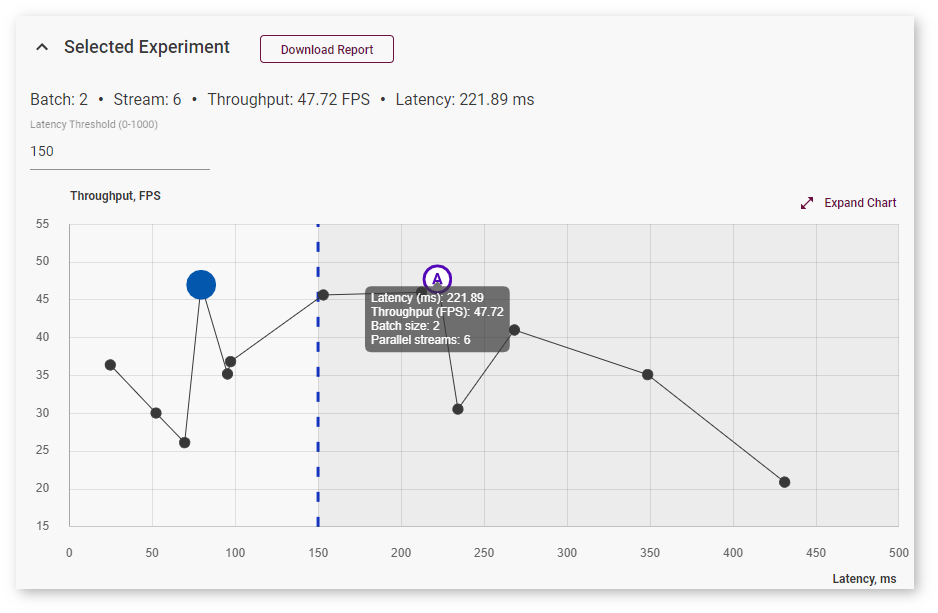
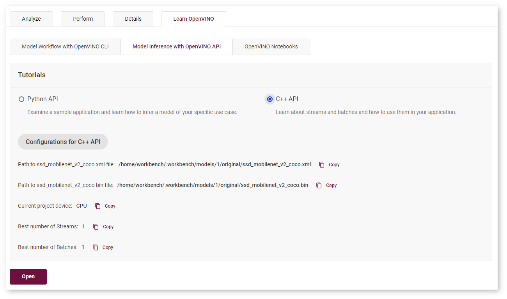
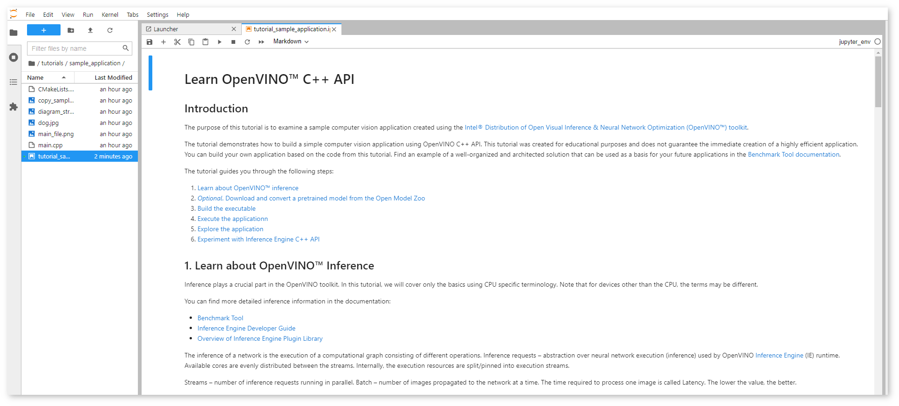
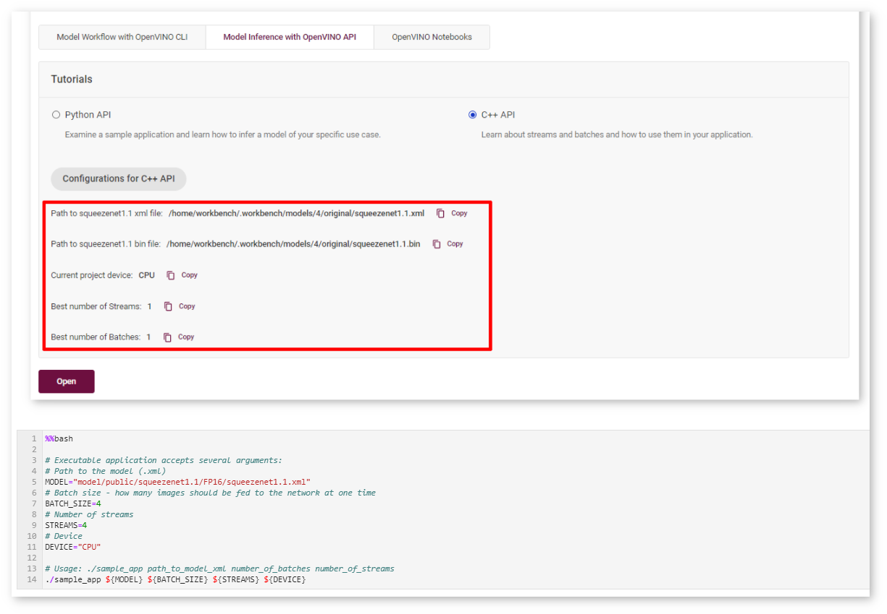

# Deploy and Integrate Performance Criteria into Application {#workbench_docs_Workbench_DG_Deploy_and_Integrate_Performance_Criteria_into_Application}

Once you identify the optimal configuration of inferences, batch and target for a model, you can incorporate those
settings into the inference engine deployed with your application.

@sphinxdirective

.. raw:: html

    <iframe  allowfullscreen mozallowfullscreen msallowfullscreen oallowfullscreen webkitallowfullscreen width="560" height="315" src="https://www.youtube.com/embed/-i8gdbukpU4" frameborder="0" allow="accelerometer; autoplay; encrypted-media; gyroscope; picture-in-picture" allowfullscreen></iframe>

@endsphinxdirective

## <a name="discover">Discover Optimal Combination of Streams and Batches with DL Workbench</a>

To find an optimal combination of inference requests and batches, follow the steps described in [Run Range of Inferences](Run_Single_Inference.md).  

The optimal combination is the highest point on the **Inference Results** graph. However, you can choose to limit latency values by specifying the **Latency Threshold** value and select an optimal inference among the limited number of inferences:

To view information about latency, throughput, batch, and parallel requests of a specific job, hover your cursor over the corresponding point on the graph:

For details, read [Integrate the OpenVINO™ Runtime New Request API with Your Application](@ref openvino_docs_OV_UG_Integrate_OV_with_your_application).

## Integrate Optimal Combination into Sample Application

### Use Streams and Batches in Your Application 

Learn how to use batches and streams in your application with DL Workbench C++ Sample Application.
To access the sample, open the **Learn OpenVINO** tab, select **Model Inference with OpenVINO API**, then select **C++ API** and click **Open**. 

The notebook with the C++ Sample Application opens:

This notebook is created for educational purposes and does not guarantee the immediate creation of a highly efficient application. You can build your own application based on the code from this tutorial. The tutorial guides you through the following steps:

1. Learn about OpenVINO™ inference  

      Read quick theory to learn about batches and streams, inference requests, and Asynchronous API. 

2. Optional. Download and convert a pretrained model from the Open Model Zoo

      Learn how to import a model in the DL Workbench or skip this step and proceed to build an application.

3. Build the executable

     Compile `main.cpp` into an executable file:

     

4. Execute the application

     Copy the path to the model, project device, and batch and stream numbers from the DL Workbench and paste them in the corresponding cell:

     

5. Explore the application 

     Inspect and change the main.cpp file with an application that uses the IE asynchronous C++ API. The file is located in the same directory as the notebook.

     

6. Experiment with OpenVINO™ Runtime C++ API
 
     Return to Step 3: Build the executable or proceed to explore the DL Workbench functionality.
     After learning about OpenVINO™ inference, you can go to The [Benchmark Tool documentation](https://docs.openvino.ai/latest/openvino_inference_engine_samples_benchmark_app_README.html) to find an example of a well-structured solution that may be used as a basis for your future applications.

---
## See Also

* [Build Your Application with Deployment Package](Deployment_Package.md)
* [Deployment Manager Guide](@ref openvino_docs_install_guides_deployment_manager_tool)
* [Troubleshooting](Troubleshooting.md)