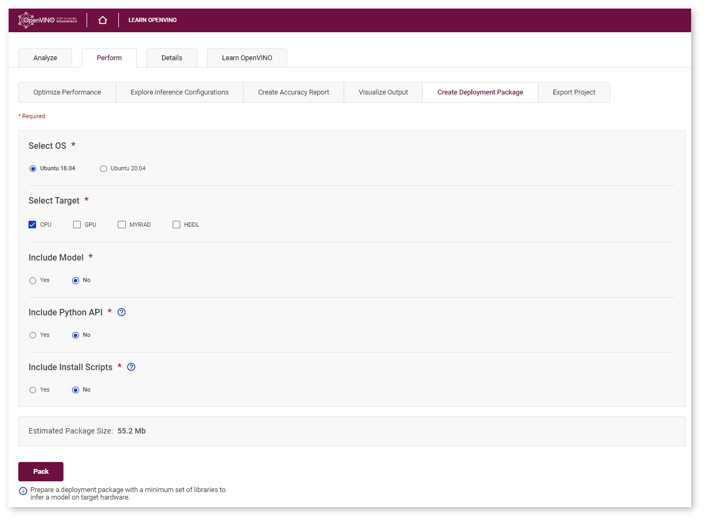
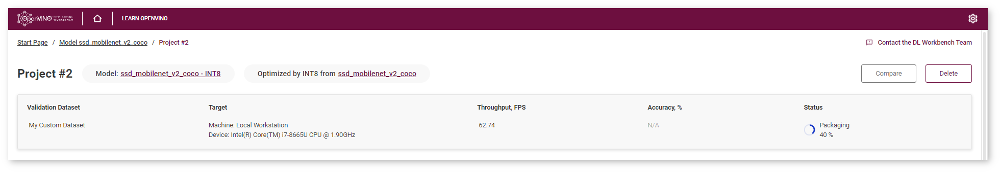

# Build Your Application with Deployment Package {#workbench_docs_Workbench_DG_Deployment_Package}

@sphinxdirective

.. toctree::
   :maxdepth: 1
   :hidden:
   
   workbench_docs_Workbench_DG_Deploy_and_Integrate_Performance_Criteria_into_Application

@endsphinxdirective

When you find an optimal configuration for your model, the next step is to use
this model with optimal parameters in your own application on a target device.
OpenVINO™ toolkit includes all you need to run the application on the target.
However, the target might have a limited drive space to store all OpenVINO™
components. 
OpenVINO™ [Deployment Manager](@ref openvino_docs_install_guides_deployment_manager_tool) 
available inside the DL Workbench extracts the minimum set of libraries required
for a target device. 

> **IMPORTANT**: Deployment Manager available inside the DL Workbench provides
> libraries compatible with Ubuntu 18.04 and 20.04.

Refer to the section below to learn how to download a deployment package for
your configuration. Once you download the package, see how to 
<a href="#sample">create a binary with your application</a> 
on your developer machine and <a href="#deploy">deploy it on a target device</a>. 

> **NOTE**: *Developer machine* is the machine where you use the DL Workbench to download
> the package and where you prepare your own application. *Target machine* is the
> machine where you deploy the application.

## Download Deployment Package

> **NOTE**: Perform these steps on your developer machine.

Go to the **Perform** tab on the **Projects** page and open the **Create Deployment Package** subtab.



In this tab, select all the targets you want to apply your model to. You can
also opt whether to include the model, Python API, and installation scripts.
Python API enables the OpenVINO™ Runtime to work in Python scripts. You can
then import the Python API into your own scripts and use IE via it. Installation
scripts install OpenVINO™ dependencies and drivers for selected targets, if
needed.

The package size displayed at the bottom of the form changes depending on your
selection. If you do not include the model in the package, the archive contains
only libraries for selected plugins.

Once you click **Pack**, the packaging process starts on the server followed by
an automatic archive download:



Now you have an archive that contains the required libraries and your model. 

> **IMPORTANT**: 
> * The archive does not contain your application, and copying the archive to
>   the target device does not mean deployment.
> * The archive contains C++\* libraries, so your application can be written in
>   C++ only. A Python\* application cannot use these libraries directly and
>   Python bindings are not included in the deployment package. This document
>   does not contain instructions on how to prepare a Python application for
>   deployment.

Your application should be compiled into a binary file. If you do 
not have an application, see <a href="#sample">Create Binary Sample</a>.
The next step is <a href="#deploy">moving a binary to the target device and deploying it there</a>.

## <a name="sample">Create Binary Sample</a>

You can learn how to use batches and streams in your application with DL Workbench [C++ Sample Application](Deploy_and_Integrate_Performance_Criteria_into_Application.md).

> **NOTE**: Perform these steps on your developer machine.

### Prerequisite

[Install the Intel® Distribution of OpenVINO™ toolkit for Linux*](@ref openvino_docs_install_guides_installing_openvino_linux) 
on your developer machine. OpenVINO™ toolkit and DL Workbench should be of the same release version.

### Step 1. Create main.cpp

Create a file named `main.cpp` with the source code of your application:     


@sphinxdirective
.. raw:: html

    <div class="collapsible-section">
@endsphinxdirective

```cpp
#include <inference_engine.hpp>
#include <vector>

using namespace InferenceEngine;

int main(int argc, char *argv[]) {
    if (argc < 3) {
        std::cerr << "Usage: " << argv[0] << " PATH_TO_MODEL_XML DEVICE" << std::endl;
        return 1;
    }

    int batchSize = 1;

    int numInferReq = 1;

    if (argc == 5) {

        batchSize = std::stoi(argv[3]);

        numInferReq = std::stoi(argv[4]);
    }

    const std::string modelXml = argv[1];

    std::string device = argv[2];

    std::transform(device.begin(), device.end(), device.begin(), ::toupper);

    Core ie;

    // Start setting number of streams
    int numStreams = numInferReq;

    if (device == "CPU") {
        ie.SetConfig({{CONFIG_KEY(CPU_THROUGHPUT_STREAMS), std::to_string(numStreams)}}, device);
    }

    if (device == "GPU") {
        numStreams = numInferReq / 2;
        if (numStreams % 2) {
            numStreams++;
        }
        ie.SetConfig({{CONFIG_KEY(GPU_THROUGHPUT_STREAMS), std::to_string(numStreams)}}, device);
    }
    // Finish setting number of streams

    CNNNetwork network = ie.ReadNetwork(modelXml);

    // Set batch
    network.setBatchSize(batchSize);

    ExecutableNetwork executableNetwork = ie.LoadNetwork(network, device);

    std::vector<InferRequest> requests(numInferReq);

    for (std::size_t i = 0; i < numInferReq; i++) {
        // Create an InferRequest
        requests[i] = executableNetwork.CreateInferRequest();
        // run the InferRequest
        requests[i].StartAsync();
    }

    for (std::size_t i = 0; i < numInferReq; i++){
        StatusCode status = requests[i].Wait(IInferRequest::WaitMode::RESULT_READY);
        if (status != StatusCode::OK){
            std::cout<< "inferRequest " << i << "failed" << std::endl;
        }
    }
    std::cout << "Inference completed successfully"<<std::endl;
    return 0;
}
```

@sphinxdirective
.. raw:: html

    </div>
@endsphinxdirective


### Step 2. Create CMakeLists.txt

In the same folder as `main.cpp`, create a file named `CMakeLists.txt` with the
following commands to compile `main.cpp` into an executable file:         

@sphinxdirective
.. raw:: html

    <div class="collapsible-section">
@endsphinxdirective

```
cmake_minimum_required(VERSION 3.10)

project(ie_sample)

set(CMAKE_CXX_STANDARD 14)

set(IE_SAMPLE_NAME ie_sample)

find_package(InferenceEngine 2.1 REQUIRED)

add_executable(${IE_SAMPLE_NAME} main.cpp ${IE_SAMPLE_SOURCES} ${IE_SAMPLES_HEADERS})

target_link_libraries(${IE_SAMPLE_NAME} PUBLIC ${InferenceEngine_LIBRARIES})
```

@sphinxdirective
.. raw:: html

    </div>
@endsphinxdirective


### Step 3. Compile Application

Open a terminal in the directory with `main.cpp` and `CMakeLists.txt`, and run
the following commands to build the sample:        
```sh
source <INSTALL_OPENVINO_DIR>/setupvars.sh
mkdir build
cd build
cmake ../
make
``` 
> **NOTE**: Replace `<INSTALL_OPENVINO_DIR>` with the directory where you
> installed the OpenVINO™ package. By default, the package is installed in
> `/opt/intel/openvino` or `~/intel/openvino`.         
Once the commands are executed, find the `ie_sample` binary in the `build`
folder in the directory with the source files. 

## <a name="deploy">Deploy Your Application on Target Machine</a>

**Step 1.** Make sure you have the following components on your developer machine:
* Deployment package 
* Model (if it is not included in the package)
* Binary file with your application, `ie_sample`, for example 

**Step 2.** Unarchive the deployment package. 
Place the binary and the model in the `deployment_package` folder as follows:

```
|-- deployment_package
    |-- bin
    |-- deployment_tools
    |-- install_dependencies
    |-- model
        |-- model.xml
        |-- model.bin
    |-- ie_sample
```

**Step 3.** Archive the `deployment_package`  folder and copy it to the target machine.

> **NOTE**: Perform the steps below on your target machine.

**Step 4.** Open a terminal in the `deployment_package` folder on the target machine. 

**Step 5.** Optional: for inference on Intel® GPU, Intel® Movidius™ VPU, or Intel®
   Vision Accelerator Design with Intel® Movidius™ VPUs targets.    
Install dependencies by running the `install_openvino_dependencies.sh` script:
```sh
sudo -E ./install_dependencies/install_openvino_dependencies.sh
```

**Step 6.**  Set up the environment variables by running `setupvars.sh`:
```sh
source ./setupvars.sh
```

**Step 7.**  Run your application:
```sh
./ie_sample  <path>/<model>.xml CPU
```    
> **NOTES**:
> * Replace `<path>` and `<model>` with the path to your model and its name.
> * In the command above, the application is run on a CPU device. See the
>   **Supported Inference Devices** section of [Install DL Workbench](Installation.md) 
>   for code names of other devices. 

**Step 8.** If you run the application created in the <a href="#sample">Create Binary Sample</a>, 
you get the following output:
```
Inference completed successfully
```

## See Also

* [Deploy and Integrate Performance Criteria into Application](Deploy_and_Integrate_Performance_Criteria_into_Application.md)
* [Deployment Manager Guide](@ref openvino_docs_install_guides_deployment_manager_tool)
* [Integrate the OpenVINO™ Runtime with Your Application](@ref openvino_docs_Integrate_OV_with_your_application)
* [Troubleshooting](Troubleshooting.md)