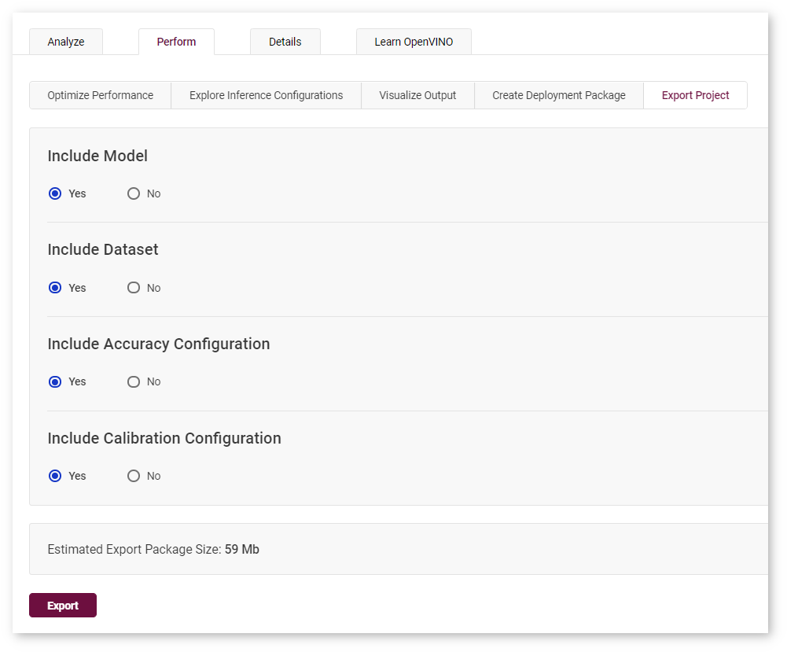

# Export Project {#workbench_docs_Workbench_DG_Export_Project}


You can download an archive with artifacts of your project:
* Model
* Dataset
* Accuracy measurement configuration delivered as a valid configuration file for the 
  [Accuracy Checker](https://docs.openvino.ai/latest/omz_tools_accuracy_checker.html)
* [Post-training Optimization Tool](@ref pot_introduction) calibration configuration file

A downloaded archive also contains information on the project and best model performance.

The archive is organized as follows:
```
|-- configs
  |-- accuracy_config.yml
  |-- calibration_config.json
|-- dataset
  |-- dataset.tar.gz
|-- model 
  |-- model.xml
  |-- model.bin
|-- description.txt
```
The example for the `mobilenet-ssd` model with a COCO dataset.

@sphinxdirective
.. raw:: html

    <div class="collapsible-section">
@endsphinxdirective


```yml
models:
- name: mobilenet-ssd
  launchers:
  - framework: dlsdk
    device: CPU
    adapter:
      type: ssd
    batch: 1
    model: /home/workbench/.workbench/models/3/16/mobilenet-ssd.xml
    weights: /home/workbench/.workbench/models/3/16/mobilenet-ssd.bin
  datasets:
  - name: dataset
    data_source: /home/workbench/.workbench/datasets/2
    annotation_conversion:
      annotation_file: /home/workbench/.workbench/datasets/2/instances_val2017_200pictures.json
      converter: mscoco_detection
      images_dir: /home/workbench/.workbench/datasets/2
    subsample_size: 100%
    preprocessing:
    - type: resize
      size: 300
    postprocessing:
    - type: resize_prediction_boxes
    metrics:
    - type: map
      integral: 11point
      ignore_difficult: true
      presenter: print_vector
```

@sphinxdirective
.. raw:: html

    </div>
@endsphinxdirective


The example is for the `mobilenet-ssd` model calibrated on a COCO dataset with Default method.

@sphinxdirective
.. raw:: html

    <div class="collapsible-section">
@endsphinxdirective


```json
{
   "model": {
      "model_name": "mobilenet-ssd",
      "model": "/home/workbench/.workbench/models/3/original/mobilenet-ssd.xml",
      "weights": "/home/workbench/.workbench/models/3/original/mobilenet-ssd.bin"
   },
   "engine": {
      "name": "mobilenet-ssd",
      "launchers": [
         {
            "framework": "dlsdk",
            "device": "CPU",
            "adapter": {
               "type": "ssd"
            },
            "batch": 1
         }
      ],
      "datasets": [
         {
            "name": "dataset",
            "data_source": "/home/workbench/.workbench/datasets/2",
            "annotation_conversion": {
               "annotation_file": "/home/workbench/.workbench/datasets/2/instances_val2017_200pictures.json",
               "converter": "mscoco_detection",
               "images_dir": "/home/workbench/.workbench/datasets/2"
            },
            "subsample_size": "100%",
            "preprocessing": [
               {
                  "type": "resize",
                  "size": 300
               }
            ],
            "postprocessing": [
               {
                  "type": "resize_prediction_boxes"
               }
            ],
            "metrics": [
               {
                  "type": "map",
                  "integral": "11point",
                  "ignore_difficult": true,
                  "presenter": "print_vector"
               }
            ]
         }
      ]
   },
   "compression": {
      "target_device": "CPU",
      "algorithms": [
         {
            "name": "DefaultQuantization",
            "params": {
               "preset": "performance",
               "stat_subset_size": 60
            }
         }
      ]
   }
}
```

@sphinxdirective
.. raw:: html

    </div>
@endsphinxdirective

The example of description.txt with information on the project, best model performance, corresponding performance reports, and the execution graph of the model on the device that you used in the project.

@sphinxdirective
.. raw:: html

    <div class="collapsible-section">
@endsphinxdirective


```txt
Model: mobilenet-ssd
Dataset: coco200
Device: CPU | Intel(R) Core(TM) i5-7300U CPU @ 2.60GHz
Target: local | 127.0.0.1 | Local Workstation
Optimized with INT8 Calibration: Yes
Corresponding latency: <latency value>
Best result FPS: <FPS value>
Best result batch configuration: 1
Best result stream configuration: 1
DL Workbench version: 2022.1

Accuracy Checker version: 0.8.6
Post-training Optimization Tool version: 1.0
```

@sphinxdirective
.. raw:: html

    </div>
@endsphinxdirective


If you submit a ticket about model support to the [OpenVINO™ team](https://github.com/openvinotoolkit/openvino/issues),
it is highly recommended to attach the model and its execution graph, which you can obtain
on this tab.

To export a project, follow the steps below.

1. Go to the **Perform** tab on the **Projects** page. Open the **Export Project** subtab. 
2. Check the items you want to include. You cannot export project-related information
   without including at least one element to the package.
3. Click Export. The exporting process starts on the server followed by an automatic archive download.

Below is an example of a project being ready for export. In this example, the model, accuracy configuration, and calibration configuration will be included in the export package, while the package will not contain the dataset.


## See Also

* [OpenVINO™ team GitHub issues](https://github.com/openvinotoolkit/openvino/issues)
* [DL Workbench on Intel Community Forum](https://community.intel.com/t5/Intel-Distribution-of-OpenVINO/bd-p/distribution-openvino-toolkit)
* [Troubleshooting](Troubleshooting.md)