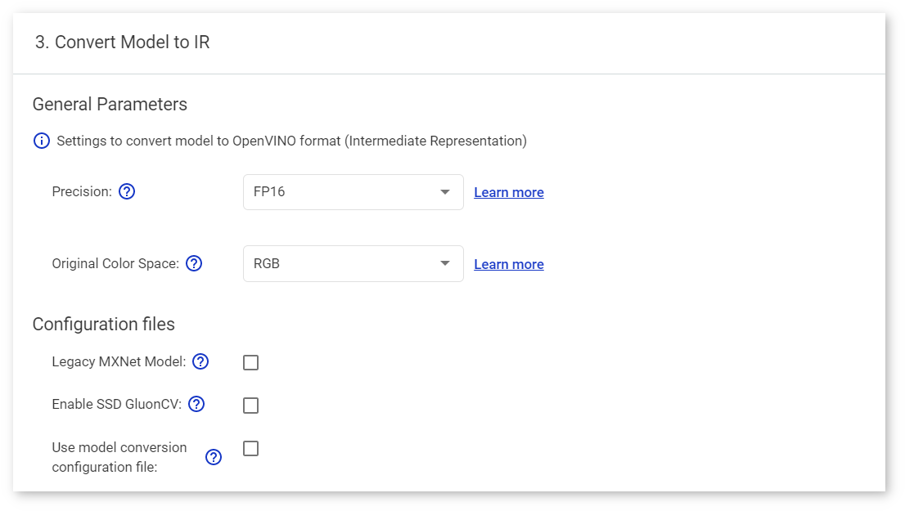
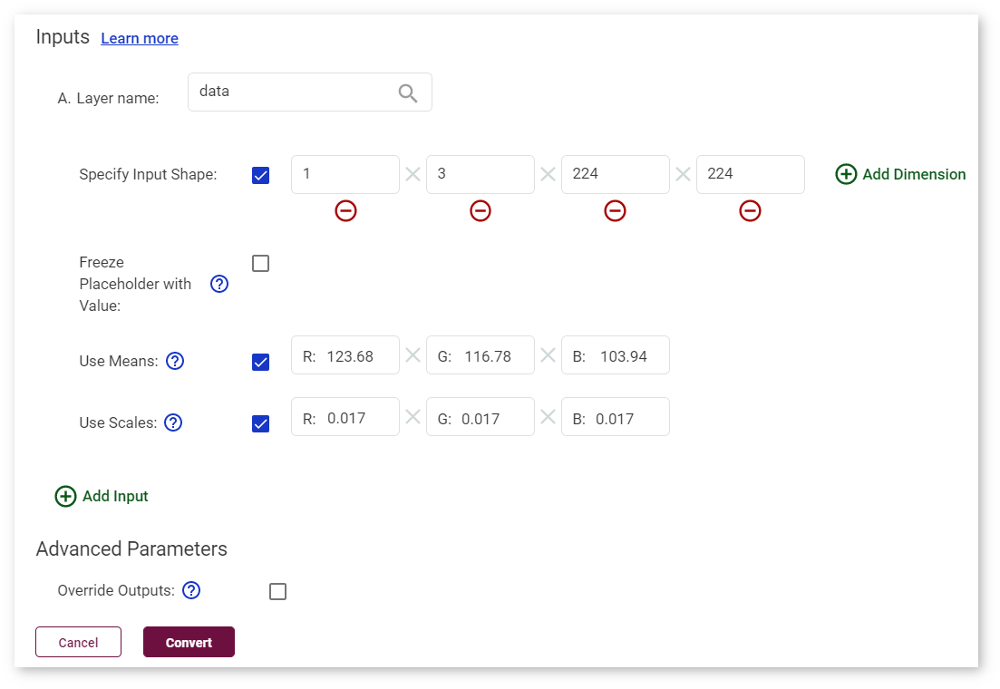

# Import MXNet* MobileNet v2 Tutorial {#workbench_docs_Workbench_DG_Import_MXNet}

This tutorial shows how to import the MobileNet v2 model, one of the original MXNet\* models, into the DL Workbench. Download the model from this [GitHub repository](https://github.com/KeyKy/mobilenet-mxnet) by saving the `mobilenet_v2-symbol.params` and `mobilenet_v2-symbol.json` files.

Go to the **Import Model** page as described in [Import Models](Select_Models.md). Select **MxNet** in the drop-down list, choose the files you downloaded. The name of the model is automatically filled in based on the name of the file you choose first.

Once you click **Import**, the tool analyzes your model and opens the **Convert Model to IR** form with conversion settings fields. Some of the fields are prepopulated as a result of the analysis.

Choose the RGB color space order as described in the [documentation of the model](https://github.com/KeyKy/mobilenet-mxnet).

The model was trained with the MXNet version lower than 1.0.0 and without MXNet GluonCV API, so do not check the **Legacy MxNet Model** and **Enable SSD gluoncv** boxes. 

Check the boxes **Use Means** and **Use Scales**. Fill in the values as described in the documentation: `[123.68, 116.78, 103.94]`  and `[0.017, 0.017, 0.017]` respectively.

Once you have the fields of the **Convert Model to IR** window filled as shown below, click **Convert** and proceed to [select a dataset](Import_Datasets.md).

---
## See Also

* [Import Models](Select_Models.md)
* [Import Frozen TensorFlow* SSD MobileNet v2 COCO Tutorial](Import_TensorFlow.md)
* [Import ONNX* MobileNet v2 Tutorial](Import_ONNX.md)
* [Troubleshooting](Troubleshooting.md)