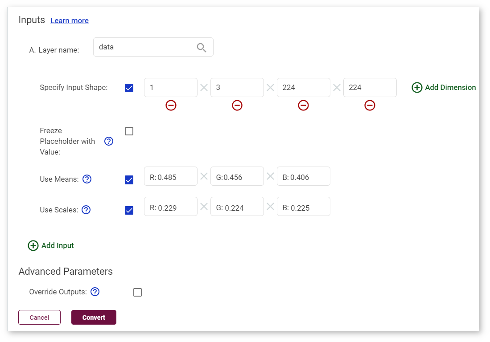

# Import ONNX* MobileNet v2 Tutorial {#workbench_docs_Workbench_DG_Import_ONNX}

This tutorial shows how to import the MobileNet v2 model, one of the original ONNX\* models, into the DL Workbench. 
To download 
other original models of this framework, go to the [public ONNX models repository](https://github.com/onnx/models).

Go to the **Import Model** page as described in [Import Models](Select_Models.md). Select **ONNX** in the drop-down list, choose the `mobilenet_v2-1.0.onnx` file. The name of the model is automatically filled in based on the file name.

Once you click **Import Model**, the tool analyzes your model and opens the **Convert Model to IR** form with conversion settings fields. Some of the fields are prepopulated as a result of the analysis.

Choose the RGB color space order as stated in the [documentation of the model](https://github.com/onnx/models/tree/master/vision/classification/mobilenet).

Check the boxes **Use Means** and **Use Scales**. Fill in the values as described in the documentation: `[0.485, 0.456, 0.406]`  and `[0.229, 0.224, 0.225]` respectively.

Once you have the fields of the **Convert Model to IR** window filled as shown below, click **Convert** and proceed to [select a dataset](Import_Datasets.md).

---
## See Also

* [Import Models](Select_Models.md)
* [Import Frozen TensorFlow* SSD MobileNet v2 COCO Tutorial](Import_TensorFlow.md)
* [Troubleshooting](Troubleshooting.md)