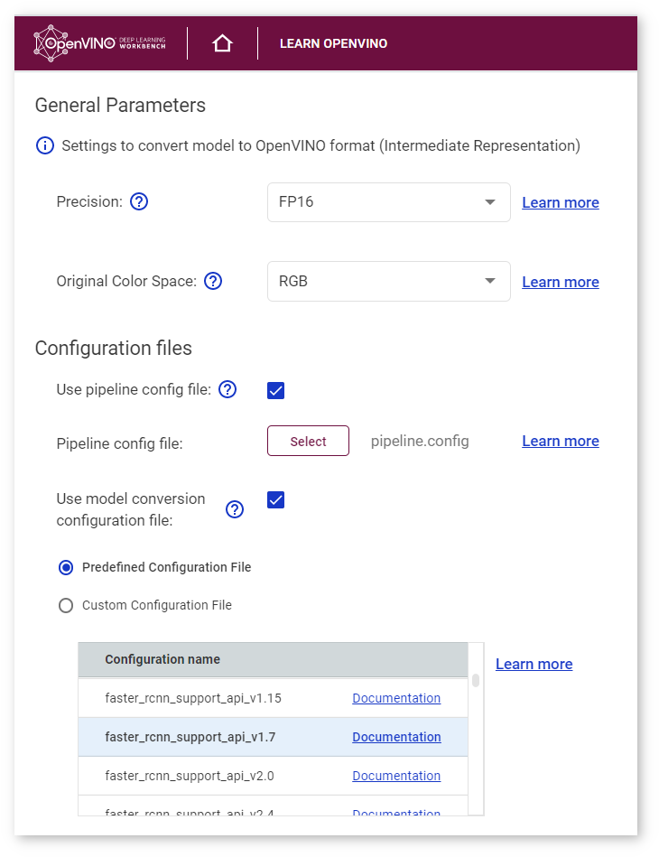
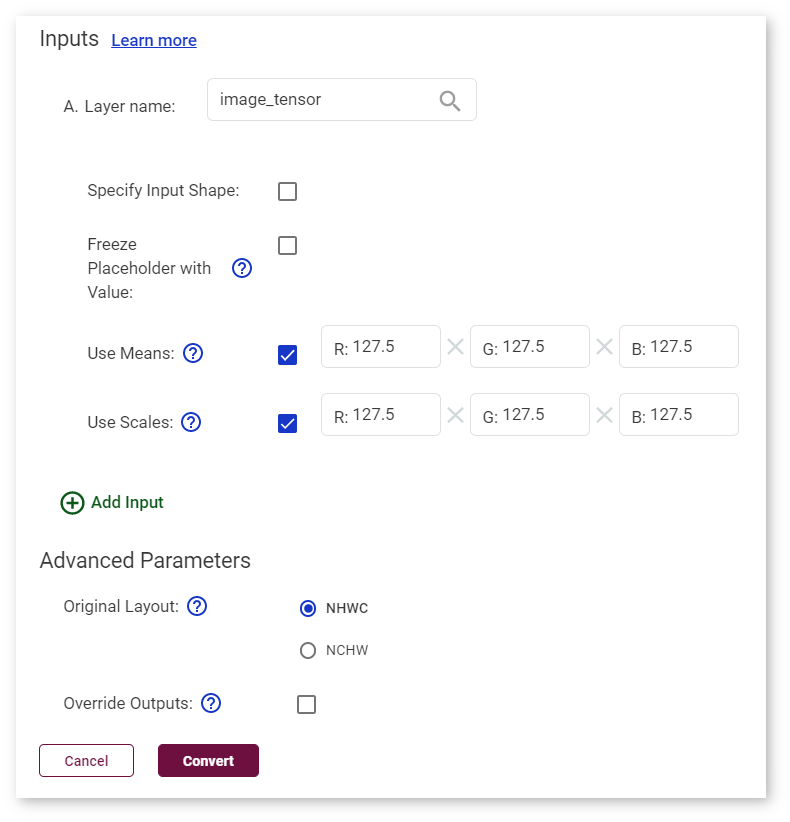

# Import Frozen TensorFlow* SSD MobileNet v1 COCO Tutorial {#workbench_docs_Workbench_DG_Import_TensorFlow}

This tutorial shows how to import the SSD MobileNet v1 COCO, one of the original TensoFlow\* models, into the DL Workbench. 
[Download the file with the model](http://download.tensorflow.org/models/object_detection/ssd_mobilenet_v1_coco_2018_01_28.tar.gz) and unarchive it.

Go to the **Import Model** page as described in [Import Models](Select_Models.md). Select **TensorFlow** in the drop-down list. Do not uncheck the **Is Frozen Model** box, because this is a frozen model. Choose the `frozen_inference_graph.pb` file. The name of the model is automatically filled in based on the name of the file you choose first.

Once you click **Import Model**, the tool analyzes your model and opens the **Convert Model to IR** form with conversion settings fields. Some of the fields are prepopulated as a result of the analysis.

Choose the RGB color space order as stated in the [documentation of the model](https://github.com/openvinotoolkit/open_model_zoo/blob/master/models/public/ssd_mobilenet_v1_coco).

Choose the pipeline configuration file `pipeline.config`.

Choose one of the model conversion configuration files in the drop-down list.

Check the boxes **Use Means** and **Use Scales**. Fill in the values as described in [the Model Optimizer documentation](@ref openvino_docs_MO_DG_prepare_model_convert_model_Convert_Model_From_TensorFlow): `[127.5, 127.5, 127.5]`  and `[127.5, 127.5, 127.5]` respectively.

Once you have the fields of the **Convert Model to IR** window filled as shown below, click **Convert** and proceed to [select a dataset](Import_Datasets.md).

---
## See Also

* [Import Models](Select_Models.md)
* [Import ONNX* MobileNet v2 Tutorial](Import_ONNX.md)
* [Troubleshooting](Troubleshooting.md)
