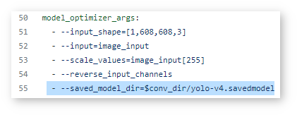
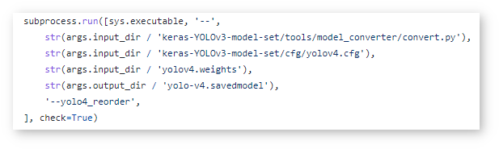
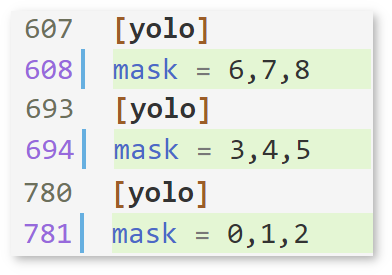
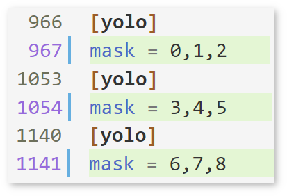
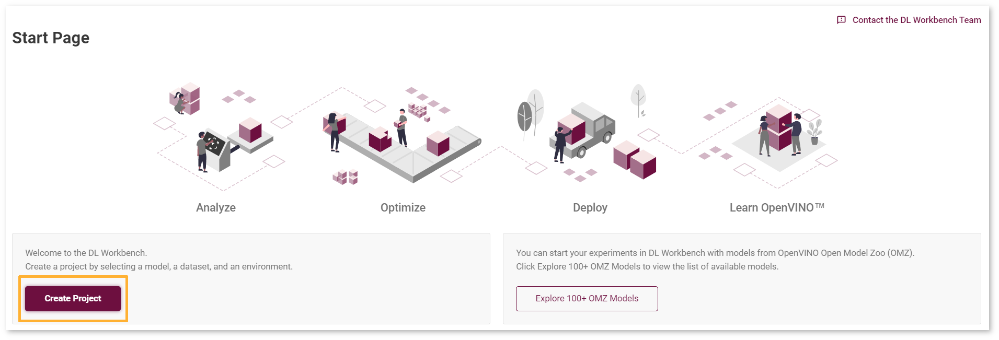
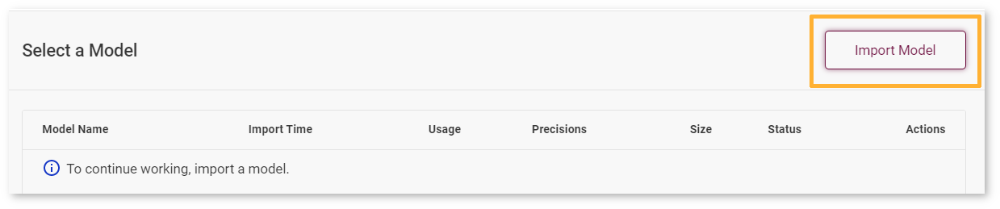
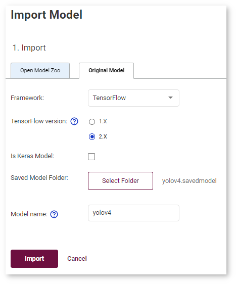
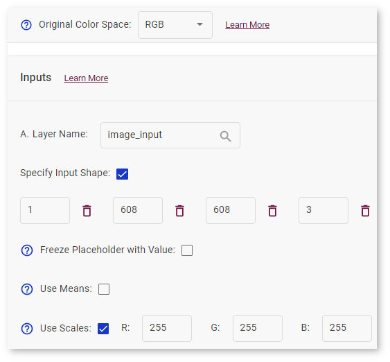
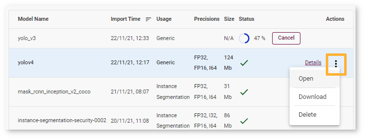
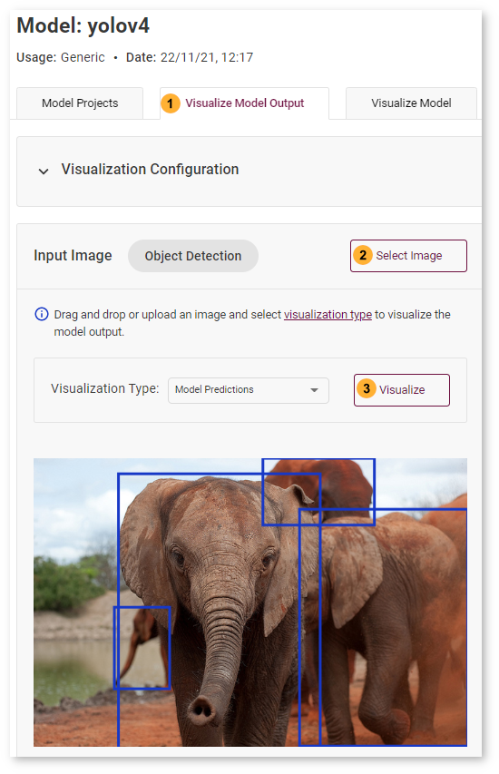

# Import Darknet* YOLOv4 Model {#workbench_docs_Workbench_DG_Tutorial_Import_YOLO}

The tutorial follows the [recommendations on importing an original model](Import_Custom_Model.md) and shows how to import an original [Darknet* YOLOv4 model](https://docs.openvino.ai/latest/omz_models_model_yolo_v4_tf.html) of [object detection](https://machinelearningmastery.com/object-recognition-with-deep-learning/) use case, and [Darknet*](https://pjreddie.com/darknet/) framework.

| Model  | Use Case | Framework | Source | 
| :---: | :---: | :---: | :---: |
| [yolo-v4](https://docs.openvino.ai/latest/omz_models_model_yolo_v4_tf.html)  | [Object Detection](https://machinelearningmastery.com/object-recognition-with-deep-learning/) | [Darknet*](https://pjreddie.com/darknet/) | [Github repository](https://github.com/AlexeyAB/darknet/releases/tag/yolov4)| 

## 1. Obtain Model

Darknet model is represented as `.weights` and `.cfg` files. [Download](https://github.com/AlexeyAB/darknet/releases/tag/yolov4) a pretrained model file `yolov4.weights` from the [Github repository](https://github.com/AlexeyAB/darknet/releases/tag/yolov4).

## 2. Convert Model to Supported Format
 
Convert the model to one of the input formats supported in the DL Workbench, for example, TensorFlow\*, ONNX\*, OpenVINO™ Intermediate Representation (IR), and [others](https://docs.openvino.ai/latest/workbench_docs_Workbench_DG_Select_Models.html#supported-frameworks).  

### 2.1 Find Similar Model Topology in the Open Model Zoo

Since the model is not supported directly in OpenVINO and DL Workbench, according to the [model import recommendations](Import_Custom_Model.md), you need to convert it to a supported format. To do that, look for a similar topology in the [Open Model Zoo repository](https://github.com/openvinotoolkit/open_model_zoo). 

Go to the Open Model Zoo (OMZ) [documentation](https://docs.openvino.ai/latest/omz_models_group_public.html), find [YOLOv4](https://docs.openvino.ai/latest/omz_models_model_yolo_v4_tf.html) model, and use the provided information to get the required model description:
    - which input format should be used ​for the model of your framework
    - how to convert the model to this format
    - how to configure accuracy of the model

### 2.2  Find Converter Parameters

Open `model.yml` file in the [OMZ repository](https://github.com/openvinotoolkit/open_model_zoo/blob/master/models/public/yolo-v4-tf/model.yml), and find the information on the model input format. Here you can see that the required format for the YOLOv4 model is SavedModel:



Open the `pre-convert.py` [file](https://github.com/openvinotoolkit/open_model_zoo/blob/master/models/public/yolo-v4-tf/pre-convert.py), and find the parameters required to use the converter: the configuration file, the weights file, and the path to the converted model. 



### 2.3 Download Darknet*-to-TensorFlow* Converter

Go to the converter [repository](https://github.com/david8862/keras-YOLOv3-model-set) and clone it: 

@sphinxdirective

.. tab:: macOS, Linux
      
   .. code-block:: sh
      
    git clone https://github.com/david8862/keras-YOLOv3-model-set.git
      
.. tab:: Windows
      
   .. code-block:: bat
      
    git clone https://github.com/david8862/keras-YOLOv3-model-set.git
      
@endsphinxdirective


### 2.4 Optional. Prepare Virtual Environment

####  Install Virtual Environment 

@sphinxdirective

.. tab:: macOS, Linux
      
   .. code-block:: sh
      
      python3 -m pip install virtualenv
      
.. tab:: Windows
      
   .. code-block:: bat
      
         python -m pip install virtualenv
         
@endsphinxdirective

####  Create Virtual Environment 

@sphinxdirective

.. tab:: macOS, Linux
      
   .. code-block:: sh
      
       python3 -m virtualenv venv
      
.. tab:: Windows
      
   .. code-block:: bat
      
         python -m virtualenv venv
      
@endsphinxdirective

#### Activate Virtual Environment

@sphinxdirective

.. tab:: macOS, Linux
      
   .. code-block:: sh
      
       source venv/bin/activate
      
.. tab:: Windows
      
   .. code-block:: bat
      
       venv\Scripts\activate

@endsphinxdirective

### 2.5 Install Requirements

Go to the `requirements.txt` file to find the converter dependencies. Adjust it for your system, if necessary. For example, if you do not have a GPU device, change `tensorflow-gpu` dependency to `tensorflow`. Install the requirements:

@sphinxdirective

.. tab:: macOS, Linux
         
   .. code-block:: sh
         
      python3 -m pip install -r ./keras-YOLOv3-model-set/requirements.txt 
         
.. tab:: Windows
         
   .. code-block:: bat
         
      python -m pip install -r .\keras-YOLOv3-model-set\requirements.txt 

@endsphinxdirective

### 2.6 Convert Darknet* Model to TensorFlow*

Run the converter by providing the paths to the configuration file, the pretrained model file, and the converted model.

In case you fine-tuned your model based on the publicly available configuration file of the Yolov4, you also need to use `--yolo4_reorder` flag. If you did not, open the configuration file `yolov4.cfg` and check the order of  `yolo` layers. If the `yolo` layers are described in ascending order, then you can proceed without this flag. Otherwise, you need to use it.

Does not require reordering:
            

        
Requires reordering:



Organize the folders and files as follows and execute the code in the terminal or PowerShell:

```
|-- keras-YOLOv3-model-set
    |-- tools
        |-- model_converter
            |-- convert.py 
    |-- cfg
       |-- yolov4.cfg
|-- yolov4.weights
|-- saved_model
```

Run the converter:

@sphinxdirective
            
.. tab:: macOS, Linux
            
   .. code-block:: sh
            
         python keras-YOLOv3-model-set/tools/model_converter/convert.py keras-YOLOv3-model-set/cfg/yolov4.cfg yolov4.weights yolov4.savedmodel --yolo4_reorder
            
.. tab:: Windows
            
   .. code-block:: bat
            
         python keras-YOLOv3-model-set\tools\model_converter\convert.py keras-YOLOv3-model-set\cfg\yolov4.cfg yolov4.weights yolov4.savedmodel --yolo4_reorder

@endsphinxdirective

## 3. Import Model

- Go to the DL Workbench and click *Create Project* and *Import Model*.
   
   
- Select TensorFlow framework and 2.X TensorFlow version. 
- Click *Select Folder* and provide the folder with the model in SavedModel format. Make sure you selected the folder, **not** the files it contains, and click *Import*:



- Specify model inputs

    - Select **RGB** color space in *General Parameters* since it was used during model training
    - Specify Input Shape. Set **1** as the first dimension, the number of batches, and fill the rest according to the `yolov4.cfg` model configuration file:
    *width* = **608**, *height* = **608**, *channels* = **3**
    - Set scales to **255** as specified in the [Darknet sources](https://github.com/AlexeyAB/darknet/blob/ca43bbdaaede5c9cbf82a8a0aa5e2d0a4bdcabc0/src/image.c#L957)

    

- Click *Convert*

## 4. Optional. Visualize Model 

To check how your model works and explore its properties, click *Open* under the *Actions* column.



Upload your image and check the prediction boxes to evaluate the model:



> **NOTE**: If the imported model predicts the right classes, but the boxes are not aligned with the objects in the image, you might have missed scales and means parameters during import. Refer to the [documentation](https://github.com/openvinotoolkit/open_model_zoo) and try to import the model again. 

Congratulations, you have imported the Darknet* YOLOv4 model. Your next step is to [Import a dataset](https://docs.openvino.ai/latest/workbench_docs_Workbench_Create_Project.html#import-dataset) to create a project. Then use one of the recommended ways to accelerate your model performance and learn how to perform 8-bit integer (INT8) calibration in the [Optimize YOLOv4 model](Tutorial_yolo.md) tutorial.

## See Also

* [Next Step: Create Project](Create_Project.md)
* [Optimize YOLOv4 model](Tutorial_yolo.md)
* [Troubleshooting](Troubleshooting.md)
 