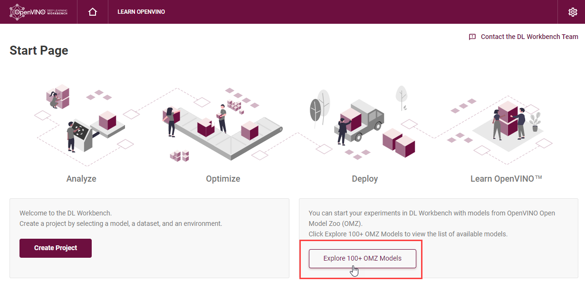

# Import Open Model Zoo Models {#workbench_docs_Workbench_DG_OMZ_Models}

To upload a model from the Open Model Zoo, click **Explore 100+ OMZ Models** on the Start Page: 

On the **Open Model Zoo** tab, select a model and click **Download and Import**. You can search the models by the Model Name, Precision, Framework and Task Type:

@sphinxdirective
.. image:: _static/images/omz_import.png
@endsphinxdirective

To work with OpenVINO tools, you need to obtain a model in the Intermediate Representation (IR) format. IR is the OpenVINO format of pre-trained model representation with two files:

* XML file describing the network topology
* BIN file containing weights and biases

On the **Convert Model to IR** step, you can specify the precision:

@sphinxdirective    
.. image:: _static/images/convert_omz_to_IR.png
@endsphinxdirective

> **NOTE**: 
> * If you are behind a corporate proxy, set environment variables during the [Installation](Run_Workbench_Locally.md) step. To learn about the import process, see the [Model Downloader documentation](@ref omz_tools_downloader).

Once you import a model, you are redirected to the **Create Project** page, where you can select the model and proceed to [select a dataset](Import_Datasets.md). 

---
## See Also

* [Model Downloader](https://docs.openvinotoolkit.org/latest/omz_tools_downloader.html)
* [Pretrained Open Model Zoo Public Models](https://docs.openvinotoolkit.org/latest/omz_models_group_public.html)
* [Pretrained Open Model Zoo Intel Models](https://docs.openvinotoolkit.org/latest/omz_models_group_intel.html)
* [Troubleshooting](Troubleshooting.md)