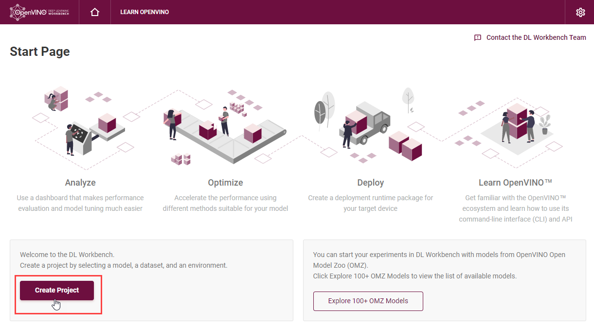
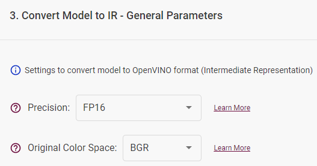
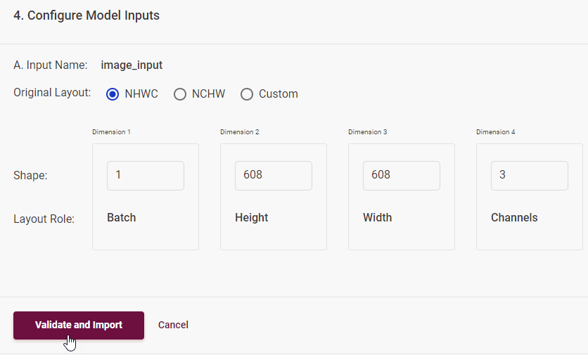

# Import Original Model {#workbench_docs_Workbench_DG_Original_Model_Import}

@sphinxdirective

.. toctree::
   :maxdepth: 1
   :hidden:
   
   workbench_docs_Workbench_DG_Tutorial_Import_Original
   
@endsphinxdirective

@sphinxdirective

To import original model in the DL Workbench, you need to:

1. Upload a model.
2. Prepare Environment.
3. Convert the model to Intermediate Representation (IR).
4. Configure Model Inputs.

@endsphinxdirective

## 1. Upload Original Models

In the DL Workbench, you can upload original models stored on your operating system.

Click **Create Project** on the Start Page to import a model:

Click **Import Model** and Select the Model Domain: Computer Vision (CV) or Natural Language Processing (NLP). The uploading process depends on the framework of your model. This section contains requirements for each supported framework:

@sphinxdirective

.. image:: _static/images/import_frameworks.png

.. dropdown:: OpenVINO™ IR

   To import an OpenVINO™ model, select the framework in the drop-down list, upload an `.xml` file and
   a `.bin` file, provide the name, and click **Import**. 
   
   Note that starting with 2022.1 release, DL Workbench supports only IR version 11. Since the model is already in the IR format and does not require the conversion, select the imported model and proceed to  :ref:`select a dataset <import datasets>`.

@endsphinxdirective

@sphinxdirective

.. dropdown:: Caffe

   To import a Caffe model, select the framework in the drop-down list, upload a `.prototxt` file and a `.caffemodel` file, and provide the name.

   To learn more about Caffe\* models, refer to the `Caffe article`_.

   .. _Caffe article: https://riptutorial.com/caffe/example/31619/prototxt-template

@endsphinxdirective

@sphinxdirective

.. dropdown:: MXNet

   To import an MXNet model, select the framework in the drop-down list, upload a `.json` file and a `.params` file, and provide the name.

   To learn more about MXNet models, refer to the `MXNet article`_.

   .. _MXNet article: https://mxnet.incubator.apache.org/versions/1.5.0/faq/visualize_graph.html

@endsphinxdirective

@sphinxdirective

.. dropdown:: ONNX

   To import an ONNX model, select the framework in the drop-down list, upload an `.onnx` file, and provide the name.

   To learn more about ONNX models, refer to the `ONNX article`_.

   .. _ONNX article: https://github.com/onnx/onnx

@endsphinxdirective

@sphinxdirective

.. dropdown:: TensorFlow

   .. tab:: TensorFlow 1.x

      TensorFlow 1.x models can be frozen and non-frozen. Frozen is an official and recommended format for
      imported models. To learn about the difference between frozen and non-frozen TensorFlow models, see `Freeze TensorFlow models`_.

      .. _Freeze TensorFlow models: https://cv-tricks.com/how-to/freeze-tensorflow-models/
      
      .. tab:: Frozen

         To import a TensorFlow 1.x frozen model:

         1. Select the framework in the drop-down list.
         2. Choose the **TensorFlow 1.x** version.
         3. Upload a `.pb` or `.pbtxt` file.
         4. Make sure the **Is Frozen Model** box is checked.
         5. Provide the name. 

         You can also check the **Use TensorFlow Object Detection API** box and upload a pipeline configuration file.
         

      .. tab:: Non-Frozen

         To import a TensorFlow 1.x non-frozen model:

         1. Select the framework in the drop-down list.
         2. Choose the **TensorFlow 1.x** version.
         3. Uncheck the **Is Frozen Model** box.
         4. Select input files type: **Checkpoint** or **MetaGraph**.

         If you select the **Checkpoint** file type, provide the following files: 

         - `.pb` or `.pbtxt` file 
         - `.checkpoint` file

         If you select the **MetaGraph** file type, provide the following files: 

         - `.meta` file 
         - `.index` file
         - data file

         5. Provide the name.

         Click **Import**.

   .. tab:: TensorFlow 2.x

      TensorFlow 2.0 models can be in SavedModel and Keras H5 format:

      * SavedModel is an official and recommended format for imported models.

      * Keras H5 format is available for Keras models with a TensorFlow 2  backend and not with a  Keras backend. Model Optimizer does not support Keras H5 models, so the DL Workbench converts Keras H5 models to the Saved Model format and then to the OpenVINO™ format with the Model Optimizer.

      .. tab:: SavedModel

         To import a TensorFlow 2.0 model in SavedModel format:

         1. Select the framework in the drop-down list.
         2. Choose the **TensorFlow 2.x** version.
         3. Upload a folder with your model. The folder should include:

         - .pb file with the model 
         - `variables` subdirectory
         - `assets` subdirectory

         4. Provide the name.

         Click **Import**.

      .. tab:: Keras

          To import a TensorFlow 2.0 model in Keras format:

          1. Select the framework in the drop-down list.
          2. Choose the **TensorFlow 2.x** version.
          3. Check the **Is Keras Model** box.
          4. Upload an .h5 file with your model.
          5. Provide the name.

          Click **Import**.  
          
@endsphinxdirective

##  2. Prepare Environment

At the **Prepare Environment** stage, the DL Workbench installs the necessary packages to work with the model framework. For each framework, the download happens only once and takes from two to five minutes. If the environment setup is successful, you will automatically proceed to the next step. Otherwise, look for a solution in [Troubleshooting](Troubleshooting.md).

##  3. Convert Models to Intermediate Representation (IR) 

To work with OpenVINO tools, you need to obtain a model in the Intermediate Representation (IR) format. IR is the OpenVINO format of pre-trained model representation with two files:

* XML file describing the network topology
* BIN file containing weights and biases

> **NOTE**: For details on converting process, refer to [Converting a Model to Intermediate Representation document](@ref openvino_docs_MO_DG_prepare_model_convert_model_Converting_Model).

### General Parameters

Specify the converted model precision and select the original color space for Computer Vision models. 

   - Precision of a converted model:  FP16 or FP32  
   - Original color space (for CV models): RGB, BGR, Grayscale

 

### Configuration Files

You can upload a Model Conversion Configuration File that contains the description of the necessary transformations required to convert a model to IR. Learn more about configuration files in the Model Optimizer [documentation](https://docs.openvino.ai/latest/openvino_docs_MO_DG_prepare_model_customize_model_optimizer_Customize_Model_Optimizer.html#generic-transformations-config-front-phase-transformations).

@sphinxdirective

   .. note::  
      When importing TensorFlow\* models, provide an additional pipeline configuration file and choose a model conversion configuration file.

@endsphinxdirective 

### Inputs

On this step you can specify the inputs of your model. This is an optional step, if your model does not require any additional conversion configurations or belongs to the NLP domain, just click **Convert** to proceed to the next step.

Check **Specify Inputs (Optional)** box, if the model requires additional conversion settings, such as:

 - changing the outputs;
 - marking the input nodes;
 - providing means and scales applied at the model training stage.

@sphinxdirective

.. dropdown:: **Specify Input name, shape and additional conversion parameters**

   **Specify Inputs (Optional)**

   Use default input layers or cut a model by specifying the layers you want to consider 
   as input ones. To change default input layers, provide the **name** of each layer.

   .. image:: _static/images/input_name.png

   **Specify Input Shape (Optional)**

   Input Shape defines the dimensionality of the input tensor. During this step, you can additionally specify layouts and their roles. Note that usually this is done during **Step 4. Configure Model Inputs**. Use the tips in the DL Workbench or refer to the next conversion section to learn more about layouts.

   .. image:: _static/images/input_shape.png 

   Learn more about inputs in the `Model Optimizer documentation`_.

   .. _Model Optimizer documentation:  https://docs.openvino.ai/latest/openvino_docs_MO_DG_prepare_model_convert_model_Cutting_Model.html 

   **Freeze Placeholder with Value**

   You can replace input layer with constant node with the provided value.

   **Use Means and Scales** 

   Specify means and scales if these transformations of input images were used during CV model training:

   - Use means: mean values to be subtracted for the input image per channel
   - Use scales: scale values to be used for multiplication for the input image per channel

   .. image:: _static/images/means_scales.png

   .. note::  

      .. _converting model general: openvino_docs_MO_DG_prepare_model_convert_model_Converting_Model_General

      To learn more about means and scales, see :ref:`Converting a Model Using General Conversion Parameters <converting model general>`.

@endsphinxdirective 

### Advanced Parameters

   In the Advanced Parameters, you can use default output layers or cut a model by specifying the layers you want to consider as output ones.

   For details on converting models from the supported frameworks, refer to the corresponding documentation: 

@sphinxdirective

.. dropdown:: **Сhange default output layers**

   To change default output layers, check the **Override Outputs** box and provide the name of a layer. 

   To find out the names of layers, view text files with a model in an editor or visualize the model in 
   the `Netron`_ neural network viewer. 

   .. _Netron: https://lutzroeder.github.io/netron

   .. note::  
      .. _converting model general: openvino_docs_MO_DG_prepare_model_convert_model_Converting_Model_General
      For more information on preprocessing parameters, refer to :ref:`Converting a Model Using General Conversion Parameters <converting model general>`.
   
   **Framework-specific parameters** 

   For **MXNet** models, specify framework-specific parameters by checking the boxes:
   - Legacy MXNet Model:  Enables MXNet loader to make a model compatible with the latest MXNet version. 
   Check only if your model was trained with MXNet version lower than 1.0.0.

   - SSD GluonCV:  Enables transformation for converting the GluonCV SSD topologies.
   Check only if your topology is one of SSD GluonCV topologies.

   * :ref:`Convert TensorFlow Model <convert model tf>`
   * :ref:`Convert Caffe Model <convert model caffe>`
   * :ref:`Convert MXNet Modele <convert model mxnet>`
   * :ref:`Convert Your ONNX Model <convert model onnx>`

@endsphinxdirective

##  4. Configure Model Inputs 

If the conversion step is completed successfully, you will obtain a model in the IR format. However, to use it in the OpenVINO tools (for example, benchmark the model, optimize it, and measure accuracy), you need to specify model layouts. Learn more about layouts in the [documentation](https://docs.openvinotoolkit.org/latest/omz_tools_downloader.html). 

Layout describes the role of each dimension of input tensors. 

Computer Vision Models: 

Layout Role | Description
--| --
Batch (N) | number of images in the batch
Height (H) | image height
Width (W) | image width
Channels (C) | number of image channels  (3 for RGB/BGR, 1 for Grayscale)
Depth | depth of the data with which the model works
Other | any other dimension role that does not refer to the number of channels or batch

The role of dimensions may differ depending on the model and the way the data was fed to the model during training. Usually, NCHW is used for ONNX models, and NHWC for TensorFlow models. If you want to specify different dimension roles, select Custom.

Natural Language Processing Models: 

Layout Role | Description
--| --
Batch (N) | number of text samples in the batch
Channels (C) |  maximum length of text that the model can process
Other | any other dimension role that does not refer to the number of channels or batch

The role of dimensions may differ depending on the model and the way the data was fed to the model during training. Usually, NCHW is used for ONNX models, and NHWC for TensorFlow models. If you want to specify different dimension roles, select Custom.

Once you click **Validate and Import**, you are redirected to the **Create Project** page, where you can select the model, analyze it and proceed to select a dataset.

## See Also

* [Model Downloader](https://docs.openvinotoolkit.org/latest/omz_tools_downloader.html)
* [Troubleshooting](Troubleshooting.md)