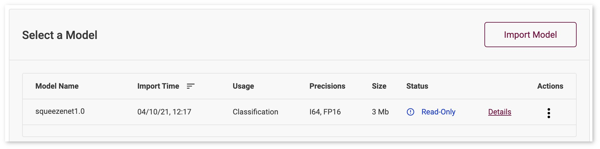

# Restore DL Workbench State {#workbench_docs_Workbench_DG_Persist_Database}

@sphinxdirective

.. toctree::
   :maxdepth: 1
   :hidden:
   
   workbench_docs_Workbench_DG_Docker_Container

@endsphinxdirective

DL Workbench enables performing multiple experiments to analyze performance and accuracy data.
To always have access to your data in the DL Workbench, use additional parameters when you [run the DL Workbench](Run_Workbench_Locally.md)
that enable DL Workbench state preservation. 

> **NOTE**: It is highly recommended to enable DL Workbench state preservation.

Why you need to preserve DL Workbench state:

* Your data might be lost due to accidental removal of a container or other infrastructural failures. 
* You want to share your experimental data and DL Workbench artifacts with your team.
* You want to transfer DL Workbench data to another machine and continue your experiments there.
* You work with the DL Workbench of some version and want to update to a higher version, 
  for example, from 2020.4 to 2021.1. 

Ignore state preservation if:

* You do not plan to share data.
* You do not plan to update the DL Workbench in the future.
* You just want to get acquainted with the DL Workbench and understand its key offerings.

Even if you do not enable state preservation, your data is secured as long as there is a container on your machine.
When you stop a container, you still have access to your data when you resume the container as described in the 
*Pause and Resume Docker Container* section of [Work with Docker Container](Docker_Container.md).
However, if you remove a container that you ran without enabling state preservation,
all your data is lost with that removed container.

To restore the DL Workbench data:

1. Follow instructions for you operating system to enable state preservation:
  * <a href="#preserve-linux-macos">Preserve the DL Workbench state on Linux* and macOS* </a>
  * <a href="#preserve-windows">Preserve the DL Workbench state on Windows* </a>
2. When you remove a container, all data is present in the mounted host folder. To continue 
working with the data in a new DL Workbench container, start the DL Workbench with the mounted 
folder or volume using `--assets-directory` or `--volume`.

## Preserve DL Workbench State on Linux and macOS <a name="preserve-linux-macos"></a>

To enable DL Workbench state preservation, mount a host directory to a Docker
container. The example below shows how to mount a local folder
while running a Docker container on Linux\* with a CPU enabled as a profiling target and in detached mode. 
To learn how to run the application on different targets, operating system, or in a different mode, see 
[Advanced Configurations](Advanced_Config.md) page.

1. To run DL Workbench with Python Starter on your OS, use the first command from [installation form](Run_Workbench_Locally.md):
```bash
python3 -m pip install -U openvino-workbench
``` 

2. In the directory with the `openvino-workbench` script, create the `/home/workbench/.workbench` folder with read, write, and execute permissions:
```
mkdir -m 777 /home/workbench/.workbench
```

3. Run the command below:   
```bash
  openvino-workbench --image openvino/workbench:2021.4.2 --assets-directory ~/.workbench
``` 
    
All your data is placed in the mounted directory once you mount it and run the DL Workbench:

```
~/.workbench
|   token.txt
|
└───datasets/
└───models/
└───postgresql_data_directory/
└───tutorials/
```

## Preserve DL Workbench State on Windows <a name="preserve-windows"></a>

Due to [problems of mounting a local folder to a Docker container on Windows](https://github.com/docker/for-win/issues/77),
the best way to preserve the state on Windows is to use Docker [volumes](https://docs.docker.com/storage/volumes/):

1. Get a Docker image as described in the **Install DL Workbench** 
section of [Install DL Workbench](Run_Workbench_Locally.md).

2. Create a Docker volume:  
```
docker volume create workbench_volume
```
3. Start the DL Workbench with the mounted volume:  
~~~
docker run -p 127.0.0.1:5665:5665 `
    --name workbench `
    --volume workbench_volume:/home/workbench/.workbench `
    -d openvino/workbench:latest
~~~

All your data is placed in the mounted volume once you mount it and run the DL Workbench:

```
|   token.txt
|
└───datasets/
└───models/
└───postgresql_data_directory/
```

## Share Profiling Data

DL Workbench `--assets-directory` contains sensitive data such as a token, models, and datasets. Share this data only in a
trusted environment. DL Workbench supports a scenario when you share only system files with profiling data, 
and not models and datasets.

Choose instructions for your operating system:
* <a href="#share-linux-macos">Share profiling data on Linux* and macOS*</a>
* <a href="#share-windows">Share profiling data on Windows*</a>

When you share only profiling data, the DL Workbench marks models, datasets, and projects as *Read-only*. 
*Read-only* means that it is not possible to run optimizations, profiling, or measurements 
on removed assets, while you can continue with importing new models and datasets.

Read-only model:



### Share Profiling Data on Linux and macOS <a name="share-linux-macos"></a>

1. Remove models and datasets directories from the `~/.workbench` folder,
so that it contains only the `postgresql_data_directory/` folder:  
```
~/.workbench
└───postgresql_data_directory/
```
2. Transfer the `~/.workbench` folder to another machine and import it with the following command:   
```bash
  openvino-workbench --image openvino/workbench:2021.4.2 --assets-directory ~/.workbench
``` 

### Share Profiling Data on Windows <a name="share-windows"></a>

1. Create an empty local folder.
2. Copy the DL Workbench data to the local folder:   
~~~
docker run --rm -v <full_path_to_local_folder>:/backup -v workbench_volume:/data busybox sh -c "cp -rp /data/* /backup"
~~~
3. Remove models and datasets directories from the local folder, so that it contains only 
the `postgresql_data_directory/` folder:  
```
/local_folder
└───postgresql_data_directory/
```
4. Transfer the local folder to another machine and create a new volume:   
```
docker volume create workbench_volume
```
5. Copy the data from the local folder to the `workbench_volume` volume:     
~~~
docker run --rm -v <full_path_to_local_folder>:/backup -v workbench_volume:/data busybox sh -c "cp -rp /backup/* /data && chown -R 5665:5665 /data && chmod -R 700 /data/postgresql_data_directory"
~~~
6. Start the DL Workbench with the mounted volume:   
~~~
docker run -p 127.0.0.1:5665:5665 `
    --name workbench `
    --volume workbench_volume:/home/workbench/.workbench `
    -it openvino/workbench:latest
~~~

## Troubleshooting

When importing assets, DL Workbench validates their consistency. If
any assets have different checksum to what the DL Workbench stores, these artifacts are considered
as threatening security of the DL Workbench. Remove these assets and try to run the DL Workbench 
again. 

DL Workbench fails to start if the provided assets cannot be imported due to aforementioned
versioning policy. In that case, create new assets directory and mount it instead of the existing one.