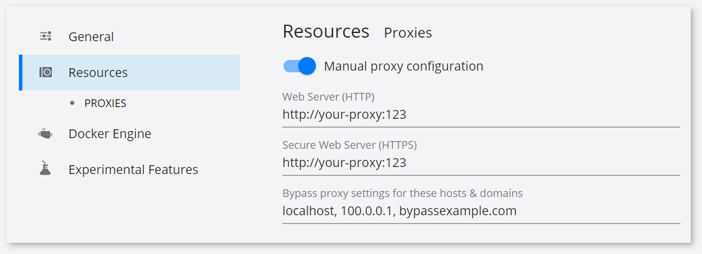

# Prerequisites {#workbench_docs_Workbench_DG_Prerequisites}

Follow these steps before running DL Workbench:
1. Make sure you have met the <a href="#recommended">recommended requirements</a>.
2. Configure [Docker](https://docs.docker.com/get-docker/) on your machine.
3. Optional. <a href="#proxy">Set proxy</a> if you are behind a firewall.
4. Optional. Install Python 3.6 or higher if you want to run the DL Workbench with Python Starter.

## <a name="recommended">Recommended Requirements</a>

 Use these requirements to make sure all features are available.

Prerequisite | Linux* | Windows* | macOS*
:----- | :----- |:----- |:-----
Operating system|Ubuntu\* 18.04|Windows\* 10 | macOS\* 10.15 Catalina
Available RAM space| 8 GB\** | 8 GB\** | 8 GB\**
Available storage space| 10 GB + space for imported artifacts| 10 GB + space for imported artifacts| 10 GB + space for imported artifacts
Docker\*| Docker CE 18.06.1 | Docker Desktop 2.3.0.3|Docker CE 18.06.1
Browser\*| Google Chrome\* 88  | Google Chrome\* 88 |Google Chrome\* 88

> ** You need more space if you optimize or measure accuracy of computationally expensive models,
> such as mask_rcnn_inception_v2_coco or faster-rcnn-resnet101-coco-sparse-60-0001.

> **NOTE**: 
> Windows*, Linux* and MacOS* support CPU targets. GPU, Intel® Neural 
> Compute Stick 2 and Intel® Vision Accelerator Design with Intel® 
> Movidius™ VPUs are supported only for Linux*. 

## <a name="proxy">Set Proxy</a>

If you are behind a firewall, Docker Desktop allows you to configure HTTP/HTTPS Proxy Settings, which are then automatically passed to Docker. If you [specify proxy settings](https://docs.docker.com/network/proxy), Docker will use them when pulling images.

However, your proxy settings will not be automatically passed to the containers you want to start. You must specify your proxy parameters when creating each container if you want to set proxy settings for them. Use the [installation form](Run_Workbench_Locally.md) to specify proxy for containers.

### Set proxy for Linux

Use [Docker official guide](https://docs.docker.com/network/proxy/) to configure proxy for containers.

### Set proxy for macOS and Windows

1. Open **Docker Desktop**.
2. Go to *Settings* >> *Proxies* >> Select *Manual proxy configuration*. Add your http-proxy
to both *Web Server* and *Secure Web Server*.
3. Add your no-proxy to *Bypass for these hosts & domains*.
4. Press *Apply settings*.
   

---
## See Also

* [Next Step: Install DL Workbench](Installation.md)
* [Troubleshooting](Troubleshooting.md)
