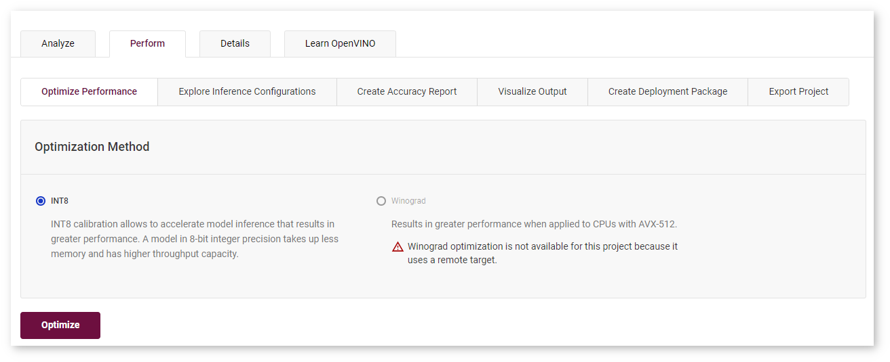
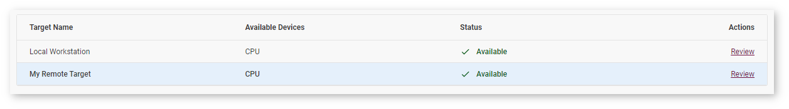

# Profile on Remote Machine {#workbench_docs_Workbench_DG_Profile_on_Remote_Machine}

DL Workbench can collect performance data not only on the machine on which you run it, but also
on other machines in your local network. 

> **NOTES**: 
> * Learn more about <a name="security">profiling on a remote machine securely</a>.
> * When using a target machine for remote profiling, make sure other users are not working on it at 
>   the same time.
> * Remote profiling takes more time than profiling on a local machine due to exchanging models,
>   datasets, the script that starts inference, and performance data.

To profile on a remote machine, follow the steps below:
1. [Set up the remote machine](Setup_Remote_Target.md).
2. [Register the remote machine](Add_Remote_Target.md) in the DL Workbench.
3. [Add a model](Select_Models.md) to a project.
4. <a href="#add-target">Add the remote machine</a> to the project.
5. [Add an environment](Select_Environment.md) to the project.
6. [Add a dataset](Import_Datasets.md)  to the project.
7. [Create a project](Create_Project.md).

After these steps, you can run single and group inference and compare performance between models on
local and remote machines. Features like accuracy measurements are disabled for remote machines:

## <a name="add-target">Add Remote Machine to Project</a>

On the **Create Project** page, [select a model](Select_Models.md) and move
on to the **Select an Environment** tab.

Machines registered in the DL Workbench are added to the **Select an Environment** table. You can only select
a machine that indicates **Available** state:

**Configuring** and **Connecting** states mean that you need to wait for the machine to set up: 

If the machine you want to use indicates **Configuration Failure**, click **Review** and
follow the instructions in [Manipulate Remote Machines](Remote_Machines.md): 

## <a name="security">Security Aspects of Remote Profiling</a>

SSH keys are sensitive data and using them in the DL Workbench is at your own risk.

DL Workbench takes control of a remote machine to perform a limited set of tasks, like installing
dependencies and OpenVINO™ tools. Connect a machine at your own risk and according to the security
policy of your organization.

[Run the DL Workbench with Transport Layer Security (TLS)](Configure_TLS.md) 
to ensure data protection.

Sensitive data is removed when you remove a machine from the DL Workbench or remove the Docker
container with the DL Workbench.

DL Workbench installs dependencies on a target machine and therefore takes additional space on it.
DL Workbench data is stored in the `.workbench` folder in your user directory. To remove the new
data from your target machine, remove the `.workbench` folder. DL Workbench transfers models and
datasets to the target machine with the SSH protocol and removes them after completing experiments
there.

## See Also

* [Work with Remote Targets](Remote_Profiling.md)
* [Manipulate Remote Machines](Remote_Machines.md)
* [Set Up Remote Target](Setup_Remote_Target.md)
* [Troubleshooting](Troubleshooting.md)