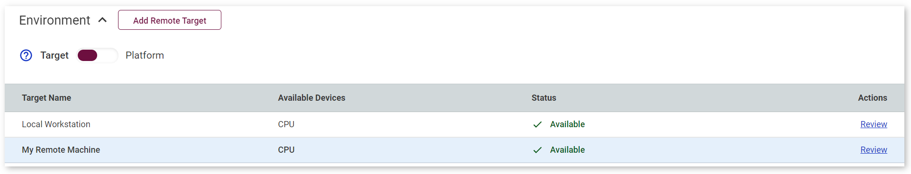
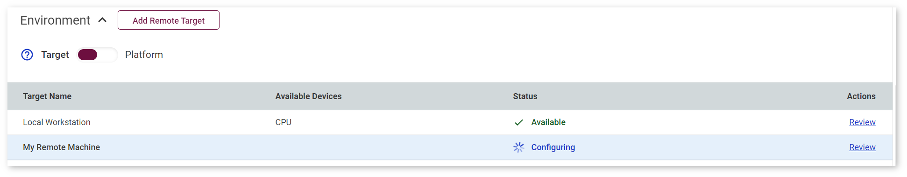
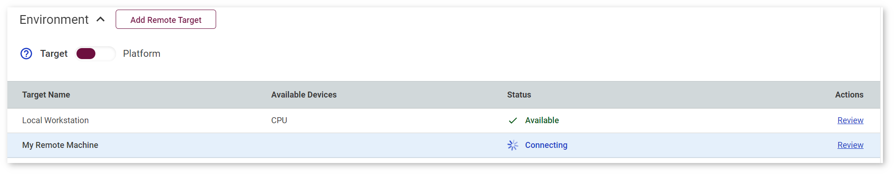
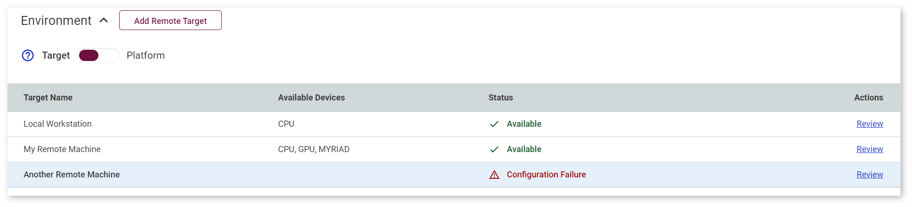
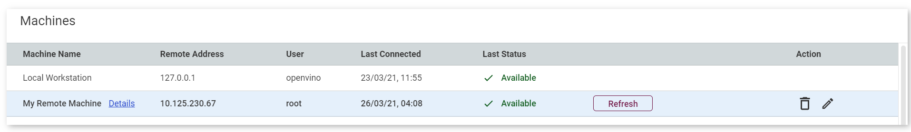

# Manipulate Remote Machines {#workbench_docs_Workbench_DG_Remote_Machines}

Machines registered in the DL Workbench are added to the **Environment** table on the **Create Project** page. You can only select
a machine that indicates **Available** state:

**Configuring** and **Connecting** states mean that you need to wait for the machine to set up: 

If the machine you want to use indicates **Configuration Failure** state, click **Review**:

Once you click **Review**, you get to the **Target Machines** page with the details of your machines: 

To remove a configuration, click the bin icon in the **Action** column. To edit the configuration,
click the pencil icon in the **Action** column of the **Machines Table** and edit parameters on the
**Edit Remote Target** page that will open. Refer to [Troubleshooting](Troubleshooting.md) to fix an issue.

Click **Refresh** to update remote machine parameters. The **Configuration Status**, **Connection Status** tables and the **System Resources** field will get configured again:

---
## See Also

* [Work with Remote Targets](Remote_Profiling.md)
* [Profile on a Remote Machine](Profile_on_Remote_Machine.md)
* [Set Up Remote Target](workbench_docs_Workbench_DG_Setup_Remote_Target.html)
* [Troubleshooting](Troubleshooting.md)