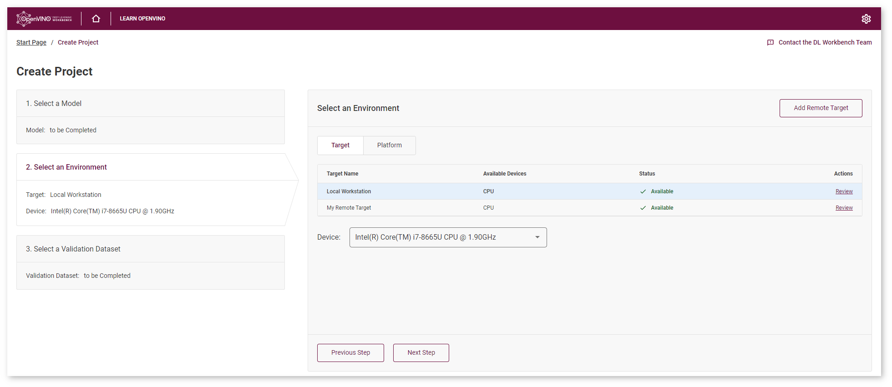
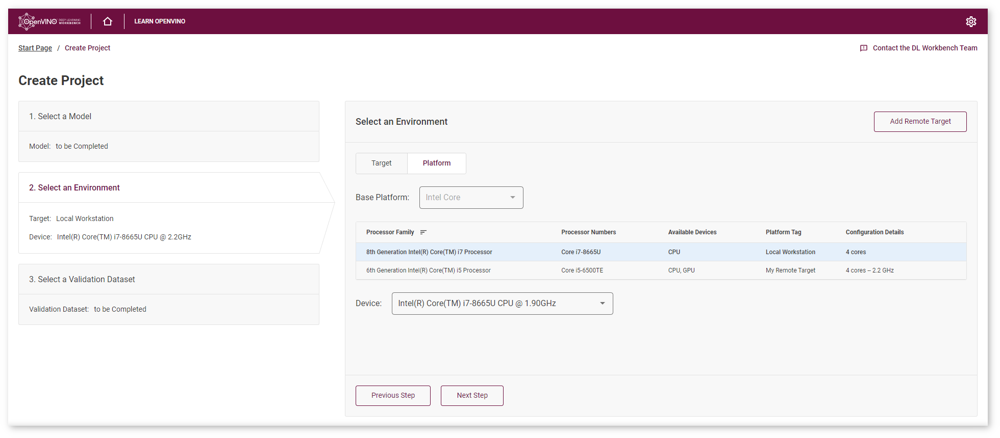

# Select Environment {#workbench_docs_Workbench_DG_Select_Environment}

@sphinxdirective

.. toctree::
   :maxdepth: 1
   :hidden:
   
   workbench_docs_Workbench_DG_Remote_Profiling
      
@endsphinxdirective

Target is a machine that hosts one or several accelerators. Device is a hardware accelerator on which a model is executed. The target can be your local workstation or a remote system. By default, your local target is selected. Learn more about setting up remote targets at the [Work with Remote Targets](Remote_Profiling.md) section. 

Select a target. This can be your local workstation or a remote target. If you use a remote target,
see [Register Remote Machine](Add_Remote_Target.md).
Select a device from a target or a platform view: 
* **Target View**  
  Use this view when the list with targets is short. Select a target from the list of machines
  registered in the DL Workbench. 
* **Platform View**   
  Use this view when the list with targets is long. Determine the base platform based on Intel®
  processors: Core™, Xeon™, or Atom™. Within a platform, choose a combination and an accelerator. To
  group targets based on a platform, switch to the platform view and select a platform in the 
  **Base Platform** drop-down list: 

  

  Targets with higher processor numbers within one platform go first. To sort from lowest to
  highest, click the arrow next to the **Processor Numbers** heading.

Targets supported in the DL Workbench:
Code name in DL Workbench | Plugin name in OpenVINO™ Runtime | Examples of devices
---|---| ---
CPU	| [CPU](@ref openvino_docs_OV_UG_supported_plugins_CPU) | Intel® Xeon® with Intel® AVX2 and AVX512, Intel® Core™ processors with Intel® AVX2, Intel Atom® processors with Intel® SSE
GPU	| [GPU](@ref openvino_docs_OV_UG_supported_plugins_GPU) |Intel® Processor Graphics, including Intel® HD Graphics and Intel® Iris® Graphics

---
## See Also

* [Work with Remote Targets](Remote_Profiling.md)
* [Troubleshooting](Troubleshooting.md)
