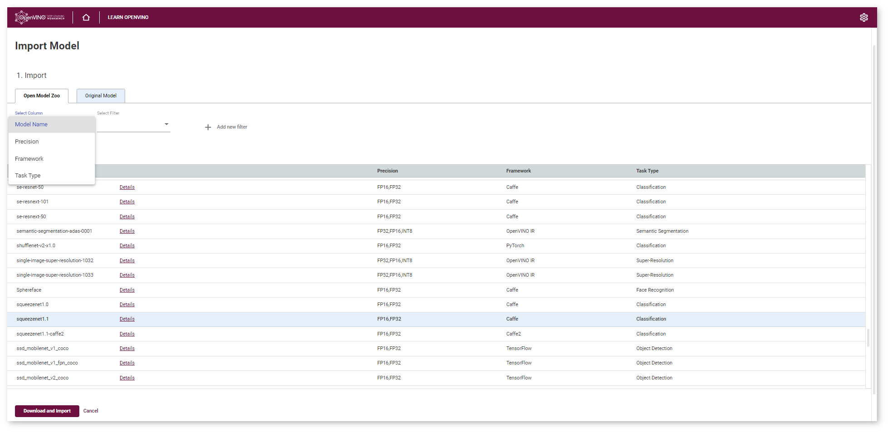
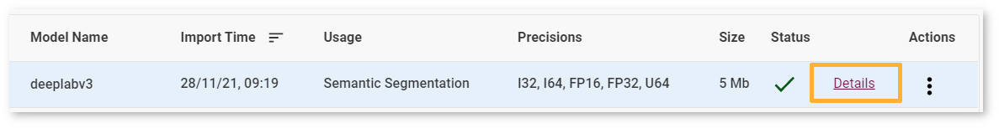
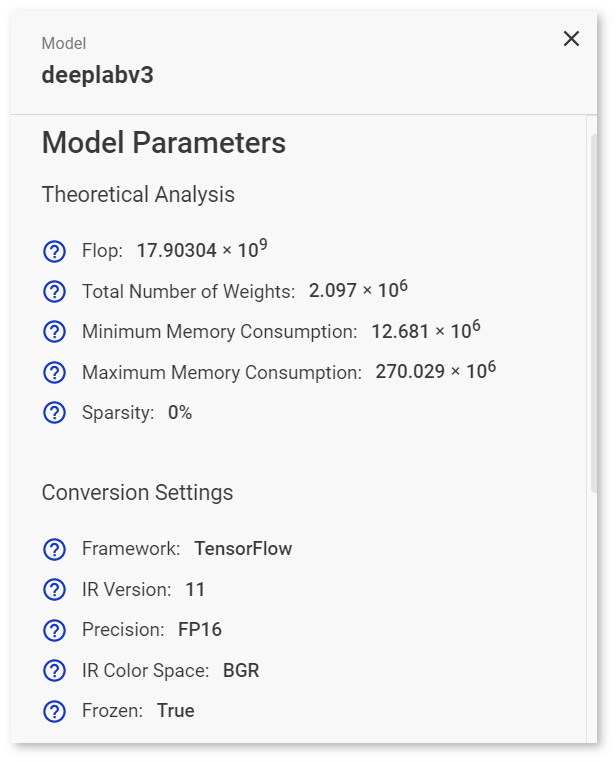

# Obtain Models {#workbench_docs_Workbench_DG_Select_Models}

@sphinxdirective

.. toctree::
   :maxdepth: 1
   :hidden:
   
   workbench_docs_Workbench_DG_Tutorial_Import_Original
   workbench_docs_Workbench_DG_Tutorial_Import_YOLO
   workbench_docs_Workbench_DG_Import_TensorFlow
   workbench_docs_Workbench_DG_Import_MXNet
   workbench_docs_Workbench_DG_Import_ONNX
      
@endsphinxdirective

> **NOTE**: If you have imported a model before, do not import it again. You can 
> [select it](Select_Model.md) from the list of available models.

You can import original and the [Open Model Zoo](@ref omz_models_group_intel) models. 
Click **Explore 100+ OMZ Models** on the Start Page or **Import Model** on the Create Project page. 

To import a model, follow the steps below:

1. <a href="#upload">Upload a model</a>
2.  <a href="#convert">Convert the model to Intermediate Representation (IR)</a> — only for non-OpenVINO™ models

> **NOTE**: To learn about the conversion logic, see the [Model Optimizer documentation](@ref openvino_docs_MO_DG_Deep_Learning_Model_Optimizer_DevGuide).

Once you import a model, you are directed back to the **Create Project** page, where you can 
[select the imported model](Select_Model.md) and proceed to 
[select a dataset](Import_Datasets.md). 

You can find all imported models on the **Start Page**:

## Supported Frameworks

DL Workbench supports the following frameworks whether uploaded from a local folder or imported from 
the Open Model Zoo.

Framework | Original Models | Open Model Zoo
:--  |:---:|:--:
OpenVINO™|  ✔ |  ✔
Caffe\* | ✔ |  ✔
MXNet\* | ✔ |  ✔
ONNX\* | ✔ |  ✔
TensorFlow\* | ✔ |  ✔
PyTorch\* | |  ✔

## Use Models from Open Model Zoo

> **NOTE**: Internet connection is required for this option. If you are behind a corporate proxy, set environment variables during the [Installation](Run_Workbench_Locally.md) step.

To use a model from the Open Model Zoo, go to the **Open Model Zoo** tab. Select a model and click **Import**. You can search the models by the Model Name, Precision, Framework and Task Type:

> **TIP**: Precision of models from the Open Model Zoo can be changed in the 
> <a href="#convert-omz">Conversion</a> step.

Once you click **Import**, the <a href="#convert">Convert Model to IR</a> section opens.

> **NOTE**: To learn about the import process, see the [Model Downloader documentation](@ref omz_tools_downloader).

## <a name="upload">Upload Original Models</a>

In the **Original Model** tab, you can upload original models stored in files on your operating system. The uploading process 
depends on the framework of your model.

### Upload OpenVINO™ (IR) Models

To import an OpenVINO™ model, select the framework in the drop-down list, upload an `.xml` file and
a `.bin` file, provide the name, and click **Import**. Starting with 2022.1 release, DL Workbench supports only IR version 11.  Since the model is already in the IR format, [select the imported model](Select_Model.md) and proceed to 
[select a dataset](Import_Datasets.md).

### Upload Caffe* Models

> **NOTE**: To learn more about Caffe\* models, refer to the [article](https://riptutorial.com/caffe/example/31619/prototxt-template).

To import a Caffe model, select the framework in the drop-down list, upload an [`.prototxt`] file and a `.caffemodel` file, and provide the name.

Once you click **Import**, the tool analyzes your model and opens the <a href="#convert">Convert Model to IR</a> form with prepopulated conversion settings fields, which you can change.

### Upload MXNet* Models

> **NOTE**: To learn more about MXNet models, refer to the [article](https://mxnet.incubator.apache.org/versions/1.5.0/faq/visualize_graph.html).

To import an MXNet model, select the framework in the drop-down list, upload a `.json` file and a `.params` file, and provide the name.

Once you click **Import**, the tool analyzes your model and opens the <a href="#convert">Convert Model to IR</a> form with prepopulated conversion settings fields, which you can change.

### Upload ONNX* Models

> **NOTE**: To learn more about ONNX models, refer to the [article](https://github.com/onnx/onnx).

To import an ONNX model, select the framework in the drop-down list, upload an `.onnx` file, and provide the name.

Once you click **Import**, the tool analyzes your model and opens the <a href="#convert">Convert Model to IR</a> form with prepopulated conversion settings fields, which you can change.

### Upload TensorFlow* Models

#### TensorFlow 1.x Models

TensorFlow 1.x models can be frozen and non-frozen. Frozen is an official and recommended format for
imported models. To learn about the difference between frozen and non-frozen TensorFlow models, see
[Freeze Tensorflow models and serve on web](https://cv-tricks.com/how-to/freeze-tensorflow-models/).

##### Frozen Models

To import a TensorFlow 1.x frozen model:
1. Select the framework in the drop-down list.
2. Choose the **TensorFlow 1.x** version.
3. Upload a `.pb` or `.pbtxt` file.
4. Make sure the **Is Frozen Model** box is checked.
5. Provide the name. 

You can also check the **Use TensorFlow Object Detection API** box and upload a pipeline configuration file.

Once you click **Import**, the tool analyzes your model and opens the <a href="#convert">Convert Model to IR</a> form with prepopulated conversion settings fields, which you can change.

##### Non-Frozen Models

To import a TensorFlow 1.x non-frozen model:
1. Select the framework in the drop-down list.
2. Choose the **TensorFlow 1.x** version.
3. Uncheck the **Is Frozen Model** box.
4. Select input files type: **Checkpoint** or **MetaGraph**.
  * If you select the **Checkpoint** file type, provide the following files: 
    - `.pb` or `.pbtxt` file 
    - `.checkpoint` file
  * If you select the **MetaGraph** file type, provide the following files: 
    - `.meta` file 
    - `.index` file
    - data file
5. Provide the name.

Once you click **Import**, the tool analyzes your model and opens the <a href="#convert">Convert Model to IR</a> form with prepopulated conversion settings fields, which you can change.

#### TensorFlow 2.0 Models

TensorFlow 2.0 models can be in SavedModel and Keras H5 format:
* SavedModel is an official and recommended format for
imported models.
* Keras H5 format is available for Keras models with a TensorFlow 2  backend and not with a  Keras backend. Model Optimizer does not support Keras H5 models, so the DL Workbench converts Keras H5 models to the Saved Model format and then to the OpenVINO™ format with the Model Optimizer.

##### SavedModel Format

To import a TensorFlow 2.0 model in SavedModel format:
1. Select the framework in the drop-down list.
2. Choose the **TensorFlow 2.x** version.
3. Upload a folder with your model. The folder should include:
  * .pb file with the model 
  * `variables` subdirectory
  * `assets` subdirectory
4. Provide the name.

Once you click **Import**, the tool analyzes your model and opens the <a href="#convert">Convert Model to IR</a> form with prepopulated conversion settings fields, which you can change.

##### Keras H5 Format

To import a TensorFlow 2.0 model in Keras format:
1. Select the framework in the drop-down list.
2. Choose the **TensorFlow 2.x** version.
3. Check the **Is Keras Model** box.
4. Upload an .h5 file with your model.
5. Provide the name.

Once you click **Import**, the tool analyzes your model and opens the <a href="#convert">Convert Model to IR</a> form with prepopulated conversion settings fields, which you can change.

## <a name="convert"> Convert Models to Intermediate Representation (IR) </a>

You are automatically directed to the **Convert Model to IR** step after uploading a model. Besides 
<a href="#general-parameters">general framework-agnostic parameters</a>, you might need to specify 
framework-specific or <a href="#advanced-parameters">advanced framework-agnostic parameters</a>.

> **NOTE**: For details on converting process, refer to [Converting a Model to Intermediate Representation](@ref openvino_docs_MO_DG_prepare_model_convert_model_Converting_Model).

### <a name="general-parameters">General Framework-Agnostic Parameters</a>

Refer to the table below to learn about parameters shared by all frameworks.

Parameter |Values | Description
--|:---:| --
Batch number | 1-256 | How many images at a time are propagated to a neural network
Precision| FP16 or FP32| Precision of a converted model
Original color space|RGB or BGR| Color space of an original model

### Framework-Specific Parameters

When importing TensorFlow\* models, provide an additional pipeline configuration file and choose a 
model conversion configuration file. For details, refer to [Import Frozen TensorFlow SSD MobileNet v2 COCO Tutorial](Import_TensorFlow.md).

### Inputs

> **NOTE**: Input layers are required for MXNet\* models.

You can use default input layers or cut a model by specifying the layers you want to consider 
as input ones. To change default input layers, provide information about the layers:

> **TIP**: To add more than one layer, click the **Add Input** button. To remove layers, click on the *red remove* sign next to the name of a layer. 

- Name
- Input shape. To add or remove dimensions, click **Add Dimension** or the *purple minus* sign respectively.
- Optionally: 
  - Use means: mean values to be used for the input image per channel
  - Use scales: scale values to be used for the input image per channel

### <a name="advanced-parameters">Advanced Framework-Agnostic Parameters</a>

You can use default output layers or cut a model by specifying the layers you want to consider 
as output ones. To change default input layers, check the **Override Outputs** box and provide the name of a layer. 

> **TIP**: To add more than one layer, click the **Add Output** button. To remove layers, click on the *red remove sign* next to the name of a layer. 

To find out the names of layers, view text files with a model in an editor or visualize the model in 
the [Netron](https://lutzroeder.github.io/netron/) neural network viewer. 
  

### Convert Original Caffe* or ONNX* Model

To convert a Caffe\* or an ONNX\* model, provide the following information in the 
<a href="#general-parameters">General Parameters section</a>:
* Batch
* Precision
* Color space

You can also use default values by checking the box in the <a href="#advanced-parameters">Advanced 
Parameters section</a>.

> **NOTE**: For details on converting Caffe and ONNX models, refer to [Converting a Caffe* Model](@ref openvino_docs_MO_DG_prepare_model_convert_model_Convert_Model_From_Caffe) and [Converting an ONNX* Model](@ref openvino_docs_MO_DG_prepare_model_convert_model_Convert_Model_From_ONNX).

Once you click **Convert**, you are directed back to the **Create Project** page, where you can 
[select the imported model](Select_Model.md) and proceed to 
[select a dataset](Import_Datasets.md).

### Convert Original MXNet* Model

To convert an MXNet model, provide the following information in the 
<a href="#general-parameters">General Parameters section</a>:
* Batch
* Precision
* Color space

In the same section, specify framework-specific parameters by checking the boxes:

  - Legacy MXNet Model:  Enables MXNet loader to make a model compatible with the latest MXNet version. 
  Check only if your model was trained with MXNet version lower than 1.0.0.

  - SSD GluonCV:  Enables transformation for converting the GluonCV SSD topologies.
  Check only if your topology is one of SSD GluonCV topologies.

Checking the **Use Default Values** box in the <a href="#advanced-parameters">Advanced Parameters 
section</a> allows you to choose to use inputs and/or outputs.

Once you click **Convert**, you are directed back to the **Create Project** page, where you can 
[select the imported model](Select_Model.md) and proceed to 
[select a dataset](Import_Datasets.md).

> **NOTE**: For details on converting MXNet models, refer to [Converting an MXNet* Model](@ref openvino_docs_MO_DG_prepare_model_convert_model_Convert_Model_From_MxNet).

### Convert Original TensorFlow* Model

To convert a TensorFlow model, provide the following information in the 
<a href="#general-parameters">General Parameters section</a>:
* Batch
* Precision
* Color space

Checking the **Use Default Values** box in the <a href="#advanced-parameters">Advanced Parameters 
section</a> allows you to choose to use inputs and/or outputs.

Once you click **Convert**, you are directed back to the **Create Project** page, where you can 
[select the imported model](Select_Model.md) and proceed to 
[select a dataset](Import_Datasets.md).

> **NOTE**: For details on converting TensorFlow models, refer to [Converting a TensorFlow* Model](@ref openvino_docs_MO_DG_prepare_model_convert_model_Convert_Model_From_TensorFlow).

### <a name="convert-omz">Convert Model from Open Model Zoo</a>

To convert a model from the Open Model Zoo, provide the precision in the 
<a href="#general-parameters">General Parameters section</a>.

Once you click **Convert**, you are directed back to the **Create Project** page, where you can 
[select the imported model](Select_Model.md) and proceed to 
[select a dataset](Import_Datasets.md).

## Analyze Models

The **Model Analyzer** is used for generating estimated performance information on neural networks.
The tool analyzes of the following characteristics:

Parameter | Explanation | Unit of Measurement
---|---|---
Flop | Total number of floating-point operations required to infer a model. Summed up over known layers only.| Number of operations
Iop | Total number of integer operations required to infer a model. Summed up over known layers only.| Number of operations
Total number of weights|Total number of trainable network parameters excluding custom constants. Summed up over known layers only.|Number of weights
Minimum Memory Consumption |Theoretical minimum of memory used by a network for inference given that the memory is reused as much as possible.  Minimum Memory Consumption does not depend on weights.|Number of activations
Maximum Memory Consumption |Theoretical maximum of memory used by a network for inference given that the memory is not reused, which means all internal feature maps are stored in the memory simultaneously. Maximum Memory Consumption does not depend on weights.|Number of activations
Sparsity |Percentage of zero weights| Percentage

Model analysis data is collected when the model is imported.  All parameters depend on the size of a batch.
Currently, information is gathered on the default model batch.

To view analysis data, click **Details** next to the name of a
model in the **Model** table on the **Create Project** page:

The details appear on the right:

---
## See Also

* [Model Downloader](https://docs.openvinotoolkit.org/latest/omz_tools_downloader.html)
* [Pretrained Open Model Zoo Public Models](https://docs.openvinotoolkit.org/latest/omz_models_group_public.html)
* [Pretrained Open Model Zoo Intel Models](https://docs.openvinotoolkit.org/latest/omz_models_group_intel.html)
* [Troubleshooting](Troubleshooting.md)