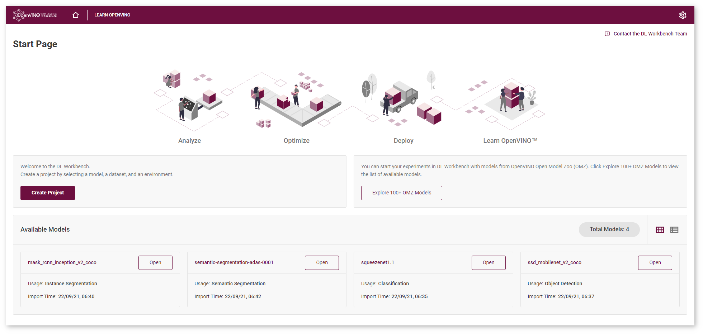

# Obtain Models {#workbench_docs_Workbench_DG_Select_Models}

@sphinxdirective

.. toctree::
   :maxdepth: 1
   :hidden:
   
   workbench_docs_Workbench_DG_OMZ_Models
   workbench_docs_Workbench_DG_Original_Model_Import
   workbench_docs_Workbench_DG_Tutorial_Import_Original
   workbench_docs_Workbench_DG_Tutorial_Import_YOLO
   workbench_docs_Workbench_DG_Tutorial_Import_NLP
   workbench_docs_Workbench_DG_Import_ONNX
   workbench_docs_Workbench_DG_Import_TensorFlow
   
@endsphinxdirective

In the DL Workbench, you can import original and the Open Model Zoo (OMZ) models. 
Click **Create Project** on the Start Page to import a model or select **Explore 100+ OMZ Models** to upload a model from Open Model Zoo. 

@sphinxdirective

.. panels::

    Import your original model to start experiments in the DL Workbench and maximize the performance. 

    .. image:: _static/images/original_model_banner.png
       :width: 300px
       :align: center

    +++

    .. link-button:: workbench_docs_Workbench_DG_Original_Model_Import
        :type: ref
        :text: Import original models
        :classes: btn-outline-primary btn-block stretched-link 

    ---

    Import models from OpenVINO Open Model Zoo (OMZ) in a quick intuitive way to get started with the pretrained high-quality models (100+).

    .. image:: _static/images/omz_banner.png
       :width: 300px
       :align: center

    +++

    .. link-button:: workbench_docs_Workbench_DG_OMZ_Models
        :type: ref
        :text: Import OMZ models
        :classes: btn-outline-primary btn-block stretched-link 
 
@endsphinxdirective

Once you have imported a model, you are redirected to the **Create Project** page, where you can select the imported model and proceed to [select a dataset](Import_Datasets.md). 

You can find all imported models on the **Start Page**:

## Supported Frameworks

DL Workbench supports the following frameworks whether uploaded from a local folder or imported from 
the Open Model Zoo.

Framework | Original Models | Open Model Zoo
:--  |:---:|:--:
OpenVINO™|  ✔ |  ✔
TensorFlow\*  | ✔ |  ✔
MXNet\* | ✔ |  ✔
ONNX\* | ✔ |  ✔
Caffe\* | ✔ |  ✔
PyTorch\* | |  ✔

## See Also

* [Open Model Zoo](@ref model_zoo)
* [Troubleshooting](Troubleshooting.md)