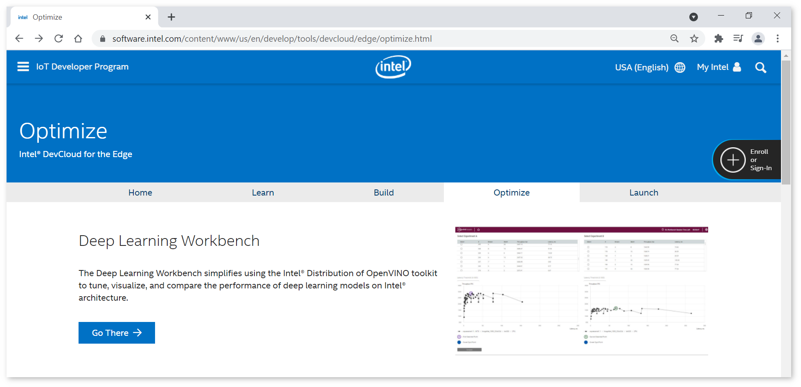
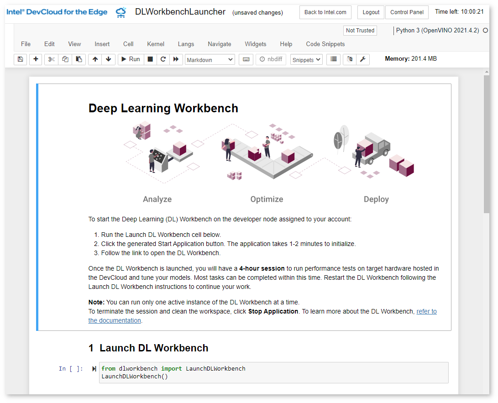
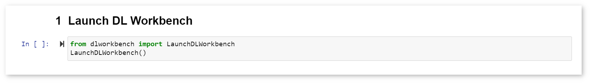
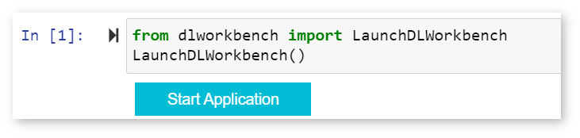
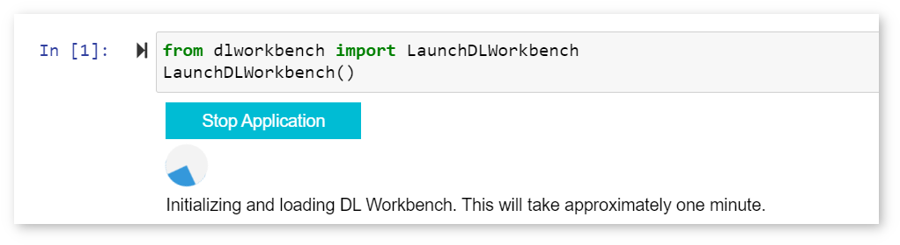
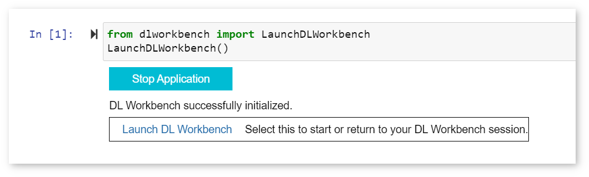

# Run the DL Workbench in the Intel® DevCloud for the Edge {#workbench_docs_Workbench_DG_Start_DL_Workbench_in_DevCloud}

[Intel® DevCloud for the Edge](https://software.intel.com/content/www/us/en/develop/tools/devcloud.html) 
is a computing resource to develop, test, and run your workloads across a range of Intel®
CPUs, GPUs, and Movidius™ Myriad™ Vision Processing Units (VPUs). Running the DL Workbench
in the DevCloud helps you optimize your model and analyze its
performance on various Intel® hardware configurations. DevCloud is
available for enterprise developers, independent developers, students, and faculty
members.

When running the DL Workbench in the DevCloud, you can use the following DL Workbench features: 

Feature| Supported
--|--
Single and group inference  | Yes  (HDDL plugin is not supported)
INT8 calibration | Yes
Accuracy measurements | Yes
Model output visualization | Yes
Visualization of runtime and Intermediate Representation (IR) graph | Yes
Connecting to your remote machine\*\* | No
Downloading models from the [Intel Open Model Zoo](https://docs.openvino.ai/latest/omz_models_group_intel.html) | Yes
Deployment package creation | Yes
JupyterLab\* learning environment | No

\*\* *In the DevCloud, you are connecting only to remote machines that are available in it. You cannot work with your local workstation or connect
to other machines in your local network.*

> **NOTES**:
> * Profiling and calibration on DevCloud machines take more time than on a local machine 
> due to the exchange of models, datasets, the job script, and performance data.
> * Inference results may insignificantly vary for identical environment configurations. 
> This happens because the same environment in the DevCloud does not mean the same physical machine.

## Start the DL Workbench in the Intel® DevCloud for the Edge

@sphinxdirective

.. list-table::

   * - .. raw:: html

           <iframe  allowfullscreen mozallowfullscreen msallowfullscreen oallowfullscreen webkitallowfullscreen height="315" width="560"
           src="https://www.youtube.com/embed/rygSRiKn0oY">
           </iframe>
   * - **Run the DL Workbench in the Intel® DevCloud for the Edge**. Duration: 4:10
     
@endsphinxdirective

1. [Register in the DevCloud](https://inteliotgnew.secure.force.com/devcloudsignup). 
Shortly after the registration, you receive a mail with a link to the home page.

2. Follow the link from the mail. Click **Accept** if you agree to the Terms and Conditions.

3. Select **Optimize** tab and click **Go There** button to access DL Workbench. 

4. The Jupyter\* notebook called `DLWorkbenchLauncher.ipynb` opens:

5. Run **Launch DL Workbench** cell:

6. The **Start Application** button appears. 

7. Once you click the button, the DevCloud starts initializing and loading the DL Workbench. 

8. In about a minute, the link appears under the cell:

Click this link to open the DL Workbench. Make sure your browser does not block pop-up windows as it prevents the tab from opening: 

You have started the DL Workbench in the DevCloud. A DL Workbench session in the DevCloud is limited to four hours. Remaining session time is
indicated in the upper-right corner of the interface: 

 

After four hours, the Docker container
with the DL Workbench stops, but your data is autosaved in the DevCloud. To continue working with the DL Workbench,
restart the session.

___
## See Also

* [Next Step: Get Started with the DL Workbench](Work_with_Models_and_Sample_Datasets.md)
* [Troubleshooting for DL Workbench in the Intel® DevCloud for the Edge](DC_Troubleshooting.md)
