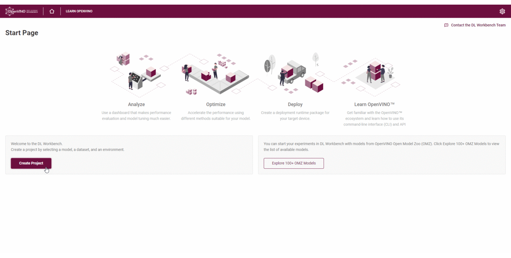
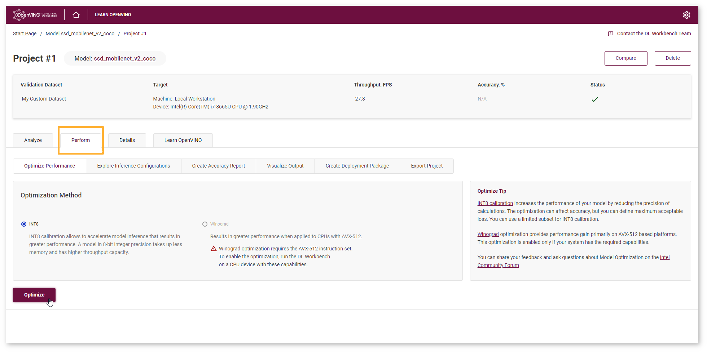
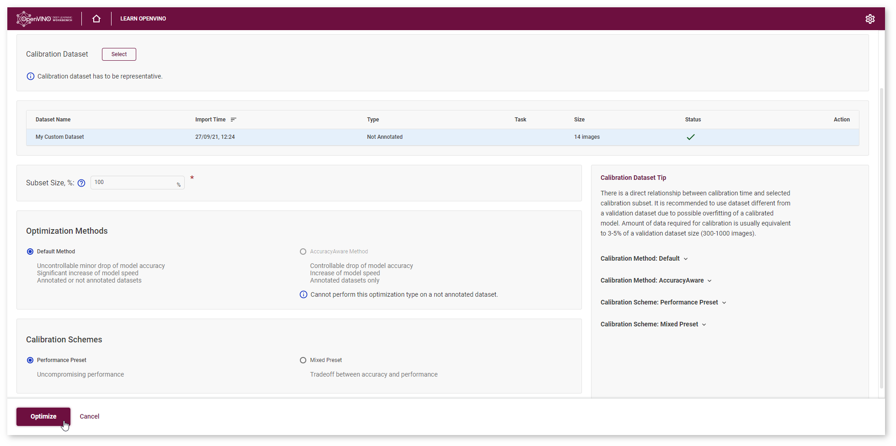
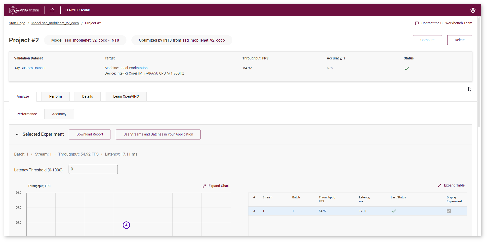
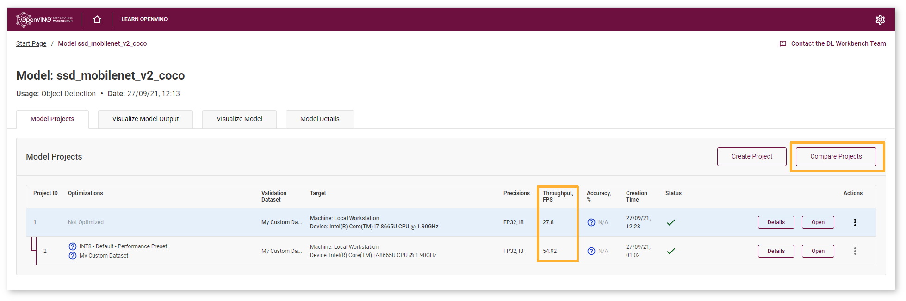
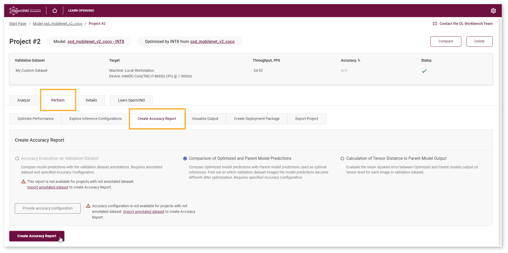
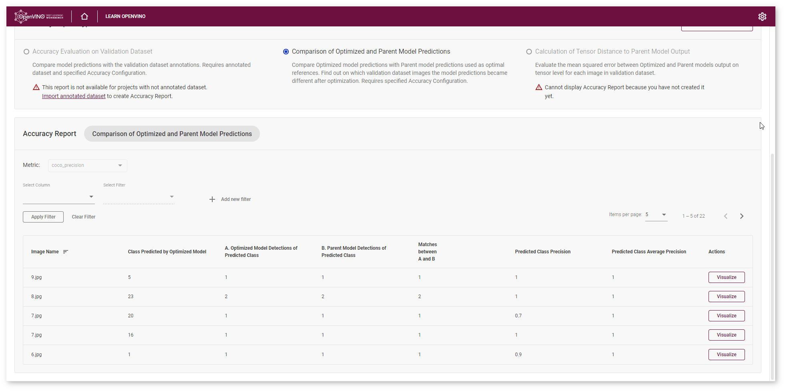
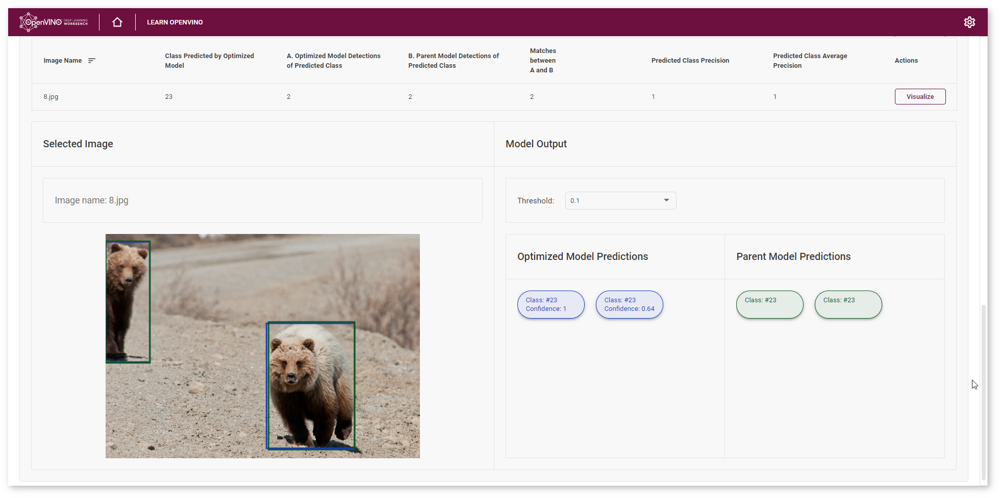
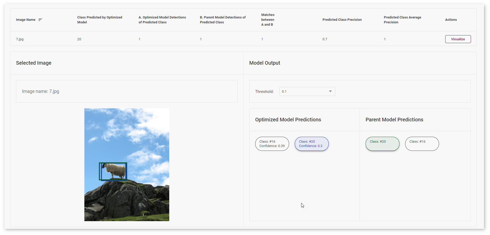

# Optimize Object Detection Model {#workbench_docs_Workbench_DG_Tutorial_Object_Detection}

## Summary

INT8 Calibration is a universal method for accelerating deep learning models. Calibration is a process of converting a Deep Learning model weights to a lower 8-bit precision such that it needs less computation.

In this tutorial, you will learn how to optimize your model using INT8 Calibration, examine how much quicker the model has become, and check the difference between original and optimized model accuracy. 

| Model  | Task Type | Framework | Source | Dataset |
| :---: | :---: | :---: | :---: |:---: |
| [ssd_mobilenet_v2_coco](https://docs.openvinotoolkit.org/latest/omz_models_model_ssd_mobilenet_v2_coco.html)  | [Object Detection](https://machinelearningmastery.com/object-recognition-with-deep-learning/) | [TensorFlow\*](https://www.tensorflow.org/) | [Open Model Zoo](https://github.com/openvinotoolkit/open_model_zoo/tree/master/models/public/mobilenet-ssd)| [Not Annotated dataset](Dataset_Types.md) |

You can learn how to [import the model](Select_Model.md) and [create a not annotated dataset](Create_Project.md) in the DL Workbench [Get Started Guide](Work_with_Models_and_Sample_Datasets.md).

Here is a quick recap of how to create the project with `ssd_mobilenet_v2_coco` from Get Started Guide:

## Optimize Model Using INT8 Calibration

To convert the model to INT8, go to  **Perform** tab on the Project page and open **Optimize** subtab. Check **INT8** and click **Optimize**.

It takes you to the **Optimize INT8** page. Select the imported dataset and perform INT8 Calibration with Default optimization method and Performance Preset calibration scheme first as it provides maximum performance speedup.

After optimization, you will be redirected to a new Project page for optimized  `ssd_mobilenet_v2_coco` model. 

To ensure that the optimized model performance is sufficiently accelerated and its predictions can be trusted, evaluate the key characteristics: performance and accuracy.

## Compare Optimized and Parent Model Performance

Go back to the model page and check the performance of the imported and optimized models. Compare the throughput numbers and click **Compare Projects** button to see more details. Learn more about projects comparison on the [Compare Performance](Compare_Performance_between_Two_Versions_of_Models.md) page.

> **NOTE**: Throughput is the number of images processed in a given amount of time. It is measured in frames per second (FPS). Higher throughput value means better performance.

You can observe that `ssd_mobilenet_v2_coco` model has become 2x times faster on CPU device after optimization. 

Lowering the precision of the model using quantization leads to a loss in prediction capability. Therefore you need to assess the model prediction capability to ensure that you have not lost a significant amount of accuracy. 

## Compare Parent and Optimized Model Predictions 

### Create Accuracy Report

Create an Accuracy Report that allows you to visualize and compare Optimized and Parent model predictions. Go to the **Perform** tab and select **Create Accuracy Report**:

Comparison of Optimized and Parent Model Predictions Report allows you to find out on which validation dataset images the predictions of the model have become different after optimization. Let's compare Optimized model predictions with Parent model predictions used as optimal references. 

### Interpret Report Results

The report has two display options: Basic and Advanced mode. 

### Basic Mode

Each line of the report table in basic mode contains a number of detected objects in the image: **A. Optimized Model Detections**. The number of objects in Parent model predictions for the image is indicated in **B. Parent Model Detections**. If the numbers do not match, the model must be incorrect.

To assess the difference between Optimized and Parent model predictions, check **Matches between A and B**. Matches show the number of times the Optimized model detected the same location of an object as the Parent Model.

 

### Advanced Mode

Each line of the report table in advanced mode contains a specific class that the model predicted for the object in the image - **Class Predicted by Optimized Model**. The number of detected objects of predicted class is represented in **A. Optimized Model Detections of Predicted Class**. The number of objects that have the same class in Parent model predictions is indicated in **B. Parent Model Detections of Predicted Class**. If the numbers do not match, the Optimized model might be incorrect.

To assess the difference between Optimized and Parent model predictions, check **Matches between A and B** and **Predicted Class Precision**. Matches show the number of times the Optimized model detected the same location of an object as the Parent Model.

> **TIP**:  To sort the numbers from lowest to highest, click on the parameter name in the table.

Click **Visualize** to see the prediction difference:

In our case, the optimized `ssd_mobilenet_v2_coco` model detected 2 objects of class 23 (bear). These detections coincide with the Parent model predictions: 2 objects of the same class as predicted by the Optimized model. The number of matches also equals 2. In the image, it is shown by almost identical bounding boxes for each object.

In another example, the Optimized `ssd_mobilenet_v2_coco` model detected 1 object of class 20 (sheep). This detection coincides with the Parent model prediction. However, Predicted class precision is now equal to 0.7. In the image, you can see that the difference between boxes is quite distinct.

Another type of Accuracy Report available for Not Annotated datasets is Calculation of Tensor Distance to Parent Model Output. The report enables you to identify differences between Parent and Optimized model predictions for a wider set of use cases besides classification and object detection. Learn more in the [Style Transfer model tutorial](Tutorial_style_transfer.md). 

## Next Step

After evaluating the accuracy, you can decide whether the difference between imported and optimized models predictions is critical or not:

- If the tradeoff between accuracy and performance is too big, [import an annotated dataset](Import_Datasets.md) and use [AccuracyAware optimization method](Int-8_Quantization.md#accuracyaware), then repeat the steps from this tutorial.

- If the tradeoff is acceptable, [explore inference configurations](Deploy_and_Integrate_Performance_Criteria_into_Application.md) to further enhance the performance. Then create a [deployment package](Deployment_Package.md) with your ready-to-deploy model. 

*All images were taken from ImageNet, Pascal Visual Object Classes, and Common Objects in Context datasets for demonstration purposes only.*

## See Also

* [Create Accuracy Report](Measure_Accuracy.md)
* [Classification model tutorial](Tutorial_classification_dataset.md)
* [Object Detection model tutorial](Tutorial_classification_dataset.md)
* [Optimize Classification model tutorial](Tutorial_classification.md)
* [Optimize Style Transfer model tutorial](Tutorial_style_transfer.md)
* [Accuracy Checker](https://docs.openvinotoolkit.org/latest/omz_tools_accuracy_checker.html)
* [Configure Accuracy Settings](Configure_Accuracy_Settings.md)
* [Troubleshooting](Troubleshooting.md)