# Visualize Model {#workbench_docs_Workbench_DG_Visualize_Model}

After you have run an initial inference, and your performance data is visible on the dashboard, you 
can evaluate performance and tune your model. The data appears in the **Model Performance Summary** 
on the **Projects** page. When you have multiple inference results, you can click on specific data 
points to view model performance details.  

## Visualize Graphs

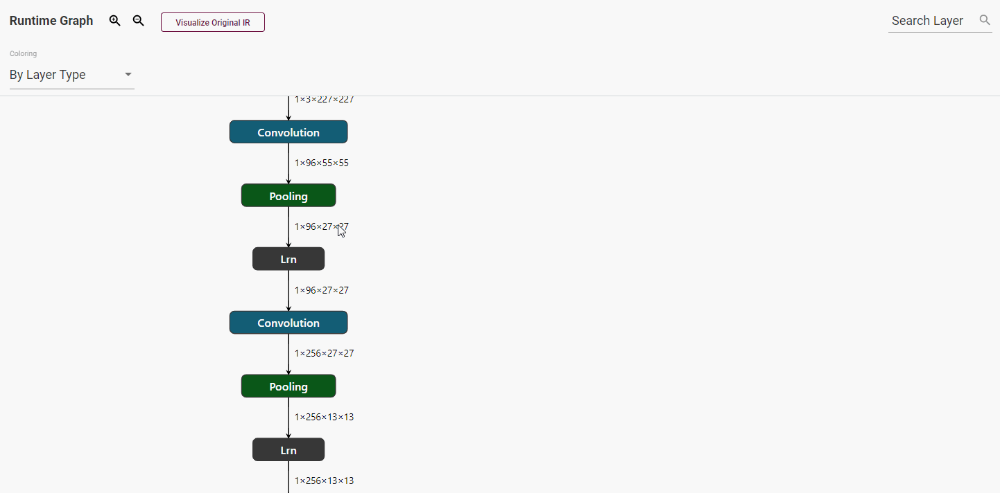

On the right to the **Layers** table on the **Kernel-Level Performance** tab, find the visualization of your model when it is
executed by the OpenVINO™ Runtime. Click **Visualize Original IR** to see the graph of the
original model in the OpenVINO™ IR format before it is executed by the OpenVINO™ Runtime.

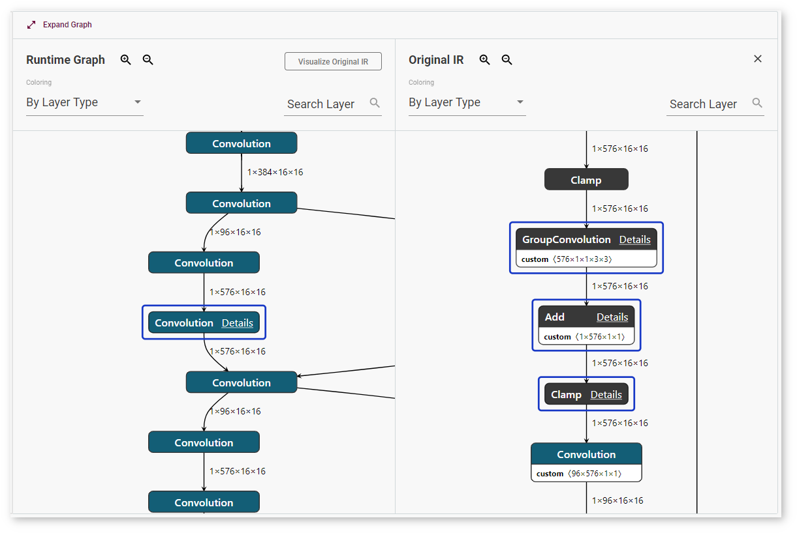

Layers in the *runtime graph* and the *IR (Intermediate Representation) graph* have different 
meanings. The IR graph reflects the structure of a model, while the runtime graph shows how a 
specific version of the model was executed on a specific device. The runtime graphs usually have 
different structures for different model versions and for the same model run on different devices, 
because every device executes models in a certain way to achieve the best performance.

To adjust the scale, use magnifying glass icons or your mouse scroll wheel. You can also make the graph larger by clicking **Expand Graph**.

To quickly find a layer, use the **Search Layer** field. Enter a layer name or input dimensions:

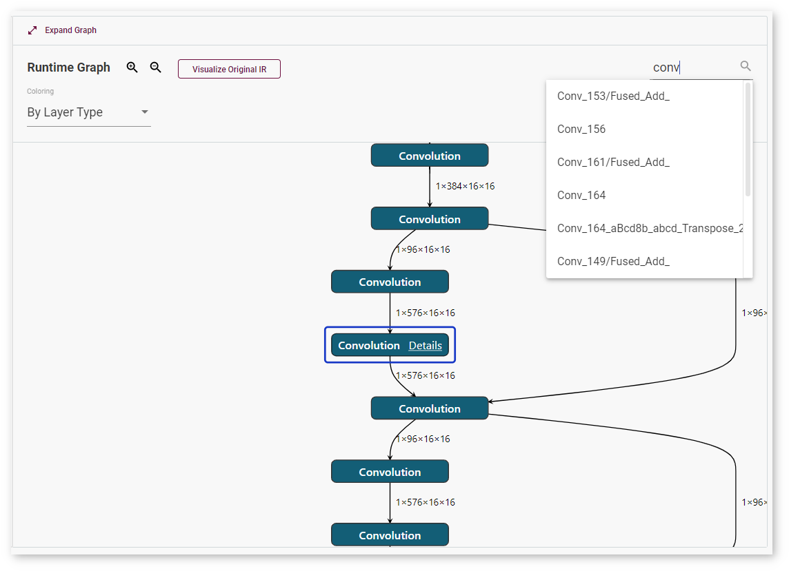

To learn details about a layer, select the layer and click **Details**. 
The window with layer information appears on the right:
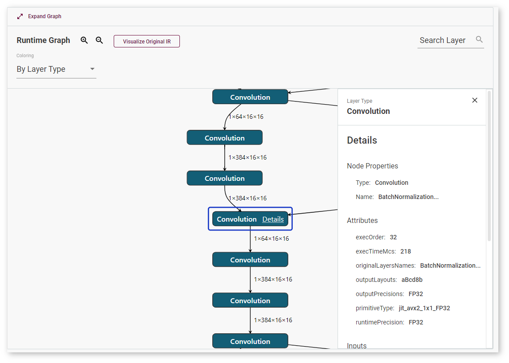

DL Workbench supports layer mapping between the table, the runtime graph, and the original
IR graph, which visually represents whether a layer was fused, tiled, or stayed intact.
Once you click a layer in the table or in any of the graphs, the same layer or the layers
corresponding to it are highlighted in other places: 
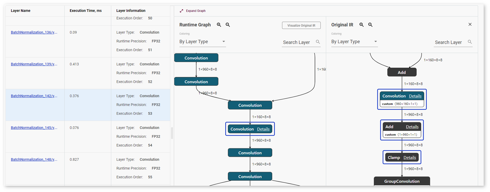

If an original IR layer does not have a corresponding runtime layer, nothing in the table
or in the **Runtime Graph** is highlighted and you get a warning: 
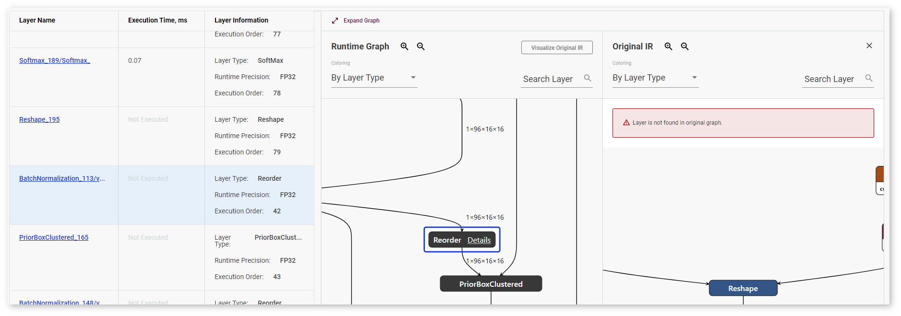

### Coloring

By default, layers are colored according to their type, but the DL Workbench also supports coloring by execution time and by runtime precision type for runtime graphs and output precision type for original IR graphs. Select the coloring logic in the **Coloring** drop-down list.

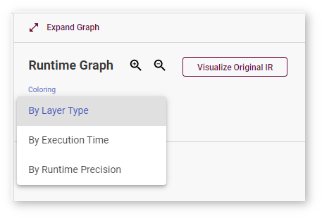

When you select coloring **By Execution Time**, the graph gets colored according to the scale that appears above it:

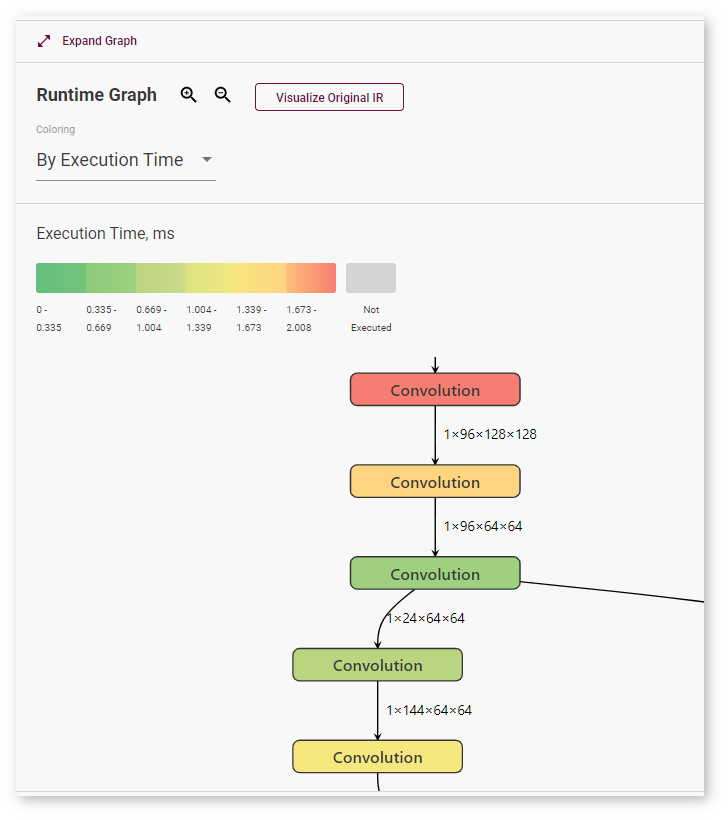

Coloring **By Runtime Precision** means a particular color for each layer precision during runtime:

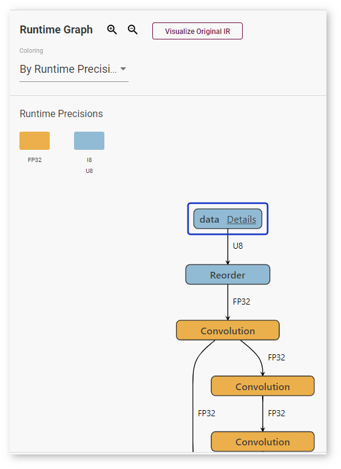

Selecting **By Output Precision** means that each layer is colored corresponding to its precision in the original graph:

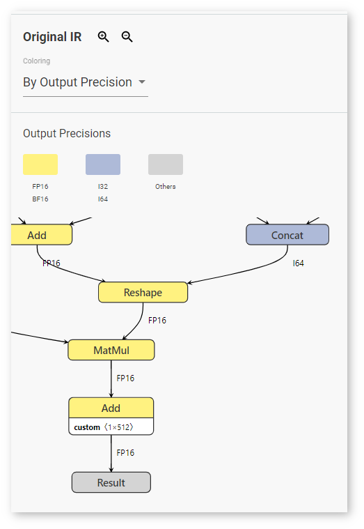

## Recommendations on Reading Model Graphs

To learn about graph optimization algorithms supported on different plugins, see the OpenVINO™ Runtime [CPU](@ref openvino_docs_OV_UG_supported_plugins_CPU), [Intel® Movidius™ Neural Compute Stick 2](@ref openvino_docs_OV_UG_supported_plugins_MYRIAD) and [Intel® Vision Accelerator Design with Intel® Movidius™ VPUs](@ref openvino_docs_OV_UG_supported_plugins_HDDL) supported plugins documentation. For additional details on reading graphs of a model executed on a VPU plugin, see the section below.

### Models Executed on a VPU Plugin

If layers are joined, the *Runtime graph* displays an *HwOp* layer with two input and two output 
layers:

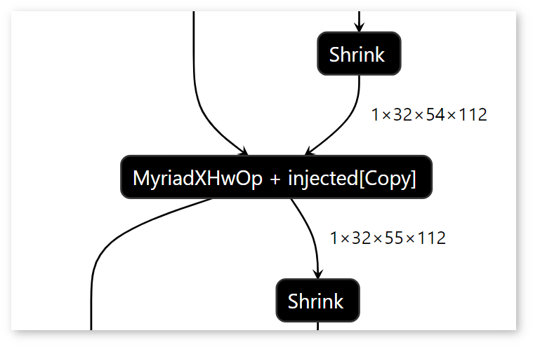

 In the Runtime graph, FullyConnected, GEMM, and 3D Convolution layers are expressed as a sequence of 2D Convolution layers.

Certain graph features may be the signs of a low-performance model:

- The graph contains many tiles and their dimensions are small. For example, if your graph has many 1x4x1x1 tiles, the model is likely to have a low performance.

- The graph contains many Split, Expand, Reshape, Pad, and Concatenate layers.

- The graph contains many Copy layers and they are outside of tilings.

> **NOTE**: Intel® Neural Compute Stick 2 does not support asymmetrical paddings. Therefore, asymmetrical paddings in the Intermediate Representation (IR) graph result in several Pad layers in the Runtime Graph, which causes lower performance of a model. 

## See Also

* [View Inference Results](View_Inference_Results.md)
* [Visualize Model Output](Visualize_Accuracy.md)
* [Deploy and Integrate Performance Criteria into Application](Deploy_and_Integrate_Performance_Criteria_into_Application.md)
* [Troubleshooting](Troubleshooting.md)
