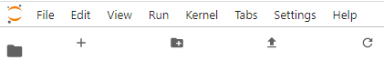
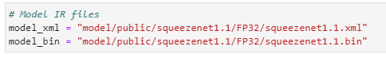
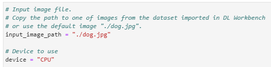

Welcome to the JupyterLab\* playground of the OpenVINO™ DL Workbench!
Here you can learn how to use OpenVINO™, its Python* API, and its components that enable you to analyze and optimize
your models.

Decide on what use case you want to work with and open the notebook with relevant tutorial:

* [Classification tutorial](classification/tutorial_classification.ipynb)
* [Object detection tutorial](object_detection_ssd/tutorial_object_detection_ssd.ipynb)
* [Semantic segmentation tutorial](semantic_segmentation/tutorial_semantic_segmentation.ipynb)
* [Style transfer tutorial](style_transfer/tutorial_style_transfer.ipynb)

If you could not find your use case in the list above, open the [generic tutorial](generic/tutorial_generic.ipynb).

Decide on the model you want to work with:

* You want to work with a model that you imported into the DL Workbench
* You want to work with a model that you have locally
* You do not have a model

## You Have a Model Imported into the DL Workbench

To use the same model, sample image, and/or the device that you imported into or used in the DL Workbench, follow the
steps below.

1. Create a project in the DL Workbench.
2. On the **Projects** page, go to the **Open in Playground** tab.
3. Copy the paths and device name from the **Open in Playground** tab in the DL Workbench and paste them into correct
   places:
   * Find the paths to IR files in the the cell under the **Requirements** section in the **Configure an Inference**
     step, replace them with the paths displayed on the **Open in Playground** tab.
   * Find the path to an image in the cell under the **Optional Parameters** section in the **Configure an Inference**
     step. Replace it with the path displayed on the **Open in Playground** tab.
   * Find the device name in the cell under the **Optional Parameters** section in the **Configure an Inference** step
     as in the image above. Replace it with the device displayed on the **Open in Playground** tab.
4. Run all code cells.

## You Have a Model Locally

To use a model, sample image, and/or device other than those specified in a tutorial, follow the steps below.

> **NOTE**: OpenVINO™ works with Intermediate Representation (IR) and ONNX\* formats. IR is a preferred format.
> If you upload an original model, convert it into the IR format. To do that, create a new cell in the notebook, and call the OpenVINO™ [Model Optimizer](https://docs.openvino.ai/latest/openvino_docs_MO_DG_Deep_Learning_Model_Optimizer_DevGuide.html). Your command should start with `!mo ...`.

1. Upload the files to the playground using the upload icon under the top menu:
   
2. Replace the paths and device name in the notebook:
   * Find the paths to IR files in the the cell under the **Requirements** section in the **Configure an Inference**
     step. Replace them with the paths of IR files that you uploaded.
     
   * Find the path to an image in the cell under the **Optional Parameters** section in the **Configure an Inference**
     step. Replace it with the path to the image you uploaded.
     
   * Find the device name in the cell under the **Optional Parameters** section in the **Configure an Inference** step
     as in the image above. Replace it with the name of the device that you want to use.
     See [Supported Inference Devices](https://docs.openvino.ai/latest/workbench_docs_Workbench_DG_Select_Environment.html)
     for reference.
4. Run all code cells.

## You Do Not Have a Model

If you do not have a model, you still can use the
tutorials. [Intel® Open Model Zoo](https://github.com/openvinotoolkit/open_model_zoo) provides pretrained models for
various use cases. Also, each notebook already has a selected model in it, so simply run all the cells to see how the
model works in the OpenVINO™ environment. Feel free to change the model and experiment with another one.

## Educational Resources

* [OpenVINO™ documentation](https://docs.openvino.ai/latest/index.html)
* [Introduction to inference with OpenVINO™](https://docs.openvino.ai/latest/openvino_docs_IE_DG_Deep_Learning_Inference_Engine_DevGuide.html)
* [Overview of the OpenVINO™ Python API](https://docs.openvino.ai/latest/openvino_inference_engine_ie_bridges_python_docs_api_overview.html)
* OpenVINO™ [samples](https://docs.openvino.ai/latest/openvino_docs_IE_DG_Samples_Overview.html)
  and [application demos](https://docs.openvino.ai/latest/omz_demos.html)
* [OpenVINO™ Python API Reference](https://docs.openvino.ai/2021.2/ie_python_api/annotated.html)
* [JupyterLab documentation](https://jupyter-notebook.readthedocs.io/en/stable/ui_components.html)

> **WARNING**: Be cautious when working with files and folders available in JupyterLab. It is recommended to work with a limited set of folders to ensure that the DL Workbench and JupyterLab continue working:
>
> * `datasets`. Contains all datasets imported in the DL Workbench. Feel free to open and use images from the folder, however, do not change the content.
> * `models`. Contains all models imported in the DL Workbench. Feel free to use models from the folder, however, do not change the content.
> * `tutorials`. Contains Jupyter notebooks with a full inference workflow for different use cases. Feel free to change the content of the folder.
